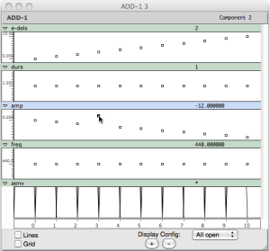

Navigation : [Previous](02-Slot's_Description "page
précédente\(Slots' Description and Default Values\)") | [page
suivante](04_Amplitude_envelope "Next\(Amplitude Envelope\)")

Managing the amplitude and using the internal editor.

## Beware of the amplitude!

There are two ways to express the amplitude.

  * linear = positive numbers from >0.0 to 1000 (which corresponds to the maximum value allowed by the chosen resolution, for instance 32767 with 16 bits)
  * exponential or dB = 0 or negative numbers from 0 to the chosen bit resolution (16 bit = 96 dB, 24 bit = 144 dB). In this case, 0 dB corresponds to the maximum value (hence to 1000 in the linear notation).

The final result (all the audio file) will always be rescaled to your audio
setting (see Normalize Output Level in "Preferences/Audio").

Mixing positive and negative numbers is possible, albeit not really
recommended. In any case, zero (0) always corresponds the maximum level (0
dB), not to a linear amplitude of zero (0), that is silence. If one really
wishes to compute silence, one should use a negative value =< to -96 (16-bits
resolution) or -144 (24 bits).

 **Patch description.**

The box contains several lists of amplitudes . Select them one by one and
evaluate the **sound** object.

The function **lisp-length** returns the numbers of elements of the chosen
list and passes the result to the slot **numcols** , which must always have
the total amount of the components that need to be synthesized. In other
words, **numcols** corresponds to the amount of columns of the matrix
initialized by ADD-1 and in which the data are stored (see the internal editor
below). It also corresponds to the amount of lines generated in the csound
score for this event.

If, for instance, the value "3" is passed, only the first 3 values of the
lists will be computed. As a consequence, a useful control strategy is to have
**numcols ****** depend on the most important control parameter in the
synthesis event, as is the case here.

The duration of each component is the default value (1 second).

The frequency of each component is the default value (440 Hz).

The sub-patch "edel" sets the events one after the other (e.g., with 5 events
the entry delays will be : 0, 1, 2, 3, 4).

The sub-patch "aenv" replaces the default amplitude envelope with a new one
built by a Break Point Function or BPF (more details about this topic in the
next Tutorial).

The difference between the two examples is the use of the keyword ":precision"
added to the class add-1 in the example B. By default the numbers of the
OMChroma's classes are rappresented with 3 decimal digits. If, for any reason,
you need more decimal digits, you have to add to the class a keyword named "
:precision" and specify how many decimal you wish.

Floating point vs. integer computation

As all the rendering in done using floating point arithmetics, the final
integer audio file is computed at the end of the rendering by converting and
rescaling the floating point file. As a consequence, there is NO risk of
overflow in the final integer file.

## Internal Editor

ADD- 1 stores all the data into a matrix. Double click on the ADD-1 box to
open the matrix's editor to display and modify the data.

The matrices above displays the data coming out of the evaluation of the first
row of the list in two ways according to the checked boxes.

Notice that:

  * the events are stored in columns from left to right,
  * the data whose input's list has less components (than the numbers of the components, i.e. **numcols)** are repeated. E.g., the frequency's list has only one value (440), and this value is repeated to entirely fill the line of the matrix,
  * if the matrix is edited, the ADD-1 box will be automatically locked.

There are two ways to modify the data in the editor.

Click on the value and drag it.

|

  
  
---|---  
  
Double click on the value to open the coordinate's window and type the new
value into the y-axis frame.

|

  
  
---|---  
  
References :

Plan :

  * [OMChroma User Manual](OMChroma)
  * [System Configuration and Installation](Installation)
  * [Getting started](Getting_Started)
    * [Class Input Slots](01-Class_Input_Slots)
    * [Slots' Description and Default Values](02-Slot's_Description)
    * Amplitude and Internal Editor
    * [Amplitude Envelope](04_Amplitude_envelope)
    * [f-GEN Reserved Numbers](05-f-GEN_Reserved_Number)
    * [Audio Waveforms](06-Audio_Waveforms)
    * [Chord-seq to OMChroma](07-Chord-seq_to_OMCh_Class)
    * [Spectrum Chord and Arpeggio](08-Spectrum_Chord_and_Arpeggio)
    * [Velocity versus Amplitude](09-Velocity_vs_Amplitude)
    * [Exponential Amplitude Envelope with a BPF](10-Exponential_Amplitude_Envelope_with_BPF)
    * [Relationship with the Csound .orc and .sco files](11-Relationship_with_the_Csound_orc_and_sco_files)
    * [Slots polymorphism](12-Slots_polymorphism)
  * [Managing GEN function and sound files](Managing_GEN_function_and_sound_files)
  * [Predefined Classes](Predefined_classes)
  * [User-fun](User-fun)
  * [Creating a new Class](Creating_a_new_Class)
  * [Multichannel processing](06-Multichannel_processing)
  * [Appendix A - Common Red Patches](A-Appendix-A_Common_red_patches)

Navigation : [Previous](02-Slot's_Description "page
précédente\(Slots' Description and Default Values\)") | [page
suivante](04_Amplitude_envelope "Next\(Amplitude Envelope\)")
