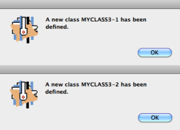
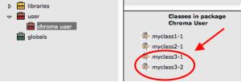
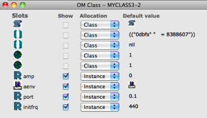
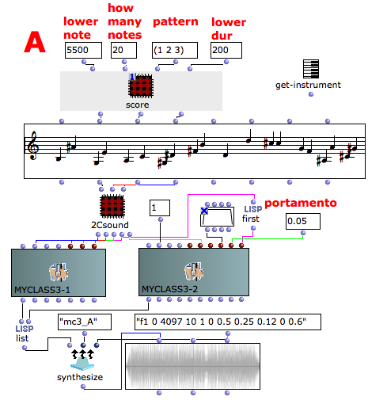

Navigation : [Previous](02-Initialize_GEN_slots "page
précédente\(Initialize GEN slots\)") | [page
suivante](06-Multichannel_processing "Next\(Multichannel
processing\)")

## Tutorial MyClass_03 Orchestra with many instruments

Csound orchestra

instr 1

|

Starts the instrument #1 block.  
  
---|---  
  
gifreq = p4

|

The frequency as global variable is set to p4  
  
endin

|

Ends the current instrument block  
  
instr 2

|

Starts the instrument #2 block.  
  
idur = p3

|

The duration is set to p3  
  
idurosc = 1/idur

|

The duration of the amplitude envelope is set to 1/idur  
  
iamp = (p4 > 0.0 ? (p4*0.001*0dbfs) : (ampdbfs (p4)))

|

The variable p4 sets the amplitude. Linear values from 0 to 1000 or in dB from
0 to negative values  
  
iaenv = p5

|

Function table number of the wave form of the amplitude envelope (GEN routine)  
  
iport = p6

|

The frequency portamento is set to p6  
  
initfreq = p7

|

The starting frequency of the portamento is set to p7  
  
kfreq = gifreq

|

The local frequency is set equal to the global frequency  
  
kfrqp portk kfreq,iport ,initfreq

|

The portamento of the frequency is made by a step-valued control signal.  
  
aenv poscil iamp, idurosc, iaenv

|

Amplitude envelope  
  
asig poscil aenv,kfrqp,1

|

The opcode "poscil" generates an audio signal with the waveform of the GEN
subroutine #1 and aenv as amplitude envelope, then writes the output to the
audio variable "asig"  
  
out asig

|

The opcode "out" writes the audio data to an external device or stream.  
  
endin

|

Ends the current instrument block  
  
Csound Orchestra description

This orchestra is a oscillator with the following controls

  * The frequency of the oscillator,
  * The waveform of the oscillator,
  * The envelope amplitude of the global audio file,
  * The portamento time of each frequency.

## Make your OMChroma class

Copy the complete following instructions in a text file and save it
as"myclass3.orc".

sr = 96000

kr = 96000

ksmps = 1

nchnls = 1

0dbfs = 8388607

instr 1

gifreq = p4

endin

instr 2

idur = p3

idurosc = 1/idur

iamp = (p4 > 0.0 ? (p4*0.001*0dbfs) : (ampdbfs (p4)))

iaenv = p5

iport = p6

initfreq = p7

kfreq = gifreq

kfrqp portk kfreq,iport ,initfreq

aenv poscil iamp, idurosc, iaenv

asig poscil aenv,kfrqp,1

out asig

endin

Make a new class following the steps of the [Tutorial MyClass_01 Three lines
class](01-Three_lines_class) and [Tutorial MyClass_02 Initialize GEN
slots](02-Initialize_GEN_slots). After the valuating of the get-
instrument two warning windows will pop up, each of them with the name of the
instrument defined.

|

  
  
---|---  
  

|

Clearly in the "Classes in package Chroma User" folder you will find two new
instruments : myclass3-1 and myclass3-2  
  
---|---  
  

|

Remember to initialize the aenv slot (p5) with a Csound table ([see Tutorial
MyClass_02 Initialize GEN slots](02-Initialize_GEN_slots))  
  
---|---  
  
Patch description

In this example you can see how two Csound instruments work together. The
frequency's data will pass via the global variable inside Csound from the
first instrument, which reads the score note by note but doesn't make any
sound synthesis, to the second which changes the frequency of the oscillator
at every new incoming note and renders the audio file.

References :

Plan :

  * [OMChroma User Manual](OMChroma)
  * [System Configuration and Installation](Installation)
  * [Getting started](Getting_Started)
  * [Managing GEN function and sound files](Managing_GEN_function_and_sound_files)
  * [Predefined Classes](Predefined_classes)
  * [User-fun](User-fun)
  * [Creating a new Class](Creating_a_new_Class)
    * [Three lines class](01-Three_lines_class)
    * [Initialize GEN slots](02-Initialize_GEN_slots)
    * Orchestra with many instruments
  * [Multichannel processing](06-Multichannel_processing)
  * [Appendix A - Common Red Patches](A-Appendix-A_Common_red_patches)

Navigation : [Previous](02-Initialize_GEN_slots "page
précédente\(Initialize GEN slots\)") | [page
suivante](06-Multichannel_processing "Next\(Multichannel
processing\)")
