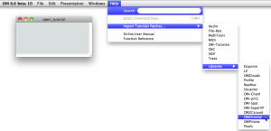
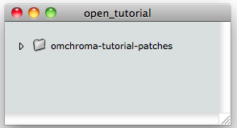

precedente](02-Libraries_and_mains_default_values "page
précédente\(Libraries and main default values\)") | [page
suivante](04-Extended_preferences "Next\(Extended
preferences\)")
# Importing tutorials

## Preliminary remarks

Warning

If the OMChroma library is not loaded, go to the "[Libraries and main default
values](02-Libraries_and_mains_default_values)" chapter and
follow the instructions.

From the OpenMusic's menu open

Help/Import Tutorials Patches/Libraries/OMChroma.

|

  
  
---|---  
  
The folder omchroma-tutorial-patches should be now in your workspace window.

|

  
  
---|---  
  
References :

Plan :

  * [OMChroma User Manual](OMChroma)
  * [System Configuration and Installation](Installation)
    * [Foreword](00-Foreword)
    * [Csound](01-Csound)
    * [Libraries and main default values](02-Libraries_and_mains_default_values)
    * Importing tutorials
    * [Extended preferences](04-Extended_preferences)
    * [Links](05-Links)
  * [Getting started](Getting_Started)
  * [Managing GEN function and sound files](Managing_GEN_function_and_sound_files)
  * [Predefined Classes](Predefined_classes)
  * [User-fun](User-fun)
  * [Creating a new Class](Creating_a_new_Class)
  * [Multichannel processing](06-Multichannel_processing)
  * [Appendix A - Common Red Patches](A-Appendix-A_Common_red_patches)

Navigation : [page
precedente](02-Libraries_and_mains_default_values "page
précédente\(Libraries and main default values\)") | [page
suivante](04-Extended_preferences "Next\(Extended
preferences\)")
