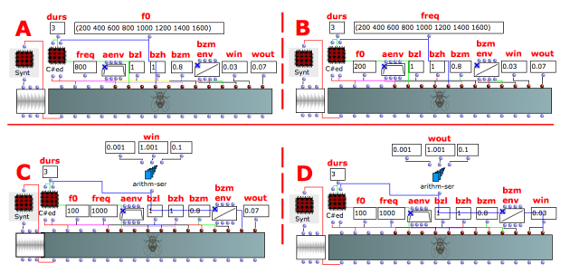
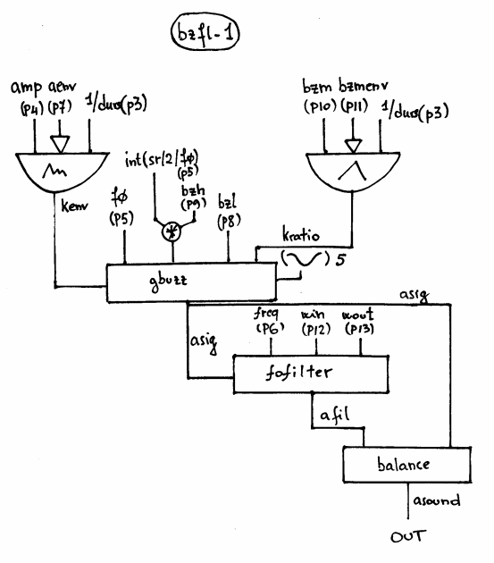

Navigation : [Previous](02-buzz-2 "page précédente\(Buzz Synthesis
with BUZZ-2\)") | [Next](03-Frequency_modulation "page
suivante\(Frequency Modulation Synthesis\)")
## Tutorial BUZFL-1

Specific Slots

Name

|

Description

|

Default value  
  
---|---|---  
  
amp

|

Maximum Amplitude. Linear from >0.0 to 1000 or in dB from 0 to -∞ (see
[Tutorial Getting Started 02 - Amplitude and Internal
Editor](03-Amplitude_and_internal_editor) for more details)

|

-6.0  
  
f0

|

Generating frequency [Hz]

|

263.8  
  
freq

|

Filter centre frequency [Hz]

|

1000.0  
  
aenv

|

Amplitude Envelope [GEN]

|

Instance: GEN07  
  
bzl

|

Lowest harmonic present in the buzz [int]

|

Instance: GEN07  
  
bzh

|

Highest harmonic present in the buzz [% of sr/2/f0. From 0.0 to 1.0]

|

1.0  
  
bzm

|

Multiplier in the series of amplitude coefficients [flt]

|

0.95  
  
bzmenv

|

Envelope of the buzz multiplier [GEN]

|

Instance: GEN07  
  
win

|

Impulse response attack time [sec]

|

0.03  
  
wout

|

Impulse response decay time [sec]

|

0.07  
  
Class description

The BUZZ-1 Class realizes a Buzz Synthesis (a set of harmonically related
cosine partials) plus a formant filter with the following controls:

  * The main amplitude,
  * The generating frequency,
  * The filter centre frequency,
  * The amplitude envelope by means of a GEN routine,
  * The lowest and the highest harmonic of the spectrum,
  * The components' amplitude of the spectrum,
  * The components' amplitude envelope by means of a GEN routine,
  * The impulse response attack time,
  * The impulse response decay time.

Patch description

The example A focuses on the  values of the generating frequencies.

The example B deals with the filter centre frequency.

The example C spreads the impulse response attack time from 0.001 to 1.001
second with 0.1 time steps.

The example D spreads the impulse response decay time from 0.001 to 1.001
second with 0.1 time steps.

Common Red Patches

For the red patch [C#ed](Component_number_and_entry_delay) and
[Synt](Synt) see [ Appendix
A](A-Appendix-A_Common_red_patches)

## Inside the Class

Csound Orchestra of the BUZFL-1 Class.

instr 1

idur = p3

idurosc = 1/p3

iamp = (p4 > 0.0 ? (p4*0.001*0dbfs) : (ampdbfs (p4)))

if0 = p5

ifq = p6

iaenv = p7

inn = sr/2/if0 ; total possible number of harmonics

ihh = int (inn * p9) ; % of possible total

ilh = p8 ; lowest harmonic

ibzmul = p10

ibzmenv = p11 ; envelope for the buzz

irise = p12

idec = p13

ifn = 5 ; stored cosine function

kenv poscil iamp, idurosc, iaenv ; amp envelope

kratio poscil ibzmul, idurosc, ibzmenv ; kratio envelope

asig gbuzz kenv,if0,ihh,ilh,kratio,ifn

afil fofilter asig, ifq, irise, idec

asound balance afil, asig

out asound

endin

References :

Plan :

  * [OMChroma User Manual](OMChroma)
  * [System Configuration and Installation](Installation)
  * [Getting started](Getting_Started)
  * [Managing GEN function and sound files](Managing_GEN_function_and_sound_files)
  * [Predefined Classes](Predefined_classes)
    * [Additive Synthesis](01-Additive_Synthesis)
    * [Buzz Synthesis](02-Buzz_Synthesis)
      * [Buzz Synthesis with BUZZ-1](01-buzz-1)
      * [Buzz Synthesis with BUZZ-2](02-buzz-2)
      * Buzz Synthesis with BUZFL-1
    * [Frequency Modulation Synthesis](03-Frequency_modulation)
    * [Formant Wave-Function Synthesis (FOF)](04_Formant_Wave_Function_\(FOF\))
    * [Granular Formant Wave Function (FOG)](05-Granular_Formant_Wave_Function_\(FOG\))
    * [Karplus-Strong](06-Karplus-Strong)
    * [Random Amplitude Modulation](07-Random_Amplitude_Modulation)
    * [Sampler](08-Sampler)
    * [Subtractive Synthesis](09-Subtractive_Synthesis)
    * [Wave Shaping Synthesis](10-Waveshaping)
    * [Hybrid Models](11-Hybrid_Models)
  * [User-fun](User-fun)
  * [Creating a new Class](Creating_a_new_Class)
  * [Multichannel processing](06-Multichannel_processing)
  * [Appendix A - Common Red Patches](A-Appendix-A_Common_red_patches)

Navigation : [Previous](02-buzz-2 "page précédente\(Buzz Synthesis
with BUZZ-2\)") | [Next](03-Frequency_modulation "page
suivante\(Frequency Modulation Synthesis\)")
