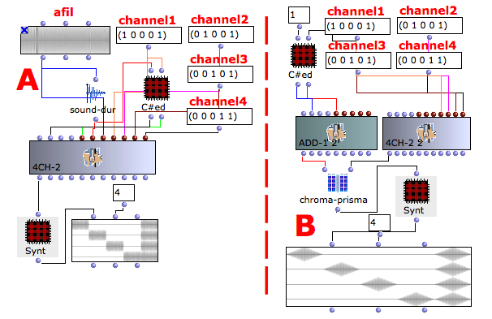

Navigation : [Previous](03-4ch-1 "page précédente\(Multichannel
Processing with 4CH-1\)") | [Next](05-5ch-1 "page
suivante\(Multichannel Processing with 5CH-1\)")
## Tutorial 4ch-2

Specific Slots

Name

|

Description

|

Default value  
  
---|---|---  
  
e-dels

|

Entry delays [sec], time interval between the object's "action-time" and the
beginning of each line in the score.

|

0  
  
durs

|

Duration of each line in the score [sec]

|

1  
  
afile

|

File name

|

nil  
  
channel1

|

Amplitude of channel 1

|

1.0  
  
channel2

|

Amplitude of channel 2

|

0.0  
  
channel3

|

Amplitude of channel 3

|

0.0  
  
channel4

|

Amplitude of channel 4

|

0.0  
  
Class description

The 4ch-2 Class allows to place the audio source in a quadraphonic space with
the following controls :

  * The independent amplitude of all channels,
  * The duration of the single event,
  * The entry delay of each event.

Patch description

The example A shows how to place a mono sound file in a quadraphonic space
using the class Sound directly connects to 4ch-1.

The examples B and C show how to use the generic function Chroma-Prisma to
place a mono sound file in a quadraphonic space.

4ch-1 versus 4ch-2

4ch-1 has only one control for all the channels, instead 4ch-2 has independent
control of all channels.

Common Red Patches

For the red patches [Synt,](Synt) and
[C#ed](Component_number_and_entry_delay) and see
[Appendix-A](A-Appendix-A_Common_red_patches).

References :

Plan :

  * [OMChroma User Manual](OMChroma)
  * [System Configuration and Installation](Installation)
  * [Getting started](Getting_Started)
  * [Managing GEN function and sound files](Managing_GEN_function_and_sound_files)
  * [Predefined Classes](Predefined_classes)
  * [User-fun](User-fun)
  * [Creating a new Class](Creating_a_new_Class)
  * [Multichannel processing](06-Multichannel_processing)
    * [Multichannel Processing with Stereo-1](01-stereo-1)
    * [Multichannel Processing with Stereo-2](02-stereo-2)
    * [Multichannel Processing with 4CH-1](03-4ch-1)
    * Multichannel Processing with 4CH-2
    * [Multichannel Processing with 5CH-1](05-5ch-1)
    * [Multichannel Processing with 6CH-1](06-6ch-1)
    * [Multichannel Processing with 8CH-1](07-8ch-1)
    * [Multichannel Processing with 12CH-1](08-12ch-1)
  * [Appendix A - Common Red Patches](A-Appendix-A_Common_red_patches)

Navigation : [Previous](03-4ch-1 "page précédente\(Multichannel
Processing with 4CH-1\)") | [Next](05-5ch-1 "page
suivante\(Multichannel Processing with 5CH-1\)")
