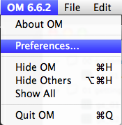

Navigation : [Previous](03-_Importing_tutorials "page
précédente\(Importing tutorials\)") | [Next](05-Links "page
suivante\(Links\)")

|

Open the Preferences  
  
---|---  
  

|

As the OpenMusic Preferences appear

Select the Audio tab  
  
---|---  
  
Set some useful parameters of the audio output and specify how OM manages the
synthesis process :

  * The Sample Rate of the output audio file,
  * The default Audio Format of the output audio file [AIFF, WAV],
  * How OM manages the Output File Exists [Replace, Auto re-name],
  * If you wish to delete the Temporary Files (strongly recommended),
  * If you wish to normalize the output and with which program,
  * The dB level of the normalization.

References :

Plan :

  * [OMChroma User Manual](OMChroma)
  * [System Configuration and Installation](Installation)
    * [Foreword](00-Foreword)
    * [Csound](01-Csound)
    * [Libraries and main default values](02-Libraries_and_mains_default_values)
    * [Importing tutorials](03-_Importing_tutorials)
    * Extended preferences
    * [Links](05-Links)
  * [Getting started](Getting_Started)
  * [Managing GEN function and sound files](Managing_GEN_function_and_sound_files)
  * [Predefined Classes](Predefined_classes)
  * [User-fun](User-fun)
  * [Creating a new Class](Creating_a_new_Class)
  * [Multichannel processing](06-Multichannel_processing)
  * [Appendix A - Common Red Patches](A-Appendix-A_Common_red_patches)

Navigation : [Previous](03-_Importing_tutorials "page
précédente\(Importing tutorials\)") | [Next](05-Links "page
suivante\(Links\)")
