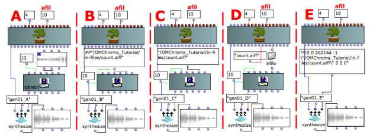

precedente](03-Global_tables_versus_local_tables "page
précédente\(Global tables vs. local tables\)") | [page
suivante](05-How_to_pass_sound_files "Next\(How to pass
sound files\)")

# GEN01 function table

## Tutorial GEN01 function table

The GEN01 is a peculiar kind of GEN routine, which transfers data from a sound
file into a function table.

The ordinary size of GEN tables is a "power of 2" or a "power of 2 + 1" (if
the audio module is interpolating, as in OMChroma, where all the audio modules
are interpolating). The maximum table size is 16777216 = 224. In the case of
an audio file, this means that the amount of memory to be allocated should
correspond to the "power of 2" immediately larger than the file size,
otherwise the file will be truncated. This is not very optimized, since some
memory will be not used and zero padded.

With some audio modules (such as **flooper** used in the classes **smpl-5**
and **smpl-6** , for instance) the allocation of the table memory can be
deferred by setting its size to 0 (see the Csound documentation for further
information concerning deferred GEN01 tables). In this case, the size
allocated is the exact number of points in the file (probably not a "power of
2").

Since GEN01 routines take a lot of memory, OMChroma only allows to pass them
as global tables.

The patch below shows 5 ways of initializing GEN01 tables.

 **WARNING** : the classes **smpl-1** and **smpl-2** read a sound file
directly from the disk, and therefore do not require a GEN01 to be
initialized. This is useful when reading large sound files, but will
considerably slow down the computation, as it makes a disk access for each
element of a synthesis class.

Patch description

This patch shows how to initialize a GEN01 as a global table.

In the examples A, B, C and D the GEN01 is initialized by a GEN01 class,
passed to **synthesize** 's keyword **:tables**. The sound file count.aiff is
given to the GEN01 class by means of:

  * A) A sound class
  * B) The absolute path of the file (lisp) - do not forget to write your own absolute pathname!
  * C) The absolute path of the file (text) - do not forget to write your own absolute pathname!
  * D) The in-file function.

In the example E the GEN01 is passed directly to **synthesize** 's keyword
**:tables**  and uses the Csound syntax.

 **Warning:** Beware of the backslash character to use the double-quote
character within a text string (the Csound score needs a path within double
quotes).

Warning

If the workspace you are using is not named "OMChroma_Tutorial", type your own
workspace's name and path at the place of the written paths.

References :

Plan :

  * [OMChroma User Manual](OMChroma)
  * [System Configuration and Installation](Installation)
  * [Getting started](Getting_Started)
  * [Managing GEN function and sound files](Managing_GEN_function_and_sound_files)
    * [Local tables](01-Local_tables)
    * [Global tables](02-Global_tables)
    * [Global tables vs. local tables](03-Global_tables_versus_local_tables)
    * GEN01 function table
    * [How to pass sound files](05-How_to_pass_sound_files)
  * [Predefined Classes](Predefined_classes)
  * [User-fun](User-fun)
  * [Creating a new Class](Creating_a_new_Class)
  * [Multichannel processing](06-Multichannel_processing)
  * [Appendix A - Common Red Patches](A-Appendix-A_Common_red_patches)

Navigation : [page
precedente](03-Global_tables_versus_local_tables "page
précédente\(Global tables vs. local tables\)") | [page
suivante](05-How_to_pass_sound_files "Next\(How to pass
sound files\)")
