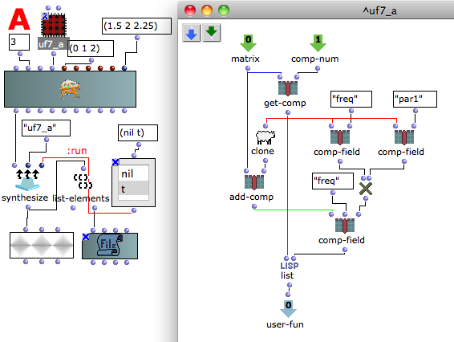

Navigation : [Previous](03-Add_components "page précédente\(Add
components\)") | [Next](05-Fletcher-Munson_curve "page
suivante\(Fletcher-Munson curve\)")

Patch description

This user-fun uses a keyword inlet added to the OMChroma class to perform the
calculus.

Reminder

As in the class-array object the OMChroma class can be added a number of
keyword arguments.

To add [keyword arguments](http://support-old.ircam.fr/forum-ol-
doc/om/om6-manual/co/AdditionalInputs "http://support-old.ircam.fr/forum-
ol-doc/om/om6-manual/co/AdditionalInputs \(nouvelle fenêtre\)"), select
the box and press **K**.

To remove them, press **SHIFT + K**

References :

Plan :

  * [OMChroma User Manual](OMChroma)
  * [System Configuration and Installation](Installation)
  * [Getting started](Getting_Started)
  * [Managing GEN function and sound files](Managing_GEN_function_and_sound_files)
  * [Predefined Classes](Predefined_classes)
  * [User-fun](User-fun)
    * [Replace data](01-Replace_data)
    * [Read modify and replace](02-Read_modify_and_replace)
    * [Add components](03-Add_components)
    * Using keywords
    * [Fletcher-Munson curve](05-Fletcher-Munson_curve)
    * [Filter](06-Filter)
  * [Creating a new Class](Creating_a_new_Class)
  * [Multichannel processing](06-Multichannel_processing)
  * [Appendix A - Common Red Patches](A-Appendix-A_Common_red_patches)

Navigation : [Previous](03-Add_components "page précédente\(Add
components\)") | [Next](05-Fletcher-Munson_curve "page
suivante\(Fletcher-Munson curve\)")
