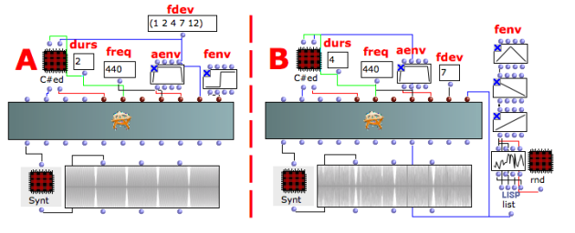
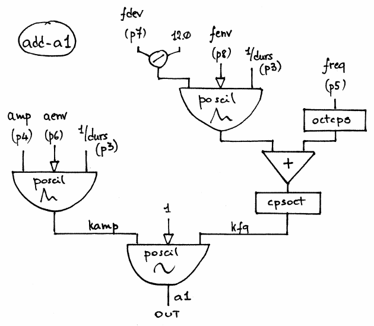

Navigation : [Previous](03-add-3 "page précédente\(Additive
Synthesys with ADD-3\)") | [Next](02-Buzz_Synthesis "page
suivante\(Buzz Synthesis\)")
## Tutorial ADD-A1

Specific Slots

Name

|

Description

|

Default value  
  
---|---|---  
  
amp

|

Maximum Amplitude. Linear from >0.0 to 1000 or in dB from 0 to -∞ (see
[Tutorial Getting Started 02 - Amplitude and Internal
Editor](03-Amplitude_and_internal_editor) for more details)

|

-6.0  
  
freq

|

(Minimum) current frequency [Hz]

|

440.0  
  
aenv

|

Amplitude Envelope [GEN]

|

Instance: GEN07  
  
fdev

|

(Minimum) frequency deviation [semitones]

|

1.0  
  
fenv

|

Envelope of the frequency deviation [GEN]

|

Instance: GEN07  
  
Class description

The ADD-A1 Class realizes an Additive Synthesis with the following controls:

  * The main amplitude,
  * The oscillator's frequency,
  * The amplitude envelope by means of a GEN routine,
  * The frequency deviation in semitones,
  * The envelope of frequency deviation by means of a GEN routine.

Patch description

The example A brings about a little portamento between two frequencies with an
interval of 1, 2, 4, 7, 12 semitones.

The example B collects 4 different frequency deviation envelopes.

Common Red Patches

For the red patches [Synt,](Synt)
[C#ed](Component_number_and_entry_delay) and
[rnd](Random_BPF) see
[Appendix-A](A-Appendix-A_Common_red_patches).

## Inside the Class

Csound Orchestra of the ADD-A1 Class.

instr 1

idur = p3

idurosc = 1/idur

iamp = (p4 > 0.0 ? (p4*0.001*0dbfs) : (ampdbfs (p4)))

ifq = p5

ifroct = octcps (ifq)

iaenv = p6

iaudiofun = 1

idfq = p7 / 12.0

ifenv = p8

kfq1 poscil idfq, idurosc, ifenv

kfq = cpsoct (kfq1 + ifroct)

kamp poscil iamp, idurosc, iaenv

a1 poscil kamp, kfq, iaudiofun

out a1

endin

References :

Plan :

  * [OMChroma User Manual](OMChroma)
  * [System Configuration and Installation](Installation)
  * [Getting started](Getting_Started)
  * [Managing GEN function and sound files](Managing_GEN_function_and_sound_files)
  * [Predefined Classes](Predefined_classes)
    * [Additive Synthesis](01-Additive_Synthesis)
      * [Additive Synthesys with ADD-1](01-add-1)
      * [Additive Synthesys with ADD-2](02-add-2)
      * [Additive Synthesys with ADD-3](03-add-3)
      * Additive Synthesys with ADD-A1
    * [Buzz Synthesis](02-Buzz_Synthesis)
    * [Frequency Modulation Synthesis](03-Frequency_modulation)
    * [Formant Wave-Function Synthesis (FOF)](04_Formant_Wave_Function_\(FOF\))
    * [Granular Formant Wave Function (FOG)](05-Granular_Formant_Wave_Function_\(FOG\))
    * [Karplus-Strong](06-Karplus-Strong)
    * [Random Amplitude Modulation](07-Random_Amplitude_Modulation)
    * [Sampler](08-Sampler)
    * [Subtractive Synthesis](09-Subtractive_Synthesis)
    * [Wave Shaping Synthesis](10-Waveshaping)
    * [Hybrid Models](11-Hybrid_Models)
  * [User-fun](User-fun)
  * [Creating a new Class](Creating_a_new_Class)
  * [Multichannel processing](06-Multichannel_processing)
  * [Appendix A - Common Red Patches](A-Appendix-A_Common_red_patches)

Navigation : [Previous](03-add-3 "page précédente\(Additive
Synthesys with ADD-3\)") | [Next](02-Buzz_Synthesis "page
suivante\(Buzz Synthesis\)")
