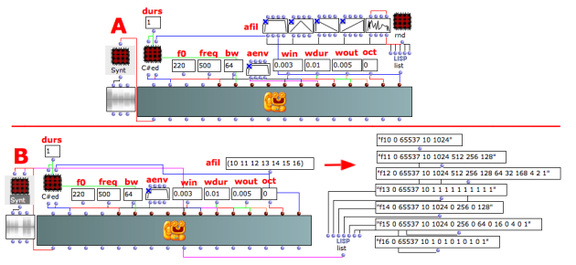
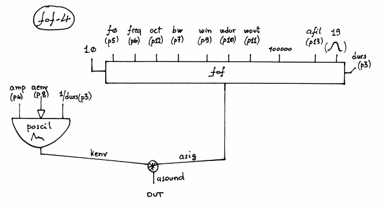

Navigation : [Previous](03_fof-3 "page précédente\(Formant Wave-
Function Synthesis with FOF-3\)") | [Next](05-fof-a1 "page
suivante\(Formant Wave-Function Synthesis with FOF-A1\)")

## Tutorial FOF-4

Specific Slots

Name

|

Description

|

Default value  
  
---|---|---  
  
amp

|

Maximum Amplitude. Linear from >0.0 to 1000 or in dB from 0 to -∞ (see
[Tutorial Getting Started 02 - Amplitude and Internal
Editor](03-Amplitude_and_internal_editor) for more details)

|

-6.0  
  
f0

|

Frequency of the impulses that create the sinebursts [Hz]

|

220.0  
  
freq

|

Formant frequency [Hz]

|

5  
  
bw

|

Formant bandwidth at -6dB [Hz]

|

0  
  
aenv

|

Amplitude Envelope [GEN]

|

Instance: GEN07  
  
win

|

Attack times of the sinusoid burst [sec]

|

0.01  
  
wdur

|

Duration of the sinusoid burst [sec]

|

0.2  
  
wout

|

Decay times of the sinusoid burst [sec]

|

0.1  
  
oct

|

Octaviation factor of the fof [flt >=0.0]

|

0.0  
  
afil

|

Table for sineburst synthesis (size of at least 4096 recommended) [GEN01 or
BPF]

|

32  
  
Class description

The FOF-4 Class realizes a Formant Wave-Function Synthesis with the following
controls:

  * The main amplitude,
  * The fundamental frequency,
  * The formant frequency,
  * The bandwidth of the formant,
  * The amplitude envelope by means of a GEN routine,
  * The attack, the oveall duration and decay of the sinusoid burst,
  * The octaviation factor,
  * The audio file (or table) for the sineburst synthesis.

Common parameters

For the explanation of **f0** , **freq** and **bw** see [Tutorial
FOF-1](01-fof-1)

For the explanation of **win** , **wdur** , **wout** and **oct** see [Tutorial
FOF-2](02-fof-2)

Patch description

The example A gives as audio file 5 different BPF.

The example B gives as audio file the table numbers which are passed to
synthesize by the keyword "tables".

Common Red Patches

For the red patches [Synt,](Synt)
[C#ed](Component_number_and_entry_delay) and
[rnd](Random_BPF) see
[Appendix-A](A-Appendix-A_Common_red_patches).

## Inside the Class

Csound Orchestra of the FOF-4 Class.

instr 1

idur = p3

idurosc = 1/p3

iamp = (p4 > 0.0 ? (p4*0.001*0dbfs) : (ampdbfs (p4)))

if0 = p5

ifreq = p6

ibw = p7

iaenv = p8

iwxin = p9

iwxdur = p10

iwxout = p11

ioct = p12

ifile = p13

iolaps = 100000 ; how many simultaneous FOFs can be played

; (takes little memory if not used)

imode = 0

iphs = 0

iskip = 0

isigfun = 19

; amplitude envelope

kenv poscil iamp, idurosc, iaenv

; xamp xfund xform oct kband kris kdur kdec iolaps ifna ifnb

asig fof 1.0, if0, ifreq, ioct, ibw, iwxin, iwxdur, iwxout, iolaps, ifile,
isigfun, idur, iphs, imode, iskip

asound = asig*kenv

outc asound

endin

Flow chart

References :

Plan :

  * [OMChroma User Manual](OMChroma)
  * [System Configuration and Installation](Installation)
  * [Getting started](Getting_Started)
  * [Managing GEN function and sound files](Managing_GEN_function_and_sound_files)
  * [Predefined Classes](Predefined_classes)
    * [Additive Synthesis](01-Additive_Synthesis)
    * [Buzz Synthesis](02-Buzz_Synthesis)
    * [Frequency Modulation Synthesis](03-Frequency_modulation)
    * [Formant Wave-Function Synthesis (FOF)](04_Formant_Wave_Function_\(FOF\))
      * [Formant Wave-Function Synthesis with FOF-1](01-fof-1)
      * [Formant Wave-Function Synthesis with FOF-2](02-fof-2)
      * [Formant Wave-Function Synthesis with FOF-3](03_fof-3)
      * Formant Wave-Function Synthesis with FOF-4
      * [Formant Wave-Function Synthesis with FOF-A1](05-fof-a1)
      * [Formant Wave-Function Synthesis with FOF-A4](06-fof-a4)
    * [Granular Formant Wave Function (FOG)](05-Granular_Formant_Wave_Function_\(FOG\))
    * [Karplus-Strong](06-Karplus-Strong)
    * [Random Amplitude Modulation](07-Random_Amplitude_Modulation)
    * [Sampler](08-Sampler)
    * [Subtractive Synthesis](09-Subtractive_Synthesis)
    * [Wave Shaping Synthesis](10-Waveshaping)
    * [Hybrid Models](11-Hybrid_Models)
  * [User-fun](User-fun)
  * [Creating a new Class](Creating_a_new_Class)
  * [Multichannel processing](06-Multichannel_processing)
  * [Appendix A - Common Red Patches](A-Appendix-A_Common_red_patches)

Navigation : [Previous](03_fof-3 "page précédente\(Formant Wave-
Function Synthesis with FOF-3\)") | [Next](05-fof-a1 "page
suivante\(Formant Wave-Function Synthesis with FOF-A1\)")
