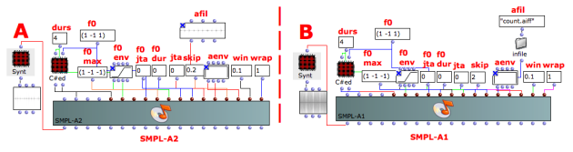
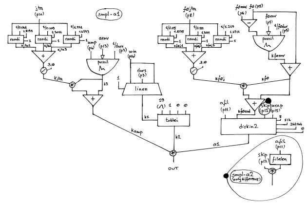

Navigation : [Previous](03-smpl-A1 "page précédente\(Reading from
a Sound file with SMPL-A1\)") | [page
suivante](02-Using_a_deferred_tables "Next\(Using a
deferred table\)")
# Reading from a Sound file with SMPL-A2

## Tutorial SMPL-A2

Specific Slots

Name

|

Description

|

Default value  
  
---|---|---  
  
amp

|

Maximum Amplitude. Linear from >0.0 to 1000 or in dB from 0 to -∞ (see
[Tutorial Getting Started 02 - Amplitude and Internal
Editor](03-Amplitude_and_internal_editor) for more details)

|

0.0  
  
f0

|

Minimum value of the pitch transposition of input sound by this factor (e.g.
0.5 means one octave lower, 2 is one octave higher, and 1 is the original
pitch). Fractional and negative values are allowed (the latter results in
playing the file backwards)

|

-2.0  
  
f0max

|

Maximum value of the pitch transposition of input sound by this factor .

|

-1.0  
  
f0env

|

Envelope of the pitch transposition between f0 and f0max

|

Instance: GEN07  
  
f0jta

|

Jitter's amplitude of the fundamental frequency [% of f0]

|

0.1  
  
f0dur

|

Duration of the envelope of the pitch transposition [sec, if 0, take global
duration]

|

0  
  
jta

|

Amplitude of the jitter/random source [%]

|

0.5  
  
afil

|

Audio file [name, with possible path, sound, string, pathname or GEN01]

|

File: santuri_96  
  
skip

|

(Minimum) starting point when reading an audio file [%]

|

1.0  
  
aenv

|

Amplitude Envelope [GEN]

|

Instance: GEN07  
  
win

|

Attack and decay time in [sec]

|

0.01  
  
wrap

|

Wrap flag: 0=locations beyond EOF produce silence, <>0=wrap from beg of file

|

1  
  
Class description

The SMPL-A2 Class is a Sampler similar to [SMPL-A1](03-smpl-A1) with the
following controls:

  * The main ampllitude,
  * The transposition range,
  * The transposition envelope by means of a GEN routine,
  * The frequency of the transposition envelope,
  * The range and amplitude of the jitter of the frequency,
  * The starting point of the audio file,
  * The amplitude envelope by means of a GEN routine,
  * The attack and decay time of the total duration of the amplitude envelope,
  * The wrapping mode (enable or disable)

Reminder

The only different between [SMPL-A1](03-smpl-A1) and SMPL-A2 is the
skipping allocation. In SMPL-A1 the skip time is set to an absolute value
(e.g. in seconds), instead in SMPL-A2 is set in relative value as a percentage
and that is really useful for reverse playing.

Patch description

The example A employs the SMPL-A2 instead the example B employs SMPL-A1 with
the same given data. How you can see the difference is the relative skip time
of SMPL-A2. Notice what happens when f0 and f0max are of opposite sign. The
audio file is read starting from the skip point in one direction for the half
time of the total duration after that come back to the skip point for the
second half time.

Reminder

The meaning of the other slots is the same as the SMPL-A1 Class. So see the
[[Tutorial SMPL-A1](03-smpl-A1)](01-smpl-1) for more details.

Common Red Patches

For the red patch [C#ed](Component_number_and_entry_delay) and
[Synt](Synt) see [ Appendix
A](A-Appendix-A_Common_red_patches)

## Inside the Class

Csound Orchestra of the SMPL-A2 Class.

instr 1

idur = p3

idurosc = 1/idur

iamp = (p4 > 0.0 ? (p4*0.001) : (10 ^ (p4/20.0)))

; amplitude relative to the sound file (to avoid multiplying twice)

if0min = p5 ; min transposition factor

if0max = p6

if0d = if0max-if0min

if0env = p7

if0jt = p8

if0dur = (p9 > 0.0 ? p9 : idur)

ijta = p10

ifile = p11

ilen filelen ifile

itmpsk = p12*ilen

iskip = (itmpsk < 0.0 ? (itmpsk*if0min) : itmpsk)

; to make the value not depend on the xposition factor if it's negative

print iskip

iaenv = p13 ; global amplitude envelope

iwin = (p14 > idur/2 ? idur/2 : p14) ; local envelope

iwout = iwin

iwrap = p15

ixmode = 1 ; index between 0 and 1

ixoff = 0 ; index offset

ixrap = 0 ; no wraparound in table reading

iformat = 8 ; 24-bit int, ignored if the sound file has a header

iwsize = 512 ; the bigger, the better the quality of the transposition

ibufsize = 262144 ; maximum = 1048576, higher makes less disk access

iskipinit = 0 ; do not skip initialization

isize = 1 ; 31-bit random number for randi

iaudiofun = 1

isigfun = 19 ; sigmoid function

;f0

; jitter for f0

; seed>1.0=> seed from the system time

kf0j1 randi if0jt, 1/0.05, 1.8135, isize

kf0j2 randi if0jt, 1/0.111, 1.3111, isize

kf0j3 randi if0jt, 1/1.219, 1.6711, isize

kf0j = (kf0j1+kf0j2+kf0j3)/3.0

;f0 envelope

kf0env poscil if0d, 1/if0dur, if0env

kf0 = kf0env+if0min

kf0end = kf0+(kf0*kf0j)

; local envelope (for the grain)

k1 linen 1,iwin,idur,iwout

k2 tablei k1,isigfun,ixmode,ixoff,ixrap

; jitter for amp

; seed>1.0=> seed from the system time

kjta1 randi ijta, 1/0.061, 1.8195, isize

kjta2 randi ijta, 1/0.109, 1.3011, isize

kjta3 randi ijta, 1/1.221, 1.6793, isize

kjta = (kjta1+kjta2+kjta3)/3.0

; global envelope

k3 poscil iamp, idurosc, iaenv

kamp = k3+(k3*kjta)

; file reading

a1 diskin2 ifile, kf0end, iskip, iwrap, iformat, iwsize, ibufsize, iskipinit

asound = a1*k2*kamp

outc asound

endin

Flow chart

References :

Plan :

  * [OMChroma User Manual](OMChroma)
  * [System Configuration and Installation](Installation)
  * [Getting started](Getting_Started)
  * [Managing GEN function and sound files](Managing_GEN_function_and_sound_files)
  * [Predefined Classes](Predefined_classes)
    * [Additive Synthesis](01-Additive_Synthesis)
    * [Buzz Synthesis](02-Buzz_Synthesis)
    * [Frequency Modulation Synthesis](03-Frequency_modulation)
    * [Formant Wave-Function Synthesis (FOF)](04_Formant_Wave_Function_\(FOF\))
    * [Granular Formant Wave Function (FOG)](05-Granular_Formant_Wave_Function_\(FOG\))
    * [Karplus-Strong](06-Karplus-Strong)
    * [Random Amplitude Modulation](07-Random_Amplitude_Modulation)
    * [Sampler](08-Sampler)
      * [Reading from a sound file](01-Reading_from_a_Sound_File)
        * [Reading from a Sound file with SMPL-1](01-smpl-1)
        * [Reading from a Sound file with SMPL-2](02-smpl-2)
        * [Reading from a Sound file with SMPL-A1](03-smpl-A1)
        * Reading from a Sound file with SMPL-A2
      * [Using a deferred table](02-Using_a_deferred_tables)
      * [Crossfading Looper](03-Crossfading_Looper)
    * [Subtractive Synthesis](09-Subtractive_Synthesis)
    * [Wave Shaping Synthesis](10-Waveshaping)
    * [Hybrid Models](11-Hybrid_Models)
  * [User-fun](User-fun)
  * [Creating a new Class](Creating_a_new_Class)
  * [Multichannel processing](06-Multichannel_processing)
  * [Appendix A - Common Red Patches](A-Appendix-A_Common_red_patches)

Navigation : [Previous](03-smpl-A1 "page précédente\(Reading from
a Sound file with SMPL-A1\)") | [page
suivante](02-Using_a_deferred_tables "Next\(Using a
deferred table\)")
