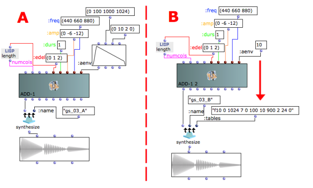

Navigation : [Previous](03-Amplitude_and_internal_editor "page
précédente\(Amplitude and Internal Editor\)") | [page
suivante](05-f-GEN_Reserved_Number "Next\(f-GEN Reserved
Numbers\)")
## Tutorial Getting Started 03 - Amplitude Envelope

Two different ways to generate the same Amplitude Envelope.

## Break Point Function versus GEN Routine

Reminder

To add keywords to **synthesize** type "k" ("shift + K" to remove them). To
select a given keyword do "alt+click" on the keyword's inlet (dark blue) and
choose the desired item from the pop-up menu.

 **:name** is the the audio-file name. One must have different names for
audio-files, if one wants to compare them. Otherwise, all the sound rendering
will have the default name (my_synt.aiff) and the last rendering will
overwrite the old one.

 **:tables** are the Csound's f-tables generator subroutines, or GEN
functions. Give the f-statement as in Csound (see the Csound documentation for
details), but between double quotes; several tables can also be used if they
are placed in a list (of tables between double quotes).

In both examples we have :

3 events one after the other -> :edel 0 1 2 (sec.) with

3 different frequencies -> :freq 440 660 880 (Hz) and

3 different maximum amplitudes -> :amp 0 -6 -12 (dB)

all the events are 1 second long :durs 1 (sec.)

BUT

In example A the Amplitude Envelope is made by a [BPF](http://support-
old.ircam.fr/forum-ol-doc/om/om6-manual/co/Edition "http://support-
old.ircam.fr/forum-ol-doc/om/om6-manual/co/Edition \(nouvelle fenêtre\)")
(Break Point Function) which is directly connected to the :aenv slot.

In example B the Amplitude Envelope is made by a [GEN
subroutine](01-Csound) (GEN function number 7, f-table number 10) which
is instanciated by the **synthesize** 's keyword inlet (:tables). The number
of the f-table is to be specified in the :aenv slot of ADD-1.

Both examples generate exactly the same result.

References :

Plan :

  * [OMChroma User Manual](OMChroma)
  * [System Configuration and Installation](Installation)
  * [Getting started](Getting_Started)
    * [Class Input Slots](01-Class_Input_Slots)
    * [Slots' Description and Default Values](02-Slot's_Description)
    * [Amplitude and Internal Editor](03-Amplitude_and_internal_editor)
    * Amplitude Envelope
    * [f-GEN Reserved Numbers](05-f-GEN_Reserved_Number)
    * [Audio Waveforms](06-Audio_Waveforms)
    * [Chord-seq to OMChroma](07-Chord-seq_to_OMCh_Class)
    * [Spectrum Chord and Arpeggio](08-Spectrum_Chord_and_Arpeggio)
    * [Velocity versus Amplitude](09-Velocity_vs_Amplitude)
    * [Exponential Amplitude Envelope with a BPF](10-Exponential_Amplitude_Envelope_with_BPF)
    * [Relationship with the Csound .orc and .sco files](11-Relationship_with_the_Csound_orc_and_sco_files)
    * [Slots polymorphism](12-Slots_polymorphism)
  * [Managing GEN function and sound files](Managing_GEN_function_and_sound_files)
  * [Predefined Classes](Predefined_classes)
  * [User-fun](User-fun)
  * [Creating a new Class](Creating_a_new_Class)
  * [Multichannel processing](06-Multichannel_processing)
  * [Appendix A - Common Red Patches](A-Appendix-A_Common_red_patches)

Navigation : [Previous](03-Amplitude_and_internal_editor "page
précédente\(Amplitude and Internal Editor\)") | [page
suivante](05-f-GEN_Reserved_Number "Next\(f-GEN Reserved
Numbers\)")
