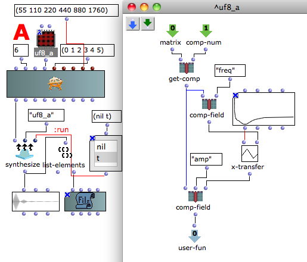

Navigation : [Previous](04-Using_keywords "page
précédente\(Using keywords\)") | [Next](06-Filter "page
suivante\(Filter\)")

Patch description

This user-fun rescales the amplitude of each component according to the
Fletcher-Munson equal-loudness curve.

Program flow

  * The [BPF](http://support-old.ircam.fr/forum-ol-doc/om/om6-manual/co/BPF-BPC "http://support-old.ircam.fr/forum-ol-doc/om/om6-manual/co/BPF-BPC \(nouvelle fenêtre\)") class collects one of the Fletcher-Munson equal-loudness curve,
  * The [x-tranfert](http://support-old.ircam.fr/forum-ol-doc/om/om6-manual/co/Tools "http://support-old.ircam.fr/forum-ol-doc/om/om6-manual/co/Tools \(nouvelle fenêtre\)") function passes the amplitude value reading the curve stored in the BPF as function of the frequency.

References :

Plan :

  * [OMChroma User Manual](OMChroma)
  * [System Configuration and Installation](Installation)
  * [Getting started](Getting_Started)
  * [Managing GEN function and sound files](Managing_GEN_function_and_sound_files)
  * [Predefined Classes](Predefined_classes)
  * [User-fun](User-fun)
    * [Replace data](01-Replace_data)
    * [Read modify and replace](02-Read_modify_and_replace)
    * [Add components](03-Add_components)
    * [Using keywords](04-Using_keywords)
    * Fletcher-Munson curve
    * [Filter](06-Filter)
  * [Creating a new Class](Creating_a_new_Class)
  * [Multichannel processing](06-Multichannel_processing)
  * [Appendix A - Common Red Patches](A-Appendix-A_Common_red_patches)

Navigation : [Previous](04-Using_keywords "page
précédente\(Using keywords\)") | [Next](06-Filter "page
suivante\(Filter\)")
