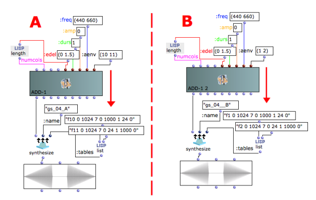

Navigation : [Previous](04_Amplitude_envelope "page
précédente\(Amplitude Envelope\)") | [Next](06-Audio_Waveforms
"Next\(Audio Waveforms\)")

GEN number **WARNING**.

## f#1

Some f-tables have reserved numbers within OMChroma. All these reserved tables
are documented in the OMChroma documentation under the chapter **Csound Tables
Conventions** (see also below for the complete list).

To understand which consequences overwriting a reserved table might have, look
at the example above. The f-table number 1 (f1) is reserved for the audio
waveform. The default audio form is a sine wave.

In the example B f1 is overwritten and defined as an amplitude envelope passed
to the **tables** keyword of **synthesize**. However, since f1 is also used as
the audio waveform, both the audio oscillator AND the amplitude envelope will
use the same table. This radically changes the resulting sound. To hear the
result, render the patch and play the result of the computation.

Warning

Don't use the reserved numbers when writing the GEN tables as Amplitude
Envelopes.

Reserved Csound f-tables.

1 Audio sine wave (default size: 65537 points)

2 Vibrato or modulating sine wave (default size: 65537 points)

3 Tremolo sine wave (default size: 65537 points)

4 Large non-interpolating sine wave (default size: 16777216 points)

5 Large cosine (for the buzz module, default size: 65537 points)

6 Ascending linear segment for glissandi (0->1)

7 Triangle function

8 Straight line = 1

10 Transfer function for waveshaping

11 Noise-modulated sine wave

12 Sine wave with only one high partial (10th)

13 Pseudo-inharmonic spectrum made of high partials

19 Large sigmoid rise/decay (1/2 cosine, 65536 points)

20 Interpolating ascending sigmoid rise (1/2 cosine, 65537 points)

21 Interpolating descending sigmoid rise (1/2 cosine, 65537 points)

22 Sine-based bell shape (sine from -90 to 270, 65537 points)

23 Slowly descending exponential envelope

24 Rapidly descending exponential envelope

31 Audio file (for granular synthesis)

32 Short audio file (for granular synthesis)

Overwriting reserved tables

For experience users of OMChroma it is always possible to overwrite reserved
tables by passing a new table with the same number to the keyword **tables**
of **synthesize**. However, one should exactly know what one is doing. A
simple case is discussed in the next tutorial.

References :

Plan :

  * [OMChroma User Manual](OMChroma)
  * [System Configuration and Installation](Installation)
  * [Getting started](Getting_Started)
    * [Class Input Slots](01-Class_Input_Slots)
    * [Slots' Description and Default Values](02-Slot's_Description)
    * [Amplitude and Internal Editor](03-Amplitude_and_internal_editor)
    * [Amplitude Envelope](04_Amplitude_envelope)
    * f-GEN Reserved Numbers
    * [Audio Waveforms](06-Audio_Waveforms)
    * [Chord-seq to OMChroma](07-Chord-seq_to_OMCh_Class)
    * [Spectrum Chord and Arpeggio](08-Spectrum_Chord_and_Arpeggio)
    * [Velocity versus Amplitude](09-Velocity_vs_Amplitude)
    * [Exponential Amplitude Envelope with a BPF](10-Exponential_Amplitude_Envelope_with_BPF)
    * [Relationship with the Csound .orc and .sco files](11-Relationship_with_the_Csound_orc_and_sco_files)
    * [Slots polymorphism](12-Slots_polymorphism)
  * [Managing GEN function and sound files](Managing_GEN_function_and_sound_files)
  * [Predefined Classes](Predefined_classes)
  * [User-fun](User-fun)
  * [Creating a new Class](Creating_a_new_Class)
  * [Multichannel processing](06-Multichannel_processing)
  * [Appendix A - Common Red Patches](A-Appendix-A_Common_red_patches)

Navigation : [Previous](04_Amplitude_envelope "page
précédente\(Amplitude Envelope\)") | [Next](06-Audio_Waveforms
"Next\(Audio Waveforms\)")
