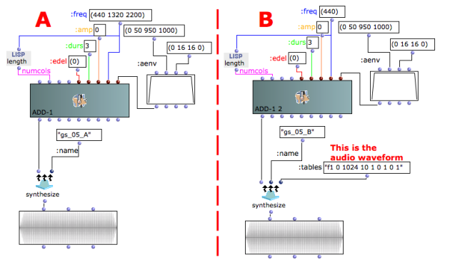
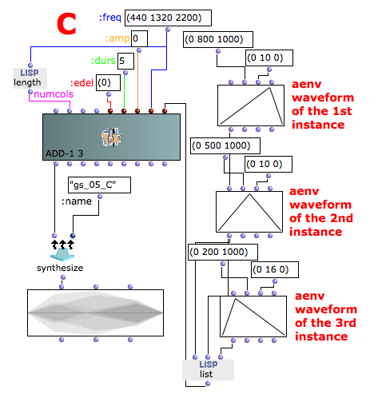

Navigation : [Previous](05-f-GEN_Reserved_Number "page
précédente\(f-GEN Reserved Numbers\)") | [Next](07-Chord-
seq_to_OMCh_Class "Next\(Chord-seq to OMChroma\)")

Additive synthesis with a GEN function vs. multilayer sine tones.

## Audio Waveforms

In the example A the oscillator uses the default audio waveform (a sine tone).
There are 3 harmonically related frequencies: 440 Hz, 1320 Hz (3rd harmonic)
and 2200 (5th harmonic). All the instances have the same entry delay.

This method allows for the maximum freedom, since all kinds of frequencies can
be specified. Moreover, the timing characteristics (entry delay and duration),
as well as the amplitude envelope of each frequency can be individually
specified (see also below, **Limits of the GEN functions as waveform** ).

However, this requires more data and is computationally less efficient than
the method used in the example B.

The Example B uses as f1 (the audio waveform) the GEN10 function, which
generates composite waveforms made up of weighted sums of simple harmonically
related sinusoids. The relative amplitudes of the partials numbers 1, 2, 3,
etc. are specified starting from p5 (5th field of the list, the field after
the number 10) as numbers between 0 and 1 (see the Csound documentation for
further information).

Here, the following values are used:

1st harmonic with amplitude 1

2nd harmonic with amplitude 0

3rd harmonic with amplitude 1

4th harmonic with amplitude 0

5th harmonic with amplitude 1

This method is very efficient, but it is really useful only the same steady
waveform is requested.

Render and play the result of examples A and B. The audio files are the same.

## Limits of the GEN functions as waveform

When using a GEN function as an audio table (as in the example B above), only
one amplitude envelope for all the components can be specified, since all the
harmonic components are already inside the waveform.

If different amplitude envelopes for each components are needed follow the
example below. The same strategy can be applied to give different entry delays
or durations to the individual components.

References :

Plan :

  * [OMChroma User Manual](OMChroma)
  * [System Configuration and Installation](Installation)
  * [Getting started](Getting_Started)
    * [Class Input Slots](01-Class_Input_Slots)
    * [Slots' Description and Default Values](02-Slot's_Description)
    * [Amplitude and Internal Editor](03-Amplitude_and_internal_editor)
    * [Amplitude Envelope](04_Amplitude_envelope)
    * [f-GEN Reserved Numbers](05-f-GEN_Reserved_Number)
    * Audio Waveforms
    * [Chord-seq to OMChroma](07-Chord-seq_to_OMCh_Class)
    * [Spectrum Chord and Arpeggio](08-Spectrum_Chord_and_Arpeggio)
    * [Velocity versus Amplitude](09-Velocity_vs_Amplitude)
    * [Exponential Amplitude Envelope with a BPF](10-Exponential_Amplitude_Envelope_with_BPF)
    * [Relationship with the Csound .orc and .sco files](11-Relationship_with_the_Csound_orc_and_sco_files)
    * [Slots polymorphism](12-Slots_polymorphism)
  * [Managing GEN function and sound files](Managing_GEN_function_and_sound_files)
  * [Predefined Classes](Predefined_classes)
  * [User-fun](User-fun)
  * [Creating a new Class](Creating_a_new_Class)
  * [Multichannel processing](06-Multichannel_processing)
  * [Appendix A - Common Red Patches](A-Appendix-A_Common_red_patches)

Navigation : [Previous](05-f-GEN_Reserved_Number "page
précédente\(f-GEN Reserved Numbers\)") | [Next](07-Chord-
seq_to_OMCh_Class "Next\(Chord-seq to OMChroma\)")
