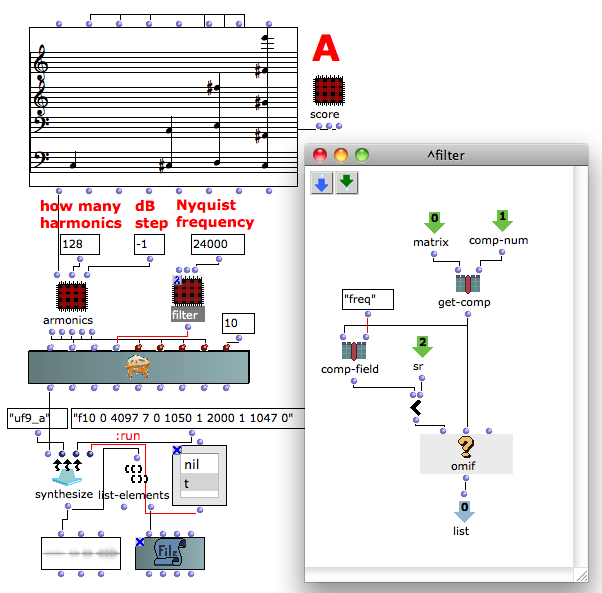

Navigation : [Previous](05-Fletcher-Munson_curve "page
précédente\(Fletcher-Munson curve\)") | [page
suivante](Creating_a_new_Class "Next\(Creating a new
Class\)")
## Tutorial User-fun 09 - Nyquist frequency's filter

Patch description

This user-fun removes all the frequencies higher than the sample rate.

Program flow

This patch is quite developed and we see only the part regarding to the user
fun. The armonics sub-patch builds a series of "how many harmonics" for each
incoming frequency. Each harmonic amplitude serie has progressively amplitude
"dB step" expressed in decibel.

  * The function om< checks the frequency of each component,
  * The function [omif](http://support-old.ircam.fr/forum-ol-doc/om/om6-manual/co/ConditionalOps "http://support-old.ircam.fr/forum-ol-doc/om/om6-manual/co/ConditionalOps \(nouvelle fenêtre\)") passes only the frequencies lower than the sample rate and removes the higher one.

References :

Plan :

  * [OMChroma User Manual](OMChroma)
  * [System Configuration and Installation](Installation)
  * [Getting started](Getting_Started)
  * [Managing GEN function and sound files](Managing_GEN_function_and_sound_files)
  * [Predefined Classes](Predefined_classes)
  * [User-fun](User-fun)
    * [Replace data](01-Replace_data)
    * [Read modify and replace](02-Read_modify_and_replace)
    * [Add components](03-Add_components)
    * [Using keywords](04-Using_keywords)
    * [Fletcher-Munson curve](05-Fletcher-Munson_curve)
    * Filter
  * [Creating a new Class](Creating_a_new_Class)
  * [Multichannel processing](06-Multichannel_processing)
  * [Appendix A - Common Red Patches](A-Appendix-A_Common_red_patches)

Navigation : [Previous](05-Fletcher-Munson_curve "page
précédente\(Fletcher-Munson curve\)") | [page
suivante](Creating_a_new_Class "Next\(Creating a new
Class\)")
