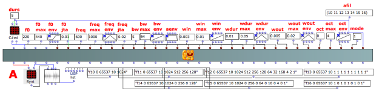
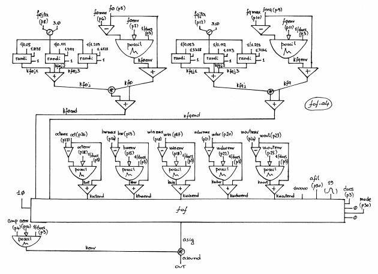

Navigation : [Previous](05-fof-a1 "page précédente\(Formant Wave-
Function Synthesis with FOF-A1\)") | [page
suivante](05-Granular_Formant_Wave_Function_\(FOG\) "page
suivante\(Granular Formant Wave Function \(FOG\)\)")
# Formant Wave-Function Synthesis with FOF-A4

## Tutorial FOF-A4

Specific Slots

Name

|

Description

|

Default value  
  
---|---|---  
  
amp

|

Maximum Amplitude. Linear from >0.0 to 1000 or in dB from 0 to -∞ (see
[Tutorial Getting Started 02 - Amplitude and Internal
Editor](03-Amplitude_and_internal_editor) for more details)

|

-6.0  
  
f0

|

Minimum fundamental frequency of the impulses that create the sinebursts [Hz]

|

131.0  
  
f0max

|

Maximum fundamental frequency of the impulses that create the sinebursts [Hz]

|

165.0  
  
f0env

|

Envelope of the fundamental frequency of the impulses that create the
sinebursts [GEN]

|

Instance: GEN07  
  
f0jta

|

Jitter's amplitude of the fundamental frequency [% of f0]

|

0.06  
  
freq

|

Minimum formant frequency [Hz]

|

2.0  
  
fqmax

|

Maximum formant frequency [Hz]

|

1.0  
  
fqenv

|

Envelope of the formant frequency [GEN]

|

Instance: GEN07  
  
fqjta

|

Jitter's amplitude of the formant frequency [% of freq]

|

0.1  
  
bw

|

Minimum formant bandwidth at -6dB [Hz]

|

0.0  
  
bwmax

|

Maximum formant bandwidth at -6dB [Hz]

|

0.0  
  
bwenv

|

Envelope of the formant bandwidth at -6dB [GEN]

|

Instance: GEN07  
  
aenv

|

Amplitude Envelope [GEN]

|

Instance: GEN07  
  
win

|

Minimum attack times of the sinusoid burst [sec]

|

0.003  
  
winmax

|

Maximum attack times of the sinusoid burst [sec]

|

0.01  
  
winenv

|

Envelope of the attack times of the sinusoid burst [GEN]

|

Instance: GEN07  
  
wdur

|

Minimum duration of the sinusoid burst [sec]

|

0.1  
  
wdurmax

|

Maximum duration of the sinusoid burst [sec]

|

1  
  
wdurenv

|

Envelope of the duration of the sinusoid burst [GEN]

|

Instance: GEN07  
  
wout

|

Minimum decay times of the sinusoid burst [sec]

|

0.02  
  
woutmax

|

Maximum decay times of the sinusoid burst [sec]

|

0.2  
  
woutenv

|

Envelope of the decay times of the sinusoid burst [GEN]

|

Instance: GEN07  
  
oct

|

Minimum octaviation factor of the fof [flt >=0.0]

|

0.0  
  
octmax

|

Maximum octaviation factor of the fof [flt >=0.0]

|

1.0  
  
octenv

|

Envelope of the octaviation factor of the fof [GEN]

|

Instance: GEN07  
  
amode

|

Formant frequency mode [0=no glissando within each grain]

|

1  
  
afil

|

Table for sineburst synthesis (size of at least 4096 recommended) [GEN01 or
BPF]

|

32  
  
Class description

The FOF-A4 Class realizes a Formant Wave-Function Synthesis with the following
controls:

  * The main amplitude,
  * The fundamental frequency (envelope between the minimum value and the maximum value and jitter),
  * The formant frequency (envelope between the minimum value and the maximum value and jitter),
  * The bandwidth of the formant (envelope between the minimum value and the maximum value),
  * The amplitude envelope by means of a GEN routine,
  * The attack, the oveall duration and decay of the sinusoid burst (envelope between the minimum value and the maximum value),
  * The octaviation factor (envelope between the minimum value and the maximum value),
  * The formant frequency mode (glissando within each grain),
  * The audio file (or table) for the sineburst synthesis.

Common parameters

For the explanation of **f0** , **freq** and **bw** see [Tutorial
FOF-1](01-fof-1)

For the explanation of **win** , **wdur** , **wout** and **oct** see [Tutorial
FOF-2](02-fof-2)

For the explanation of afil see [Tutorial FOF-4](04-fof-4)

Patch description

The example A shows some possibilities of this class.

Common Red Patches

For the red patch [C#ed](Component_number_and_entry_delay) and
[Synt](Synt) see [ Appendix
A](A-Appendix-A_Common_red_patches)

## Inside the Class

Csound Orchestra of the FOF-A4 Class.

instr 1

idur = p3

idurosc = 1/p3

iamp = (p4 > 0.0 ? (p4*0.001*0dbfs) : (ampdbfs (p4)))

if0min = p5

if0max = p6

if0d = if0max-if0min

if0env = p7

if0jt = p8/3.0 ; three modules

ifqmin = p9

ifqmax = p10

ifqd = ifqmax-ifqmin

ifqenv = p11

ifqjt = p12/3.0

ibwmin = p13

ibwmax = p14

ibwd = ibwmax-ibwmin

ibwenv = p15

iaenv = p16

iwinmin = p17

iwinmax = p18

iwind = iwinmax-iwinmin

iwinenv = p19

iwdurmin= p20

iwdurmax= p21

iwdurd = iwdurmax-iwdurmin

iwdurenv= p22

iwoutmin= p23

iwoutmax= p24

iwoutd = iwoutmax-iwoutmin

iwoutenv= p25

ioctmin = p26

ioctmax = p27

ioctd = ioctmax-ioctmin

ioctenv = p28

imode = p29

ifile = p30

iolaps = 100000 ; how many simultaneous FOFs can be played

; (takes little memory if not used)

iphs = 0

iskip = 0

isize = 1 ; 31-bit random numbers for randi

isigfun = 19

;f0

; jitter for f0

; seed>1.0=> seed from the system time

kf0j1 randi if0jt, 1/0.05, 1.8135, isize

kf0j2 randi if0jt, 1/0.111, 1.3111, isize

kf0j3 randi if0jt, 1/1.219, 1.6711, isize

kf0j = (kf0j1+kf0j2+kf0j3)

;f0 envelope

kf0env poscil if0d, idurosc, if0env

kf0 = kf0env+if0min

kf0end = kf0+(kf0*kf0j)

;freq

; jitter for freq

kfqj1 randi ifqjt, 1/0.053, 1.5318, isize

kfqj2 randi ifqjt, 1/0.112, 1.1113, isize

kfqj3 randi ifqjt, 1/1.215, 1.7166, isize

kfqj = (kfqj1+kfqj2+kfqj3)

;freq envelope

kfqenv poscil ifqd, idurosc, ifqenv

kfq = kfqenv+ifqmin

kfqend = kfq+(kfq*kfqj)

;bw

kbw poscil ibwd, idurosc, ibwenv

kbwend = ibwmin+kbw

;krise (win)

kwin poscil iwind, idurosc, iwinenv

kwinend = iwinmin+kwin

;kdur (wdur)

kwdur poscil iwdurd, idurosc, iwdurenv

kwdurend = iwdurmin+kwdur

;kdec (wout)

kwout poscil iwoutd, idurosc, iwoutenv

kwoutend = iwoutmin+kwout

;koct

koct poscil ioctd, idurosc, ioctenv

koctend = ioctmin+koct

; amplitude envelope

kenv poscil iamp, idurosc, iaenv

; xamp xfund xform oct kband kris kdur kdec iolaps ifna ifnb

asig fof 1.0, kf0end, kfqend, koctend, kbwend, kwinend, kwdurend, kwoutend, \

iolaps, ifile, isigfun, idur, iphs, imode, iskip

asound = asig*kenv

outc asound

endin

Flow chart

References :

Plan :

  * [OMChroma User Manual](OMChroma)
  * [System Configuration and Installation](Installation)
  * [Getting started](Getting_Started)
  * [Managing GEN function and sound files](Managing_GEN_function_and_sound_files)
  * [Predefined Classes](Predefined_classes)
    * [Additive Synthesis](01-Additive_Synthesis)
    * [Buzz Synthesis](02-Buzz_Synthesis)
    * [Frequency Modulation Synthesis](03-Frequency_modulation)
    * [Formant Wave-Function Synthesis (FOF)](04_Formant_Wave_Function_\(FOF\))
      * [Formant Wave-Function Synthesis with FOF-1](01-fof-1)
      * [Formant Wave-Function Synthesis with FOF-2](02-fof-2)
      * [Formant Wave-Function Synthesis with FOF-3](03_fof-3)
      * [Formant Wave-Function Synthesis with FOF-4](04-fof-4)
      * [Formant Wave-Function Synthesis with FOF-A1](05-fof-a1)
      * Formant Wave-Function Synthesis with FOF-A4
    * [Granular Formant Wave Function (FOG)](05-Granular_Formant_Wave_Function_\(FOG\))
    * [Karplus-Strong](06-Karplus-Strong)
    * [Random Amplitude Modulation](07-Random_Amplitude_Modulation)
    * [Sampler](08-Sampler)
    * [Subtractive Synthesis](09-Subtractive_Synthesis)
    * [Wave Shaping Synthesis](10-Waveshaping)
    * [Hybrid Models](11-Hybrid_Models)
  * [User-fun](User-fun)
  * [Creating a new Class](Creating_a_new_Class)
  * [Multichannel processing](06-Multichannel_processing)
  * [Appendix A - Common Red Patches](A-Appendix-A_Common_red_patches)

Navigation : [Previous](05-fof-a1 "page précédente\(Formant Wave-
Function Synthesis with FOF-A1\)") | [page
suivante](05-Granular_Formant_Wave_Function_\(FOG\) "page
suivante\(Granular Formant Wave Function \(FOG\)\)")
