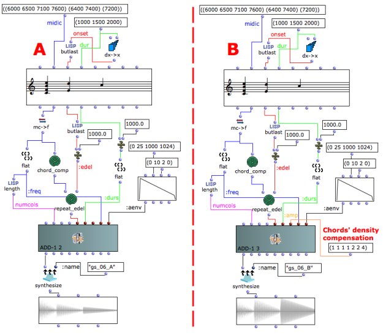
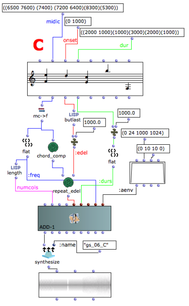

Navigation : [Previous](06-Audio_Waveforms "page
précédente\(Audio Waveforms\)") | [page
suivante](08-Spectrum_Chord_and_Arpeggio "Next\(Spectrum
Chord and Arpeggio\)")
## Tutorial Getting Started 06 - Chord-seq to OMChroma

Passing data from Chord-seq to an OMChroma synthesis class (as add-1).

## Data Conversion

The **chord-seq** 's data must be converted in order to be used with Csound.

The conversions requested are the following:

  * midicent to frequency using the **mc- >f** function
  * time from milliseconds to seconds dividing by 1000 onsets and durations (or using the **ms- >sec** function)
  * velocity to amplitude (for more details see **Tutorial 01_08 Velocity versus Amplitude** ).

In the example A observe in the **sound** object the amplitude of the chords
rendered by **add-1**.

The first chord has 4 notes and an amplitude of 0 dB.

The second chord has 2 notes and an amplitude of about 1/2 of the first one.

The third chord has only 1 note and an amplitude of about 1/4 of the first
one.

Although it is difficult to exactly compute the amount (as it depends on the
frequency and phase of each note), the amplitude of 4 simultaneous notes is
higher than that of 2 notes, and therefore a sort of amplitude compensation
might be needed.

In the example B the list of amplitudes (1 1 1 1 2 2 4) balances the density
of the chords.

Amplitude balance

The way to balance amplitudes shown above does not refer to loudness
(perceptual amplitude), but only to the signal's highest value. Compensating
loudnesses of complex signals is a very tricky process, which will not be
explained in this documentation.

## Polyphony

The example C gives a demonstration of the usage of polyphony without chord's
density compensation.

References :

Plan :

  * [OMChroma User Manual](OMChroma)
  * [System Configuration and Installation](Installation)
  * [Getting started](Getting_Started)
    * [Class Input Slots](01-Class_Input_Slots)
    * [Slots' Description and Default Values](02-Slot's_Description)
    * [Amplitude and Internal Editor](03-Amplitude_and_internal_editor)
    * [Amplitude Envelope](04_Amplitude_envelope)
    * [f-GEN Reserved Numbers](05-f-GEN_Reserved_Number)
    * [Audio Waveforms](06-Audio_Waveforms)
    * Chord-seq to OMChroma
    * [Spectrum Chord and Arpeggio](08-Spectrum_Chord_and_Arpeggio)
    * [Velocity versus Amplitude](09-Velocity_vs_Amplitude)
    * [Exponential Amplitude Envelope with a BPF](10-Exponential_Amplitude_Envelope_with_BPF)
    * [Relationship with the Csound .orc and .sco files](11-Relationship_with_the_Csound_orc_and_sco_files)
    * [Slots polymorphism](12-Slots_polymorphism)
  * [Managing GEN function and sound files](Managing_GEN_function_and_sound_files)
  * [Predefined Classes](Predefined_classes)
  * [User-fun](User-fun)
  * [Creating a new Class](Creating_a_new_Class)
  * [Multichannel processing](06-Multichannel_processing)
  * [Appendix A - Common Red Patches](A-Appendix-A_Common_red_patches)

Navigation : [Previous](06-Audio_Waveforms "page
précédente\(Audio Waveforms\)") | [page
suivante](08-Spectrum_Chord_and_Arpeggio "Next\(Spectrum
Chord and Arpeggio\)")
