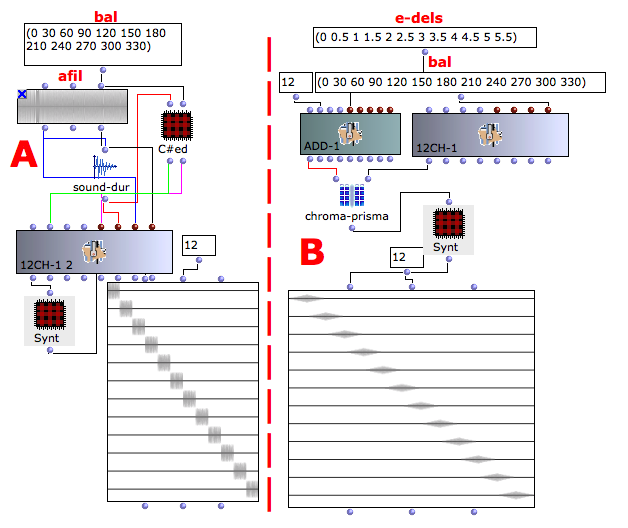

Navigation : [Previous](07-8ch-1 "page précédente\(Multichannel
Processing with 8CH-1\)") | [page
suivante](A-Appendix-A_Common_red_patches "Next\(Appendix
A - Common Red Patches\)")

## Tutorial 12CH-1

Specific Slots

Name

|

Description

|

Default value  
  
---|---|---  
  
e-dels

|

Entry delays [sec], time interval between the object's "action-time" and the
beginning of each line in the score.

|

0  
  
durs

|

Duration of each line in the score [sec]

|

1  
  
afile

|

File name

|

nil  
  
bal

|

Panning in degree : 0=output1, 30 =output2, 60=output3, 90=output4,
120=output5, 150=output6, 180=output7, 210=output8, 240=output9, 270=output10,
300=output11, 330=output12

|

0  
  
Class description

The 12ch-1 Class allows to place the audio source in a dodecaphonic space with
the following controls :

  * The position in the dodecaphonic space,
  * The duration of the single event,
  * The entry delay of each event.

Patch description

The example A shows how to place a mono sound file in a dodecaphonic space
using the class Sound directly connects to 12ch-1.

The example B shows how to use the generic function Chroma-Prisma to place a
mono sound file in a dodecaphonic space.

Common Red Patches

For the red patches [Synt,](Synt) and
[C#ed](Component_number_and_entry_delay) and see
[Appendix-A](A-Appendix-A_Common_red_patches).

References :

Plan :

  * [OMChroma User Manual](OMChroma)
  * [System Configuration and Installation](Installation)
  * [Getting started](Getting_Started)
  * [Managing GEN function and sound files](Managing_GEN_function_and_sound_files)
  * [Predefined Classes](Predefined_classes)
  * [User-fun](User-fun)
  * [Creating a new Class](Creating_a_new_Class)
  * [Multichannel processing](06-Multichannel_processing)
    * [Multichannel Processing with Stereo-1](01-stereo-1)
    * [Multichannel Processing with Stereo-2](02-stereo-2)
    * [Multichannel Processing with 4CH-1](03-4ch-1)
    * [Multichannel Processing with 4CH-2](04-4ch-2)
    * [Multichannel Processing with 5CH-1](05-5ch-1)
    * [Multichannel Processing with 6CH-1](06-6ch-1)
    * [Multichannel Processing with 8CH-1](07-8ch-1)
    * Multichannel Processing with 12CH-1
  * [Appendix A - Common Red Patches](A-Appendix-A_Common_red_patches)

Navigation : [Previous](07-8ch-1 "page précédente\(Multichannel
Processing with 8CH-1\)") | [page
suivante](A-Appendix-A_Common_red_patches "Next\(Appendix
A - Common Red Patches\)")
