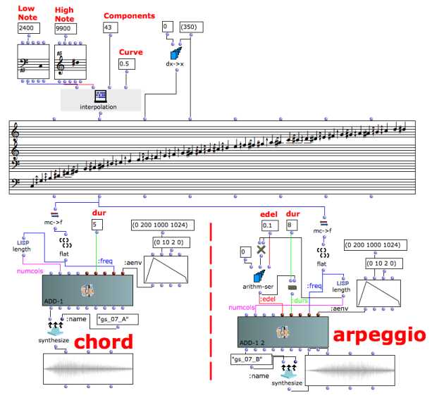

Navigation : [Previous](07-Chord-seq_to_OMCh_Class "page
précédente\(Chord-seq to OMChroma\)") | [page
suivante](09-Velocity_vs_Amplitude "Next\(Velocity versus
Amplitude\)")
## Tutorial Getting Started 07 - Spectrum Chord and Arpeggio

Building a spectrum chord and an arpeggio

## First additive synthesis patch

This example shows how to build a spectral chord or a spectral arpeggio. Try
to modify the data and hear the results.

Low Note

|

The lowest pitch of the spectrum expressed in midicent.  
  
---|---  
  
High Note

|

The highest pitch of the spectrum expressed in midicent.  
  
Components

|

Total amount of components including the first and last pitch.  
  
Curve

|

Exponential factor of the interpolation. 0=linear (positive and negative
numbers are allowed).  
  
dur

|

Duration of the sound.  
  
edel

|

Delay time between each component. Beware that the number of components
multiplied by the delay time be not be greater than the duration
(Components*edel<dur). In other words, the components whose entry delay is
bigger than the duration will not be rendered.  
  
References :

Plan :

  * [OMChroma User Manual](OMChroma)
  * [System Configuration and Installation](Installation)
  * [Getting started](Getting_Started)
    * [Class Input Slots](01-Class_Input_Slots)
    * [Slots' Description and Default Values](02-Slot's_Description)
    * [Amplitude and Internal Editor](03-Amplitude_and_internal_editor)
    * [Amplitude Envelope](04_Amplitude_envelope)
    * [f-GEN Reserved Numbers](05-f-GEN_Reserved_Number)
    * [Audio Waveforms](06-Audio_Waveforms)
    * [Chord-seq to OMChroma](07-Chord-seq_to_OMCh_Class)
    * Spectrum Chord and Arpeggio
    * [Velocity versus Amplitude](09-Velocity_vs_Amplitude)
    * [Exponential Amplitude Envelope with a BPF](10-Exponential_Amplitude_Envelope_with_BPF)
    * [Relationship with the Csound .orc and .sco files](11-Relationship_with_the_Csound_orc_and_sco_files)
    * [Slots polymorphism](12-Slots_polymorphism)
  * [Managing GEN function and sound files](Managing_GEN_function_and_sound_files)
  * [Predefined Classes](Predefined_classes)
  * [User-fun](User-fun)
  * [Creating a new Class](Creating_a_new_Class)
  * [Multichannel processing](06-Multichannel_processing)
  * [Appendix A - Common Red Patches](A-Appendix-A_Common_red_patches)

Navigation : [Previous](07-Chord-seq_to_OMCh_Class "page
précédente\(Chord-seq to OMChroma\)") | [page
suivante](09-Velocity_vs_Amplitude "Next\(Velocity versus
Amplitude\)")
