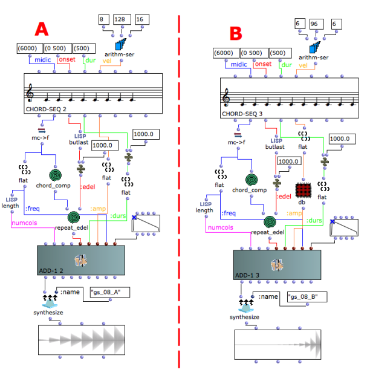
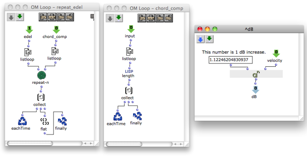
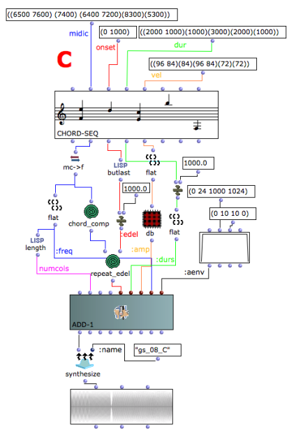

Navigation : [Previous](08-Spectrum_Chord_and_Arpeggio "page
précédente\(Spectrum Chord and Arpeggio\)") | [page
suivante](10-Exponential_Amplitude_Envelope_with_BPF "page
suivante\(Exponential Amplitude Envelope with a BPF\)")
## Tutorial Getting Started 08 - Velocity versus Amplitude

Focusing on the velocity of a **chord-seq**.

MIDI velocity expresses the dynamics with a linear range of 7 bits (from 0 to
127). This is an extremely serious limitation when doing synthesis.

In the example A the velocities are connected directly to the **:amp** slot.

In the example B the velocities are transformed in decibels by the db
subpatch. Now the amplitude's range is bigger, but the resolution is smaller.
The main problem is that we have always only 128 values to express the
amplitude range.

It is very difficult to find a good mapping between velocities and amplitudes
used for synthesis, and it would be safer to express amplitudes using the much
larger resolution given by the bit depth of the final audio result.

## Polyphony

The example C is the same of the example C of the [[[Tutorial Getting Started
06 - Chord-seq to_OMChroma Class](07-Chord-
seq_to_OMCh_Class)](07-Chord-
seq_to_OMCh_Class)](07-Chord-seq_to_OMCh_Class), but the
representation of the amplitude is in decibels.

References :

Plan :

  * [OMChroma User Manual](OMChroma)
  * [System Configuration and Installation](Installation)
  * [Getting started](Getting_Started)
    * [Class Input Slots](01-Class_Input_Slots)
    * [Slots' Description and Default Values](02-Slot's_Description)
    * [Amplitude and Internal Editor](03-Amplitude_and_internal_editor)
    * [Amplitude Envelope](04_Amplitude_envelope)
    * [f-GEN Reserved Numbers](05-f-GEN_Reserved_Number)
    * [Audio Waveforms](06-Audio_Waveforms)
    * [Chord-seq to OMChroma](07-Chord-seq_to_OMCh_Class)
    * [Spectrum Chord and Arpeggio](08-Spectrum_Chord_and_Arpeggio)
    * Velocity versus Amplitude
    * [Exponential Amplitude Envelope with a BPF](10-Exponential_Amplitude_Envelope_with_BPF)
    * [Relationship with the Csound .orc and .sco files](11-Relationship_with_the_Csound_orc_and_sco_files)
    * [Slots polymorphism](12-Slots_polymorphism)
  * [Managing GEN function and sound files](Managing_GEN_function_and_sound_files)
  * [Predefined Classes](Predefined_classes)
  * [User-fun](User-fun)
  * [Creating a new Class](Creating_a_new_Class)
  * [Multichannel processing](06-Multichannel_processing)
  * [Appendix A - Common Red Patches](A-Appendix-A_Common_red_patches)

Navigation : [Previous](08-Spectrum_Chord_and_Arpeggio "page
précédente\(Spectrum Chord and Arpeggio\)") | [page
suivante](10-Exponential_Amplitude_Envelope_with_BPF "page
suivante\(Exponential Amplitude Envelope with a BPF\)")
