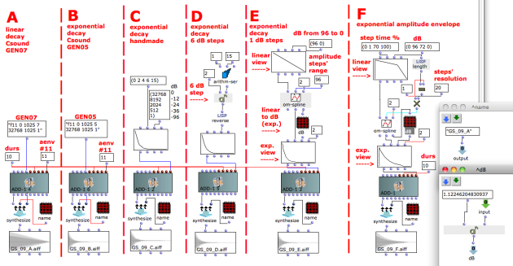

Navigation : [Previous](09-Velocity_vs_Amplitude "page
précédente\(Velocity versus Amplitude\)") | [page
suivante](11-Relationship_with_the_Csound_orc_and_sco_files
"Next\(Relationship with the Csound .orc and .sco files\)")

## Tutorial Getting Started 09 - Exponential Amplitude Envelope with a BPF

The [Tutorial Getting Started 03 -
Amplitude_Envelope](04_Amplitude_envelope) explains how to give a Break
Point Function ([[[BPF](http://support-old.ircam.fr/forum-ol-
doc/om/om6-manual/co/Edition "http://support-old.ircam.fr/forum-ol-
doc/om/om6-manual/co/Edition \(nouvelle fenêtre\)")](http://support-
old.ircam.fr/forum-ol-doc/om/om6-manual/co/BPF-BPC "http://support-
old.ircam.fr/forum-ol-doc/om/om6-manual/co/BPF-BPC \(nouvelle
fenêtre\)")](http://support-old.ircam.fr/forum-ol-
doc/om/om6-manual/co/Edition "http://support-old.ircam.fr/forum-ol-
doc/om/om6-manual/co/Edition \(nouvelle fenêtre\)")) as an amplitude
envelope to a OMChroma synthesis class. The amplitude is, however, a magnitude
expressed in an exponential scale, the decibel scale. The BPF class, however,
gathers the values in a linear way. This chapter displays many strategies to
use a BPF with an exponential scale.

  * The example A uses the Csound's GEN07 (the GEN function initialized in the **add-1** class), which constructs functions from straight, lineraly interpolated segments. Since 32768 is the maximum absolute value with 16 bit depth, this corresponds to a linear decay of 96 dB.
  * The example B uses the Csound's GEN05, which constructs functions from segments of exponential curves. This corresponds to an exponential decay of 96 dB. However, since the GEN05 cannot end at zero (0) a very light click will be produced at the end of every component.
  * In the example C the values of the decay are directly typed as X and Y coordinate points. The numbers on the list are equivalent to dB values of 0, -12, -24, -36, -96.
  * In the example D every step is 6 dB wide (doubling a value corresponds to 6 dB).
  * In the example E every step is 1 dB wide (the number 1.12246204830937 inside the subpatch dB is the multiplication factor corresponding to 1 dB).
  * The example F is a method to build an exponential amplitude envelope. The "steps" resolution parameter allows to specify the numbers of steps between each segment of the envelope.

Reminder

Only the GEN05 function generated a perfectly exponential curve whose
steepness depends on the interval between the first and the last value (see
the Csound documentation for further information). On the other hand, the
segment between the points of the curve in the BPF is always linear. Hence,
these examples give approximate curves, but listen to them to find the
difference!

## Watch out at the kind of GEN function

To summarize, the envelopes can built in two ways :

  * with an f-table given directly to the **:tables** key word of **synthesize** and recalled by its number in the OMChroma object's envelope input slot **aenv** ([Tutorial Getting Started 03 -_Amplitude_Envelope](04_Amplitude_envelope)), 
  * with a [BPF](http://support-old.ircam.fr/forum-ol-doc/om/om6-manual/co/BPF-BPC "http://support-old.ircam.fr/forum-ol-doc/om/om6-manual/co/BPF-BPC \(nouvelle fenêtre\)") connected to the OMChroma object's envelope input slot **aenv** ([Tutorial Getting Started 03 -_Amplitude_Envelope](04_Amplitude_envelope)).

With the first method you can change the GEN's type (so if an OMChroma's slot
has been initialized with a GEN07 you can give a GEN05)

With the second method the data of the BPF will be usually converted to a
GEN07.

Envelope slots

All the OMChroma slots that are connected to envelopes (Csound GEN functions)
end with "env". However, this does not include slots that read audio files
into tables (GEN01).

Other ways to pass envelopes.

OMChroma also has classes that allow to specify f-tables directly (ex. GEN07,
GEN-07, GEN05, etc.). Their usage will be explained in the next chapter.

References :

Plan :

  * [OMChroma User Manual](OMChroma)
  * [System Configuration and Installation](Installation)
  * [Getting started](Getting_Started)
    * [Class Input Slots](01-Class_Input_Slots)
    * [Slots' Description and Default Values](02-Slot's_Description)
    * [Amplitude and Internal Editor](03-Amplitude_and_internal_editor)
    * [Amplitude Envelope](04_Amplitude_envelope)
    * [f-GEN Reserved Numbers](05-f-GEN_Reserved_Number)
    * [Audio Waveforms](06-Audio_Waveforms)
    * [Chord-seq to OMChroma](07-Chord-seq_to_OMCh_Class)
    * [Spectrum Chord and Arpeggio](08-Spectrum_Chord_and_Arpeggio)
    * [Velocity versus Amplitude](09-Velocity_vs_Amplitude)
    * Exponential Amplitude Envelope with a BPF
    * [Relationship with the Csound .orc and .sco files](11-Relationship_with_the_Csound_orc_and_sco_files)
    * [Slots polymorphism](12-Slots_polymorphism)
  * [Managing GEN function and sound files](Managing_GEN_function_and_sound_files)
  * [Predefined Classes](Predefined_classes)
  * [User-fun](User-fun)
  * [Creating a new Class](Creating_a_new_Class)
  * [Multichannel processing](06-Multichannel_processing)
  * [Appendix A - Common Red Patches](A-Appendix-A_Common_red_patches)

Navigation : [Previous](09-Velocity_vs_Amplitude "page
précédente\(Velocity versus Amplitude\)") | [page
suivante](11-Relationship_with_the_Csound_orc_and_sco_files
"Next\(Relationship with the Csound .orc and .sco files\)")
