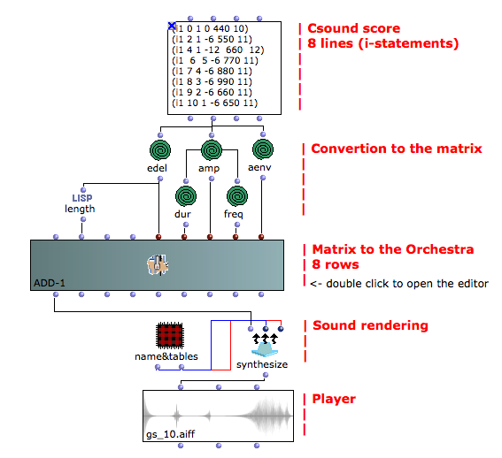
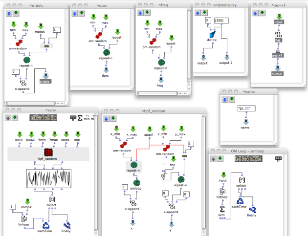
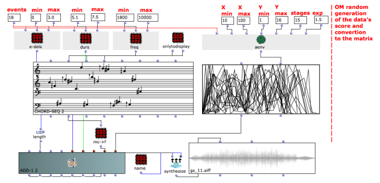

Navigation : [page
precedente](10-Exponential_Amplitude_Envelope_with_BPF "page
précédente\(Exponential Amplitude Envelope with a BPF\)") | [page
suivante](12-Slots_polymorphism "Next\(Slots polymorphism\)")

## Tutorial Getting Started 10 - Relationship with the Csound .orc and .sco
files I

Csound divides the process of sound generation in two files: the orchestra
file (ending with ".orc") and the score file (ending with ".sco", see the
[Csound](01-Csound) chapter). However, in OpenMusic there is no clear
separation between the two files; all the sound process lies within the patch.
The example below systematizes the data flow and the relationship with the
Csound .orc and .sco files.

This example displays a simple way to convert a Csound score to be used by the
OMChroma **add-1** class. All the given data are in the TextFile box and
OpenMusic deals only with arranging them according to the needs of the matrix.

Note: OMChroma doesn't need the number of instrument statement (the first data
of the each line), as it is automatically computed.

Open the corresponding ".orc" and ".sco" files (in the outfiles folder) to
take a look at the Csound data generated by OMChroma.

## Tutorial Getting Started 11 - Relationship with the Csound .orc and .sco
files II

This example is quite developed and all the data are randomly generated by
OpenMusic. With respect to the previous example, OpenMusic is used here for
what it actually is.

The result of the previous tutorial could be simply obtained in Csound in the
traditional way (two text-files). The result of this would be much more
difficult to realize directly in Csound.

events

|

numbers of i-statments (lines) of the score, i.e., how many frequencies are
wished  
  
---|---  
  
edel

|

entry delays' range in seconds  
  
durs

|

durations in seconds  
  
freq

|

frequency range in midicents  
  
aenv x and y

|

Cartesian coordinates of the amplitude envelope  
  
aenv stages

|

stages of the amplitude envelope  
  
aenv exp

|

exponential factor of the y axis  
  
References :

Plan :

  * [OMChroma User Manual](OMChroma)
  * [System Configuration and Installation](Installation)
  * [Getting started](Getting_Started)
    * [Class Input Slots](01-Class_Input_Slots)
    * [Slots' Description and Default Values](02-Slot's_Description)
    * [Amplitude and Internal Editor](03-Amplitude_and_internal_editor)
    * [Amplitude Envelope](04_Amplitude_envelope)
    * [f-GEN Reserved Numbers](05-f-GEN_Reserved_Number)
    * [Audio Waveforms](06-Audio_Waveforms)
    * [Chord-seq to OMChroma](07-Chord-seq_to_OMCh_Class)
    * [Spectrum Chord and Arpeggio](08-Spectrum_Chord_and_Arpeggio)
    * [Velocity versus Amplitude](09-Velocity_vs_Amplitude)
    * [Exponential Amplitude Envelope with a BPF](10-Exponential_Amplitude_Envelope_with_BPF)
    * Relationship with the Csound .orc and .sco files
    * [Slots polymorphism](12-Slots_polymorphism)
  * [Managing GEN function and sound files](Managing_GEN_function_and_sound_files)
  * [Predefined Classes](Predefined_classes)
  * [User-fun](User-fun)
  * [Creating a new Class](Creating_a_new_Class)
  * [Multichannel processing](06-Multichannel_processing)
  * [Appendix A - Common Red Patches](A-Appendix-A_Common_red_patches)

Navigation : [page
precedente](10-Exponential_Amplitude_Envelope_with_BPF "page
précédente\(Exponential Amplitude Envelope with a BPF\)") | [page
suivante](12-Slots_polymorphism "Next\(Slots polymorphism\)")
