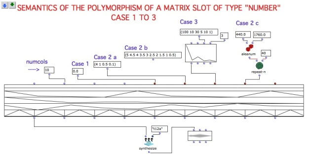
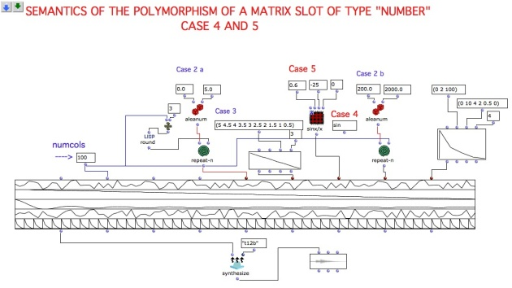
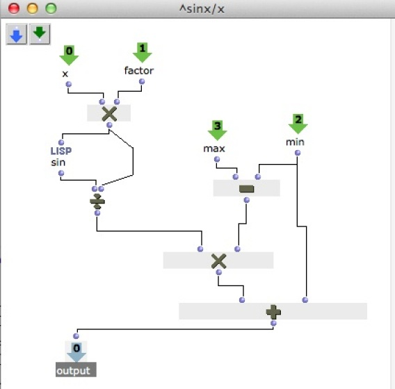

precedente](11-Relationship_with_the_Csound_orc_and_sco_files
"page précédente\(Relationship with the Csound .orc and .sco files\)") | [page
suivante](Managing_GEN_function_and_sound_files "page
suivante\(Managing GEN function and sound files\)")

## Tutorial Getting Started 12 - Slots polymorphism I / II

Different types of input data to a synthesis class are processed differently
by OMChroma. This is known as "polymorphism" and is a powerful feature of this
environment.

There are TWO cases, the general case, and the case reserved to envelopes
(i.e., slots which end by "env"), which will be discussed in the next chapter
[Managing GEN function and sound
files](Managing_GEN_function_and_sound_files).

This tutorial deals only with the general case.

The most important slot is **numcols** , which defines how many components
will be generated.

There are 5 cases (see the tutorial ****gs_12 slot polymorphism I**** ):

1\. Single number

2\. List

3\. BPF

4\. Function name

5\. Lambda function or lambda patch.

 **CASE 1: single number.**

The number will be repeated **numcols** times. In the patch below, if the
output below the e-dels input slot, whose value is 0, is evaluated, a list
with as many zero's as **numcols** will be displayed.

 **CASE 2: list of values.**

There are three possibilities:

a. the list has more values than **numcols** -> only the first "numcols"
values will be used.

b. the list has as many values as **numcols** -> it will be used as is.

c. the list has less values than **numcols** -> the list will be repeated,
starting again from the beginning.

See the three cases by connecting the three lists to the **durs** slot in the
patch below.

 **CASE 3: Break Point Function (BPF)**

The BPF will be sampled "numcols" times. The first and last value will
correspond to the first and last values of the BPF, the others will be
sampled.

 **WARNING:** If only one point is requested, the point in the middle of the
BPF will be returned.

 **CASE 4: Name of a function with one argument**

The function will be called with an argument from 0 to "numcols-1" and
evaluated. The value returned will be written in the matrix.

Ex: if you connect the function "sin" in the tutorial ****gs_12 slot
polymorphism I** I** to an input, the value of "(sin 0)", "(sin 1)", ...,
"(sin <numcols-1>)" will be shown in the corresponding column.

 **WARNING:** unless a personal function is written, this usage is not very
practical (hence CASE 5).

 **CASE 5: Lambda function or lambda patch (with the first argument non
assigned)**

In this case a lamda patch (or a hand-written Lisp function with more than one
argument) will be called, as in case 4, and evaluated with the first (empy)
argument assigned from 0 to "numcols-1". The other input arguments must have a
value.

In this example (see the contents of the red patch below), the patch is
computing a damped sine wave (sinx/x, here with a damping factor or 0.6),
rescaled between a min and max value (here, -25 and 0).

This is a very powerful way to apply a computation to each computed element of
an event while the matrix is being evaluated.

References :

Plan :

  * [OMChroma User Manual](OMChroma)
  * [System Configuration and Installation](Installation)
  * [Getting started](Getting_Started)
    * [Class Input Slots](01-Class_Input_Slots)
    * [Slots' Description and Default Values](02-Slot's_Description)
    * [Amplitude and Internal Editor](03-Amplitude_and_internal_editor)
    * [Amplitude Envelope](04_Amplitude_envelope)
    * [f-GEN Reserved Numbers](05-f-GEN_Reserved_Number)
    * [Audio Waveforms](06-Audio_Waveforms)
    * [Chord-seq to OMChroma](07-Chord-seq_to_OMCh_Class)
    * [Spectrum Chord and Arpeggio](08-Spectrum_Chord_and_Arpeggio)
    * [Velocity versus Amplitude](09-Velocity_vs_Amplitude)
    * [Exponential Amplitude Envelope with a BPF](10-Exponential_Amplitude_Envelope_with_BPF)
    * [Relationship with the Csound .orc and .sco files](11-Relationship_with_the_Csound_orc_and_sco_files)
    * Slots polymorphism
  * [Managing GEN function and sound files](Managing_GEN_function_and_sound_files)
  * [Predefined Classes](Predefined_classes)
  * [User-fun](User-fun)
  * [Creating a new Class](Creating_a_new_Class)
  * [Multichannel processing](06-Multichannel_processing)
  * [Appendix A - Common Red Patches](A-Appendix-A_Common_red_patches)

Navigation : [page
precedente](11-Relationship_with_the_Csound_orc_and_sco_files
"page précédente\(Relationship with the Csound .orc and .sco files\)") | [page
suivante](Managing_GEN_function_and_sound_files "page
suivante\(Managing GEN function and sound files\)")
