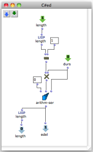

Navigation : [Previous](A-Appendix-A_Common_red_patches
"page précédente\(Appendix A - Common Red Patches\)") | [page
suivante](Random_BPF "Next\(Random Break Point Punction\)")

|

This little red patch calculates how many components there are and places them
one after the other.  
  
---|---  
  
References :

Plan :

  * [OMChroma User Manual](OMChroma)
  * [System Configuration and Installation](Installation)
  * [Getting started](Getting_Started)
  * [Managing GEN function and sound files](Managing_GEN_function_and_sound_files)
  * [Predefined Classes](Predefined_classes)
  * [User-fun](User-fun)
  * [Creating a new Class](Creating_a_new_Class)
  * [Multichannel processing](06-Multichannel_processing)
  * [Appendix A - Common Red Patches](A-Appendix-A_Common_red_patches)
    * Component number and entry delay
    * [Random Break Point Punction](Random_BPF)
    * [Synt](Synt)

Navigation : [Previous](A-Appendix-A_Common_red_patches
"page précédente\(Appendix A - Common Red Patches\)") | [page
suivante](Random_BPF "Next\(Random Break Point Punction\)")
