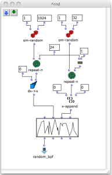

Navigation : [Previous](Component_number_and_entry_delay
"page précédente\(Component number and entry delay\)") | [page
suivante](Synt "Next\(Synt\)")

|

This little red patch generates a [BPF](http://support-old.ircam.fr/forum-ol-
doc/om/om6-manual/co/BPF-BPC "http://support-old.ircam.fr/forum-ol-
doc/om/om6-manual/co/BPF-BPC \(nouvelle fenêtre\)") with random point but
with 0 (zero) as starting and ending point.  
  
---|---  
  
References :

Plan :

  * [OMChroma User Manual](OMChroma)
  * [System Configuration and Installation](Installation)
  * [Getting started](Getting_Started)
  * [Managing GEN function and sound files](Managing_GEN_function_and_sound_files)
  * [Predefined Classes](Predefined_classes)
  * [User-fun](User-fun)
  * [Creating a new Class](Creating_a_new_Class)
  * [Multichannel processing](06-Multichannel_processing)
  * [Appendix A - Common Red Patches](A-Appendix-A_Common_red_patches)
    * [Component number and entry delay](Component_number_and_entry_delay)
    * Random Break Point Punction
    * [Synt](Synt)

Navigation : [Previous](Component_number_and_entry_delay
"page précédente\(Component number and entry delay\)") | [page
suivante](Synt "Next\(Synt\)")
