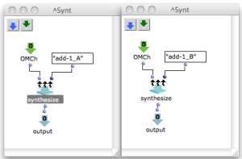

Navigation : [Previous](Random_BPF "page précédente\(Random
Break Point Punction\)") | [Next](OMChroma_1 "page
suivante\(Plan\)")

|

This little red patch calls the generic function synthesize and gives a name
to the audio file.  
  
---|---  
  
Warning

If inside a patch there are more "Synt" red patches the file name given for
each example will have a different extension, e.g. : namefile_A, namefile_B,
and so on.

References :

Plan :

  * [OMChroma User Manual](OMChroma)
  * [System Configuration and Installation](Installation)
  * [Getting started](Getting_Started)
  * [Managing GEN function and sound files](Managing_GEN_function_and_sound_files)
  * [Predefined Classes](Predefined_classes)
  * [User-fun](User-fun)
  * [Creating a new Class](Creating_a_new_Class)
  * [Multichannel processing](06-Multichannel_processing)
  * [Appendix A - Common Red Patches](A-Appendix-A_Common_red_patches)
    * [Component number and entry delay](Component_number_and_entry_delay)
    * [Random Break Point Punction](Random_BPF)
    * Synt

Navigation : [Previous](Random_BPF "page précédente\(Random
Break Point Punction\)") | [Next](OMChroma_1 "page
suivante\(Plan\)")
