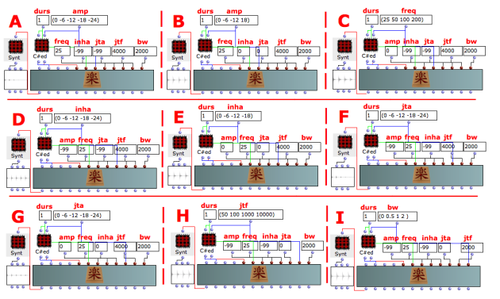

Navigation : [Previous](11-Hybrid_Models "page
précédente\(Hybrid Models\)") | [Next](User-fun "page
suivante\(User-fun\)")
## Tutorial SNARE-1

Specific Slots

Name

|

Description

|

Default value  
  
---|---|---  
  
amp

|

Maximum Amplitude. Linear from >0.0 to 1000 or in dB from 0 to -∞ (see
[Tutorial Getting Started 02 - Amplitude and Internal
Editor](03-Amplitude_and_internal_editor) for more details)

|

200.0  
  
freq

|

(Minimum) current frequency [Hz]

|

20.0  
  
inha

|

Amplitude of the pseudo-inharmonic tone [lin, >0.0-1000.0 or dB <= 0.0]

|

75.0  
  
jta

|

Amplitude of the jitter/random source [%]

|

250.0  
  
jtf

|

(Centre) frequency of the jitter [Hz]

|

4000.0  
  
bw

|

Seed value for the recursive pseudo-random formula

|

1500.0  
  
Class description

The SNARE-1 Class realizes a a simple simulation of a snare drum (percussion
like sound) with the following controls:

  * The amplitude of the harmonic tone,
  * The fundamental frequency, 
  * The amplitude of the pseudo-inharmonic tone,
  * The amplitude of the jitter/random source [%],
  * The frequency of the jitter [Hz],
  * The Seed value for the recursive pseudo-random formula.

Patch description

The examples A and B focus on the amplitude of the harmonic tone,

The example C deals with the frequency of the harmonic tone,

The examples D and E focus on the amplitude of the pseudo-inharmonic tone,

The examples F and G deal with the amplitude of the random source

The example H fixes on the frequency of the jitter,

The example I focuses on the seed value for the recursive pseudo-random
formula. A value between 0 and 1 will produce an initial output of amp * seed.
A value greater than 1 will be seeded from the system clock. A negative value
will cause seed re-initialization to be skipped.

Common Red Patches

For the red patches [Synt,](Synt)
[C#ed](Component_number_and_entry_delay) and
[rnd](Random_BPF) see
[Appendix-A](A-Appendix-A_Common_red_patches).

## Inside the Class

Csound Orchestra of the SNARE-1 Class.

instr 1

idur = p3

idurosc = 1/idur

isin_amp = (p4 > 0.0 ? (p4*0.001*0dbfs) : (ampdbfs (p4)))

if0 = p5

inh_amp = (p6 > 0.0 ? (p6*0.001*0dbfs) : (ampdbfs (p6)))

iran_amp = (p7 > 0.0 ? (p7*0.001*0dbfs) : (ampdbfs (p7)))

iran_cfq = p8

iran_bw = p9

iranfun = 11

inhfun = 12

iaudiofun = 13

islowenv = 21

ifastenv = 22

; noise

a4 rand iran_amp, iran_bw

a5 poscil a4, idurosc, ifastenv

a6 poscil a5, iran_cfq, iranfun

; pseudo-inharmonic spectrum

a3 poscil iran_amp, idurosc, ifastenv

a4 poscil a3, if0, inhfun

; sine tone

a1 oscili isin_amp, idurosc, islowenv

a2 poscil a1, if0, iaudiofun

asound = a2+a4+a6

out asound

endin

References :

Plan :

  * [OMChroma User Manual](OMChroma)
  * [System Configuration and Installation](Installation)
  * [Getting started](Getting_Started)
  * [Managing GEN function and sound files](Managing_GEN_function_and_sound_files)
  * [Predefined Classes](Predefined_classes)
    * [Additive Synthesis](01-Additive_Synthesis)
    * [Buzz Synthesis](02-Buzz_Synthesis)
    * [Frequency Modulation Synthesis](03-Frequency_modulation)
    * [Formant Wave-Function Synthesis (FOF)](04_Formant_Wave_Function_\(FOF\))
    * [Granular Formant Wave Function (FOG)](05-Granular_Formant_Wave_Function_\(FOG\))
    * [Karplus-Strong](06-Karplus-Strong)
    * [Random Amplitude Modulation](07-Random_Amplitude_Modulation)
    * [Sampler](08-Sampler)
    * [Subtractive Synthesis](09-Subtractive_Synthesis)
    * [Wave Shaping Synthesis](10-Waveshaping)
    * [Hybrid Models](11-Hybrid_Models)
      * Hybrid Models - SNARE-1
  * [User-fun](User-fun)
  * [Creating a new Class](Creating_a_new_Class)
  * [Multichannel processing](06-Multichannel_processing)
  * [Appendix A - Common Red Patches](A-Appendix-A_Common_red_patches)

Navigation : [Previous](11-Hybrid_Models "page
précédente\(Hybrid Models\)") | [Next](User-fun "page
suivante\(User-fun\)")
