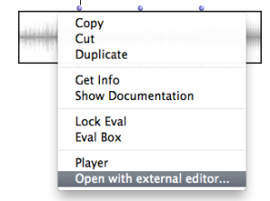
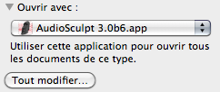
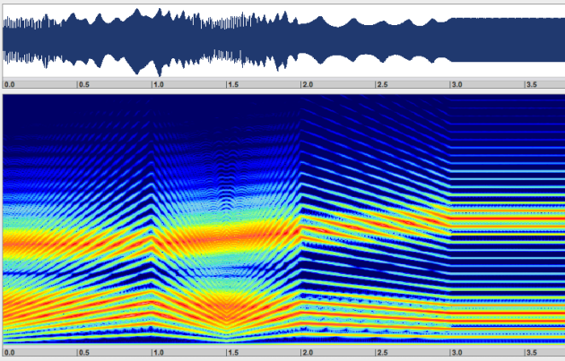

  * [Additional resources](Resources)

Navigation : [Previous](Low "page précédente\(Low-level Control
Tools\)") | [Next](Events "Next\(Chant Events\)")
Navigation generale :

  * [Guide](OM-Chant)
  * [Plan](OM-Chant_1)

OM-Chant 2.0 User Manual

Navigation : [Previous](Low "page précédente\(Low-level Control
Tools\)") | [Next](Events "Next\(Chant Events\)")

# Displaying Results as a Sonogram

In addition to the audio feedback and the different possibilities to display
the contents of the SDIF control file, visualizing the sonogram of the
synthesized sound in software such as AudioSculpt can help appreciate and
accurately design the control procedures.

An option in the **SOUND** box contextual menu allows to "open the sound with
an external editor". This external editor is the application associated to the
sound file format in your operating system.

|

  
  
---|---  
  
Changing the External Editor on MacOSX

|

Select a sound file in your computer, change its "Open with..." property
(CMD+i, "get informations"), and push "modify all" so that it applies to all
sound files of the same type.  
  
---|---  
  
Below is a sonogram display from AudioSculpt on which the parallel evolutions
of the F0 and of the FOFs parameters are clearly visible.

References :

Plan :

  * [Introduction](OM-Chant)
  * [Installation](Install)
  * [Principles](Intro)
  * [Low-level Control Tools](Low)
  * Displaying Results as a Sonogram
  * [Chant Events](Events)
  * [Durations and Continuous Control](Continuous)
  * [Modulating Effects](Modulation)
  * [Formants and vocal simulation](Formants)
  * [Spatialization and Multi-Channel Control](Spatialization)
  * [Time and Structure](Time)
  * [Transitions](Transitions)
  * [Chant Maquettes](Maquette)
  * [Additional resources](Resources)

Navigation : [Previous](Low "page précédente\(Low-level Control
Tools\)") | [Next](Events "Next\(Chant Events\)")
