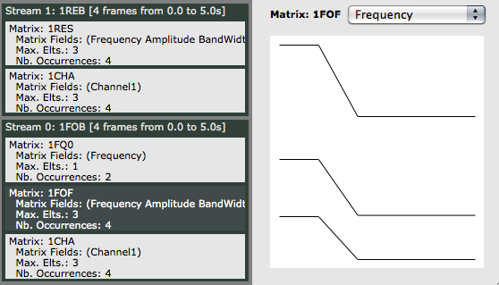

Navigation : [Previous](Display "page précédente\(Displaying
Results as a Sonogram\)") | [Next](Continuous "page
suivante\(Durations and Continuous Control\)")
Navigation generale :

  * [Guide](OM-Chant)
  * [Plan](OM-Chant_1)

OM-Chant 2.0 User Manual

Navigation : [Previous](Display "page précédente\(Displaying
Results as a Sonogram\)") | [Next](Continuous "page
suivante\(Durations and Continuous Control\)")

# Chant Events

Sommaire

  1. Setting the CHANT events attributes
  2. Synthesis
  3. "Phrases" and events combinations
  4. Examples - Chant synthesis patches

 **Synthesis events [1]** are high-level control structures, defined in the
form of parameter matrices [components x parameters]. Each synthesis event (or
matrix) has a number of parameters (e.g. frequency, amplitude, bandwidth)
defined for a number of "components" (typically, the different formants in a
Chant synthesis process). The synthesis events have an "onset" (also called
action time) and a duration allowing for their organisation in a larger-scale
time structure. As a result, each event produces at least 2 SDIF frames in the
final control sequence, corresponding to the state of a module at the event
onset and at its end (onset \+ duration).

Different types (or classes) of Chant events are defined to control the FOF
module parameters (classes **CH-FOF** and **CH-F0** ), the resonant filters
(class **CH-FLT** ) or the noise generators ( **CH-NOISE** ).

Matrices and scalar controlers

 **CH-F0** and **CH-NOISE** are not matrices but scalar controllers.

The generic function **SYNTHESIZE** performs the synthesis of the Chant
events. Its main parameter is a list of events. From these events (and
eventually following other keyword arguments) it does its best to format the
SDIF control file with adequate initialization, and calls the synthesizer (via
an internal can to CHANT-SYNTH).

Here is a basic example with Chant patch #0 (FOFs only). In this example use 1
event of type **CH-FOF** (a set of 3 FOF generators) and 1 event of type
**CH-F0** (the fundamental frequency controller of the FOFs).

|

  
  
---|---  
  
Note that the action-time and duration of the events must be set so that the
F0 and FOF generators are both activated simultaneously, otherwise no sound
will be produced by the synthesis patch. If the FOF event is not active all
the time, for instance, the sound may be null before and after activation of
the FOF modules.

|

  
  
---|---  
  
## Setting the CHANT events attributes

All Chant event classes share the action-time and duration slots, which
determine their temporal properties. In this section, we discuss the different
means to set their other synthesis parameters.

Matrix events (CH-FOF, CH-FLT)

Matrix events work on the model of the OMChroma synthesis events, based on the
OM **CLASS-ARRAY** object. They are defined thanks to the general slot
numcols, which determines the number of "components" (in the case of Chant
events, the number of FOF generators - or formants - with CH-FOF, or the
number of resonant filters with CH-FLT). Then, the other parameters are
determined according to theinput data and following this number of components.
The default value for numcols is 1.

|

  
  
---|---  
  
Use the "optional input" command [`alt` \+ `->`] to show the available
parameters for CH-FOF or CH-FLT:

You can add as many inputs as you like (in the limit of the available slots).
The hidden inputs will be assigned default values.

Parameters

Use `d` to see the reference page of the objects an get for more information
on the different parameters of the Chant event classes.

The CLASS-ARRAY provides different means to fill the contents of the matrix:

  *  **One single value** (number) will be considered constant and repeated for all the components.

Ex. numcols = 5, :amp = 0.5 => amp = [0.5 0.5 0.5 0.5 0.5]

  *  **A list of values** will be applied to the successive components (and repeated circularly if needed).

Ex. numcols = 5, :bw = (40 60) => bw = [40 60 40 60 40]

  *  **A BPF** will be sampled and applied according to the number of components.

Ex. numcols = 5, :freq = /\ (0 1 0) => freq = [0 0.5 1 0.5 0]

  *  **A function (or patch mode 'lambda')** will be called iteratively with the component indices.

Ex. numcols = 5; :amp = (lambda (evt i) (* i 0.1)) => amp = [0.1 0.2 0.3 0.4
0.5]

Continuous values

Instead of numbers, each parameter of a Chant event's component can also be a
**curve** , expressed with **BPF** objects in OM. In order to assign a
(pseudo-) continuous evolution to one or several synthesis parameters during
the event, just use a list(s) of BPFs instead of lists of numbers.

|

  
  
---|---  
  
Voir aussi

  * [Events Duration and "Continuous" Control](Continuous)

Get more info on the CLASS-ARRAY in the OM User Manual :
http://support.ircam.fr/docs/om/om6-manual/co/ClassArray

Simple events (CH-F0, CH-NOISE)

The events of type CH-F0 and CH-NOISE are not matrices: they only embed one
parameter (resp. the frequency of excitation of the FOF generator, or the
amplitude of the noise).

They are therefore easy to set and manipulate, either with single (constant)
values or with BPFs (for a pseudo-continuous evolution of the controlled
parameter).

|

  
  
---|---  
  
Special case: CH-SND

|

CH-SND is a special event used in Chant patches 2, 3, 5, 7, 8 and 10 where a
sound input is part of the synthesis process. As other events, CH-SND has an
action-time and a duration. However, it has no other parameter than the path
of the corresponding audio file.  
  
---|---  
  
## Synthesis

Use **SYNTHESIZE** to generate a sound out of a list of Chant event instances.
The SYNTHESIZE generic function has a number of additional (keyword) inputs,
of which some of them might be of a particular interest for Chant synthesis
processes:

  *  **sr** : sample rate.
  *  **duration** : the total duration of the synthesis.
  *  **name** : the name of the sound file to synthesize.
  *  **rescale** : noralization of the output sound.
  *  **patch** : the Chant patch to use for synthesis [0-10].
  *  **run** : determines if the synthesizer is called or not.

If these arguments are not specified, SYNTHESIZE will do its best to guess:

  * Which Chant **patch** must be used (depending of the type of the events)
  * The total **duration** (according to the onsets and durations of the events)

RUN ?

If the run argument is NIL, SYNTEHSIZE will just create and return the SDIF
control file. This option might be useful to inspect and debug the Chant
processes using the control data.

## "Phrases" and events combinations

The different classes of Chant events can be use to implement synthesis
processes with one of the different Chant patches. Each event will determine
the state and evolution of the parameters of a given module of the synthesis
patch and for a given time interval. We can therefore use several events in
order to generate time-structured "phrases" with the synthesizer.

Remember that, by default, Chant interpolates between successive states
determined by the control process, producing continuous transitions.

FOF and F0

The FOF generators require **CH-FOF** and **CH-F0** controls: these two
classes must always be used together.

In the following example (inspired from the tutorial patche "events"), we use
two CH-FOF events (one at t=0, with duration=1s, the second one at t=3,
duration = 1s as well) and one F0 event (t=0, duration = 4s).

As visible in the OM Listener window, SYNTHESIZE automatically deduced that we
were using the Chant patch #0 (FOF generators only) :

OM > CHANT PATCH: 0

We used here two instances of the **SYNTEHSIZE** box: the first one
synthesizes the sound and the second one, with the keyword argument " **:run**
" set to NIL, just generates the SDIF control file. We can check by opening
the **SDIFFile** editor that the two FOF "events" are visible in the SDIF
frame sequence, and visualize the interpolation process between the
frequencies of event 1 and 2.

In this second example, we now add two F0 events. We can also check in the
SDIF control file that the fundamental frequency in the control sequence
follows our event-based construction.

FOF and F0

In this example we see an advantage of separating the control of the FOFs
(formant values) and of the F0 (fundamental frequency): FOFs and F0 can have
free variations and time structures independently from one another.

Overlaps

In this example and the following, we minded never creating overlaps between
events of the same type at setting the onsets and durations. Considering that
every event produces one control value at its beginning and one value at its
end in the SDIF frame sequence, and that the synthesizer interpolates between
each two successive control values, an overlap of, say, the first two events
in the previous example would produce the following effect:

[The sonogram of this sound is displayed in section "[Displaying Results as a
Sonogram](Display)"]

The situation will get even more complex with advanced time structures or when
continuous values are used in the synthesis events. It will be discussed and
handled specifically in Section "Transitions".

Voir aussi

  * [Transitions](Transitions)

## Examples - Chant synthesis patches

The previous examples were all using Chant patch #0 (FOF generator only). Here
are some examples of other Chant synthesis processes using different possible
Chant "patches".

Selecting the patch

As far as possible SYNTHESIZE tries to guess which Chant patch to use and
initialize depending on the input Chant events. However, the patch can also be
set explicitly if needed, or in case the event information is not enough to
precisely determine the synthesizer's configuration (e.g. patches #1 and #9,
or #7 and #10, use the exact same types of modules, connected differently).

Patch #4: NOISE ==> FILTER

Patch #4 filters a noise (possibly controlled in time using events or
continuous variations) with one or several filter events (hence, the filter
can also be controlled in a "phrase-based" fashion).

The sonogram below shows the evolution of the noise amplitude, the "filter
events" stable states and the transition created by the synthesizer.

Voir aussi

  * [Displaying Results as a Sonogram](Display)

Patch #5: SOUND ==> FILTER

Patch #5 permits the same kind of process as patch #4, but with an input sound
file.

Limitation on sound file players

There can be only 1 sound file module (and 1 CH-SND event) running in a Chant
synthesis process.

Patch #6: FOF ==> FILTER

Patch #6 filters the output of the FOF with a resonant filter bank. Of course,
filters and FOF events are not necessarily related.

The **SDIFFile** editor shows the different evolution of FOF and filter
parameters:

Patch #1: [FOF + NOISE] --> FILTER vs. Patch #9: FOF + [NOISE --> FILTER]

Patch #1 and #9 use the same modules but connect them differently. Patch #9 is
a "merge" of patches #0 and #4: the FOF synthesis is added to the filtered
noise. In patch #1 however, the FOF is first merged to the noise, and then the
result is filtered.

In the example below are present FOF and F0 events, a Filter event, and a
Noise event. The filter's amplitudes are set by a BPF describing an evolution
from 0 to 1 on the whole 5 seconds of sound (see section "[Continuous
control](Continuous)"). If the synthesis process is run with patch #1,
this filter applied to all source inputs (the FOF and the Noise). With patch 9
however, the FOF input is constant and the filter applies only to the Noise.

Relative amplitudes

Due to the differences in the paths and processing, the relative amplitudes of
the FOFs, Noise and filters may need to be readjusted depending on the
configurations. In the previous example, if a same order is acceptable with
Patch #1 (noise amplitude = 1, FOFs = 0.8, etc.), with Patch 9 (where only the
noise go through the filter) either the noise or filter amplitudes will need
to be divided (in this case appx. by a factor 100).

References :

  1. Synthesis event

The notion of synthesis event is inspired from the similar concept in the
OMChroma framework. See http://repmus.ircam.fr/cao/omchroma

Plan :

  * [Introduction](OM-Chant)
  * [Installation](Install)
  * [Principles](Intro)
  * [Low-level Control Tools](Low)
  * [Displaying Results as a Sonogram](Display)
  * Chant Events
  * [Durations and Continuous Control](Continuous)
  * [Modulating Effects](Modulation)
  * [Formants and vocal simulation](Formants)
  * [Spatialization and Multi-Channel Control](Spatialization)
  * [Time and Structure](Time)
  * [Transitions](Transitions)
  * [Chant Maquettes](Maquette)
  * [Additional resources](Resources)

Navigation : [Previous](Display "page précédente\(Displaying
Results as a Sonogram\)") | [Next](Continuous "page
suivante\(Durations and Continuous Control\)")
