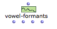
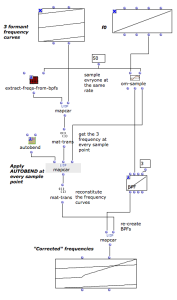

Navigation : [Previous](Modulation "page précédente\(Modulating
Effects\)") | [Next](Spatialization "page
suivante\(Spatialization and Multi-Channel Control\)")
Navigation generale :

  * [Guide](OM-Chant)
  * [Plan](OM-Chant_1)

OM-Chant 2.0 User Manual

Navigation : [Previous](Modulation "page précédente\(Modulating
Effects\)") | [Next](Spatialization "page
suivante\(Spatialization and Multi-Channel Control\)")

# Formants and vocal simulation

The Chant synthesizer is based on the vocal production model and can be very
good at imitating voiced (or voice-related) sounds. In order to obtain
realistic voice sounds, the FOFs must be finely tuned and parameterized. The
following tools of OM-Chant facilitate this process.

## Vowel parameters and databases

 **VOWEL-FORMANTS** is the main function available to get the frequency,
amplitude and bandwidth values of the FOFs permitting the to model sung
vowels.

VOWEL-FORMANTS returns 4 lists: a list of formants formatted as ((freq1 amp1
bw1) (freq2 amp2 bw2) ...), and then the separate lists of frequencies,
amplitudes and bandwidths. Basically, and as visible in different previous
examples, these 3 lists are suited to be connected to the slots freq, amp and
bw of he CH-FOF and CH-FILTER events.

dB / linear

A second, optional input of VOWEL-FORMANTS allows to choose between dB or
linear values for the amplitudes. In OM-Chant in principle, the amplitudes are
considered and set in linear mode.

 **DATABASE-FORMANTS** is an alternative function allowing to choose among a
personalized formant database. An example is given in the tutorial patch
"vowel-formants".

## Control Rules

OM-Chant provides a number of functions for the automatic computation or
correction of synthesis parameters.

These functions (or "rules") are inspired from experimental research carried
out in the 80s by the Chant project team.

  *  **AUTOAMP** calculates the amplitude of the formants depending on the frequencies and bandwidths, taking into account the interactions between formants (reinforcement of the amplitudes of formants approaching one another).
  *  **AUTOBEND** adjusts the frequencies of the formants depending on the fundamental frequency.
  *  **AUTOBW** calculates the bandwidth of the formants depending on the frequencies.
  *  **AUTOTEX** calculates the FOF 'tex' parameter (in seconds) from the bandwidth and skirt width of a formant.
  *  **FCOMP** calculates the amplitude a complement formant to be added to the spectrum.
  *  **CSLOPE** allows to control the spectrum in relation to the dynamic amplitude of the sound, the type of voice which is being used, and the fundamental frequency.
  *  **SPCOR** adjusts the formants amplitudes according to the duration of the attacks of the FOFs and the bandwidths of the respective formants.

Use `d` to see the functions' reference pages and get detailed descriptions.

Using the Chant rules in OM patches

The Chant rules can be used in arbitrary control processes to modify or
correct synthesis parameters. In particular, they can be embedded in iterative
processes to apply "continuously" on evolving sets of parameters.

The tutorial patch "autobend-example" is an example where frequency curves are
processed iteratively following an evolution of the fundamental frequency.

|

  
  
---|---  
  
References :

Plan :

  * [Introduction](OM-Chant)
  * [Installation](Install)
  * [Principles](Intro)
  * [Low-level Control Tools](Low)
  * [Displaying Results as a Sonogram](Display)
  * [Chant Events](Events)
  * [Durations and Continuous Control](Continuous)
  * [Modulating Effects](Modulation)
  * Formants and vocal simulation
  * [Spatialization and Multi-Channel Control](Spatialization)
  * [Time and Structure](Time)
  * [Transitions](Transitions)
  * [Chant Maquettes](Maquette)
  * [Additional resources](Resources)

Navigation : [Previous](Modulation "page précédente\(Modulating
Effects\)") | [Next](Spatialization "page
suivante\(Spatialization and Multi-Channel Control\)")
