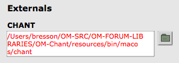

Navigation : [Previous](OM-Chant "page
précédente\(Introduction\)") | [Next](Intro "page
suivante\(Principles\)")
Navigation generale :

  * [Guide](OM-Chant)
  * [Plan](OM-Chant_1)

OM-Chant 2.0 User Manual

Navigation : [Previous](OM-Chant "page
précédente\(Introduction\)") | [Next](Intro "page
suivante\(Principles\)")

# Installation

The Chant synthesizer must be installed prior to use the OM-Chant library.

## Chant

In OM-Chant 2.0, a working version of the Chant synthesizer is distributed
within the library.

In previous versions, or in case the synthesizer has been installed
separately, it can just be unpacked and copied anywhere on the computer.

## Configuration in OM

Once the OM-Chant library is loaded in OM, the **Chant** item is added to the
`Externals` tab of the main Preferences window.

The button  permits setting or modifying the path
to the Chant synthesizer used by OM-Chant.

|

The OM preference windows, with OM-Chant library loaded.  
  
---|---  
  
The default configuration for the Chant path shall point to the `resources`
folder in the library. Use `Restore` if needed in order to reset this default
path.

If Chant is missing or not found, the path will be displayed in red.

Use  to set the correct path, then validate using
`Apply` or `OK`.

|

  
  
---|---  
  
## Tutorials

Use the `Help/Import Tutorials/Libraries/OM-Chant/` menu from the workspace
window in order to import the OM-Chant tutorial/example patches.

References :

Plan :

  * [Introduction](OM-Chant)
  * Installation
  * [Principles](Intro)
  * [Low-level Control Tools](Low)
  * [Displaying Results as a Sonogram](Display)
  * [Chant Events](Events)
  * [Durations and Continuous Control](Continuous)
  * [Modulating Effects](Modulation)
  * [Formants and vocal simulation](Formants)
  * [Spatialization and Multi-Channel Control](Spatialization)
  * [Time and Structure](Time)
  * [Transitions](Transitions)
  * [Chant Maquettes](Maquette)
  * [Additional resources](Resources)

Navigation : [Previous](OM-Chant "page
précédente\(Introduction\)") | [Next](Intro "page
suivante\(Principles\)")
