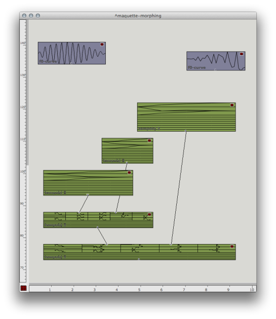
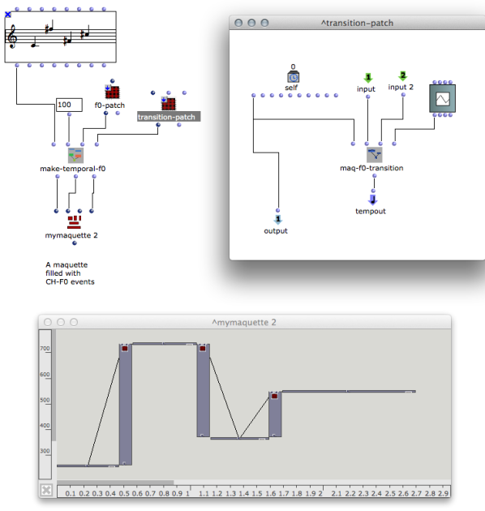
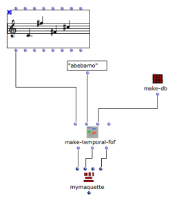
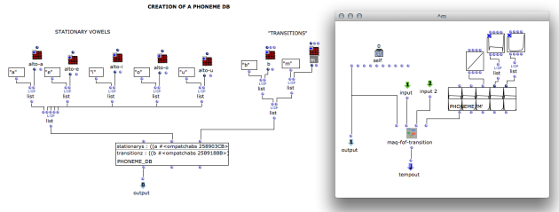
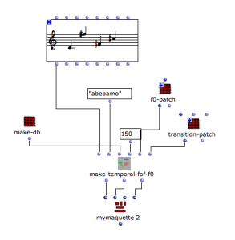
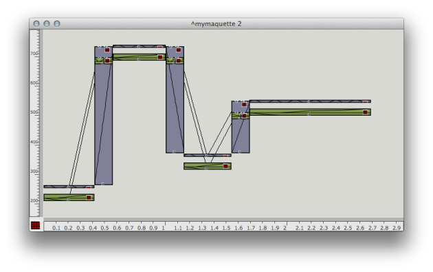

Navigation : [Previous](Transitions "page
précédente\(Transitions\)") | [Next](Resources "page
suivante\(Additional resources\)")
Navigation generale :

  * [Guide](OM-Chant)
  * [Plan](OM-Chant_1)

OM-Chant 2.0 User Manual

Navigation : [Previous](Transitions "page
précédente\(Transitions\)") | [Next](Resources "page
suivante\(Additional resources\)")

# Using the Maquette as a Control and Interaction Framework

The functions in the menu `Chant Events/Maquette` of the OM-Chant library
allow for the quick and easy creation of temporal boxes in the maquette
corresponding to Chant events.

Use :

  *  **MAQ-FOF** to create CH-FOF events
  *  **MAQ-F0** , **MAQ-F0-VIB** , **MAQ-F0-JIT** , etc. to create CH-F0 events with possible vibrato, jitter and other effects.

Generating CH-F0 events as temporal boxes in a maquette

The tutorial patch "chant-temporal-boxes" shows how to articulate these events
using transition or morphing between the temporal events.

Voir aussi

  * [Time and Structure](Time)

Use SYNTHESIZE inside the **synthesis patch** at the bottom-left corner of the
maquette in order to synthesize the contents.

## Transitions

Transition events can be created as temporal boxes using **MAQ-FOF-
TRANSITION** (for CH-FOF events) or **MAQ-F0-TRANSITION** (for CH-F0 events).

A transition profile must be specified, using a BPF for CH-F0 events, and
using a list of lists of BPF profiles, or a **PHONEME** object for CH-FOF
events.

|

Generating a transition in a temporal box  
  
---|---  
  
More about the PHONEME object in section "Transitions"

  * [Transitions](Transitions)

By connecting the transition boxes to existing Chant event temporal boxes,
continuous phrases can be built automatically in the maquette editor.

A maquette with CH-FOF, CH-F0 and corresponding transition events.

The Chant events must not overlap in order to leave space for the transition
events.

## Morphing

Morphing between CH-FOF events can be intergated as temporal boxes as well
using the **MAQ-FOF-MORPH** function.

A transition profile must also be specified, using a BPF.

|

Generating a morphing in a temporal box  
  
---|---  
  
This time, the events must overlap in order to obtain the morphing effect on
the overlapping interval.

A maquette with morphing events.

Note that the Chant synthesis method will ultimately ignore the events used as
initial events of a morphing, in order to consider only the resulting, morphed
events.

It is also possible to create advanced combined effects, by connecting
morphing modules to other morphing modules, or a morphing module to a
transition, etc...

## Generating Chant Phrases

OM-Chant provides tools to automatically generate maquettes starting from
CHORD-SEQ melodic lines and other compositional objects.

Examples are provided in the tutorial patch "gen-maquette".

F0 events

 **MAKE-TEMPORAL-F0** fills a maquette with CH-F0 events according to the
melodic data of a CHORD-SEQ and instructions for the generation of the
temporal boxes.

These instructions are :

  * A duration for the transitions ;
  * A temporal patch responsible for the generation of one "note" event (i.e., a patch in mode "reference") ;
  * A temporal patch responsible for the generation of a transition between two CH-F0 events (id.)

The patches are just the same as the temporal patches created for instance
using MAQ-F0, etc.

The 3 outputs of MAKE-TEMPORAL-F0 must then be connected to the inputs of the
maquette box : **time** , **objs** , and **connections**.

The rest of the Chant events for synthesis (in particular the CH-FOF events)
must be added in the maquette in order to complement the F0 events generated
here.

FOF events

 **MAKE-TEMPORAL-FOF** fills a maquette with CH-FOF events according to the
melodic data of a CHORD-SEQ and instructions for the generation of the
temporal boxes.

These instructions are :

  * A string containing the sequence of phonemes to be synthesized ;
  * A database (PONEME_DB) containing at least the phonemes in the previous string ;
  * A duration for the transitions.

|

  
  
---|---  
  
The Phoneme DataBase

The phoneme database must be created as an object of type PHONEME_DB.

The two slots of this objects are :

  * A list of pairs (character patch) where patch is a temporal patch corresponding to stationary events in the maquette (the formants or "vowels" corresponding to the notes in the chord-seq). [See MAQ-FOF]
  * A list of pairs (character patch) where patch is a temporal patch corresponding to a transition between events. [See MAQ-FOF-TRANSITION]

Voir aussi

  * [Using the Maquette as a Control and Interaction Framework](Maquette)

The 3 outputs of MAKE-TEMPORAL-F0 must then be connected to the inputs of the
maquette box : **time** , **objs** , and **connections**.

The rest of the Chant events for synthesis (in particular the CH-F0 events)
must be added in the maquette in order to complement the F0 events generated
here.

FOF + F0 : Generatingthe whole sequence as a Maquette

 **MAKE-TEMPORAL-F0-FOF** merges the two previous functions in one and
generates a complete, ready-to-synthesize maquette.

|

  
  
---|---  
  

References :

Plan :

  * [Introduction](OM-Chant)
  * [Installation](Install)
  * [Principles](Intro)
  * [Low-level Control Tools](Low)
  * [Displaying Results as a Sonogram](Display)
  * [Chant Events](Events)
  * [Durations and Continuous Control](Continuous)
  * [Modulating Effects](Modulation)
  * [Formants and vocal simulation](Formants)
  * [Spatialization and Multi-Channel Control](Spatialization)
  * [Time and Structure](Time)
  * [Transitions](Transitions)
  * Chant Maquettes
  * [Additional resources](Resources)

Navigation : [Previous](Transitions "page
précédente\(Transitions\)") | [Next](Resources "page
suivante\(Additional resources\)")
