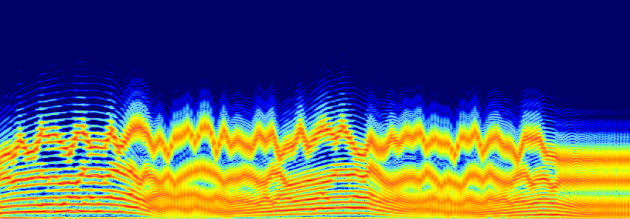

  * [Chant Maquettes](Maquette)
  * [Additional resources](Resources)

Navigation :  | [Next](Install "Next\(Installation\)")
Navigation generale :

  * Guide
  * [Plan](OM-Chant_1)

OM-Chant 2.0 User Manual

Navigation :  | [Next](Install "Next\(Installation\)")

OM-Chant is an OpenMusic library for the control of the Chant synthesizer. The
Chant synthesiser was developed at IRCAM in the early 80s, in order to
simulate and reproduce sung voice sounds, but also in order to create more
abstract sounds using the same production model.

Chant is a reference implementation of the FOF synthesis technique (for French
"Fonctions d'Ondes Formantiques", or formant wave functions), although it also
embeds other signal generators or processing modules such as resonant filters
or noise generators.

FOF synthesis allows to model the vocal production system considering an
excitation signal and his response to a resonant system. In contrast with the
more traditional "source-filter" model, the FOF synthesis generates trains of
small signals (simple sinusoids multiplied by an exponential envelope) at a
given frequency, which contribute to the overall spectrum of the resulting
signal with a **formant** (typically, a FOF synthesiser is compound of several
FOF generators in parallel, each one producing one formant).

Formants are modulations of the spectrum characterizing vocal signals. They
can be described with few simple and intuitive parameters (central frequency,
amplitude, bandwidth, etc.) which have a direct matching with the parameters
of the FOFs.

Associated to the continuous / high-level control procedures provided in OM-
Chant, FOF synthesis offers interesting possibilities challenging the limits
of vocal synthesis.

This manual describes the functionalities of the OM-Chant library in version
2.0 (released, fall 2012).

OM-Chant R&D

Jean Bresson (IRCAM / UMR STMS) ; Marco Stroppa (Musical Research, IRCAM) ;
Raphael Foulon (Master student, ATIAM 2012).

Thanks : Analysis/Synthesis team, IRCAM : Xavier Rodet, Charles Picasso, Axel
Robel ; Jean-Baptiste Barriere.

More about Chant and the OM-Chant project :

[http://repmus.ircam.fr/cao/om-chant](http://repmus.ircam.fr/cao/om-chant
"http://repmus.ircam.fr/cao/om-chant \(nouvelle fenêtre\)")

References :

Plan :

  * Introduction
  * [Installation](Install)
  * [Principles](Intro)
  * [Low-level Control Tools](Low)
  * [Displaying Results as a Sonogram](Display)
  * [Chant Events](Events)
  * [Durations and Continuous Control](Continuous)
  * [Modulating Effects](Modulation)
  * [Formants and vocal simulation](Formants)
  * [Spatialization and Multi-Channel Control](Spatialization)
  * [Time and Structure](Time)
  * [Transitions](Transitions)
  * [Chant Maquettes](Maquette)
  * [Additional resources](Resources)

Navigation :  | [Next](Install "Next\(Installation\)")
