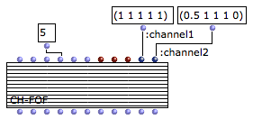
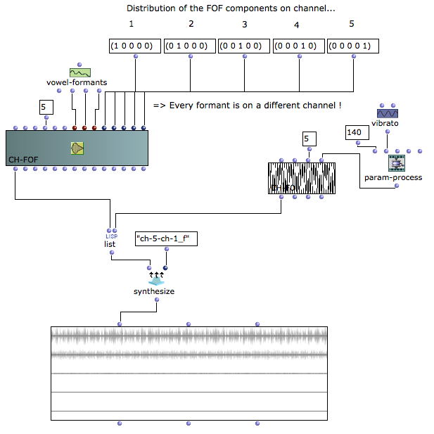
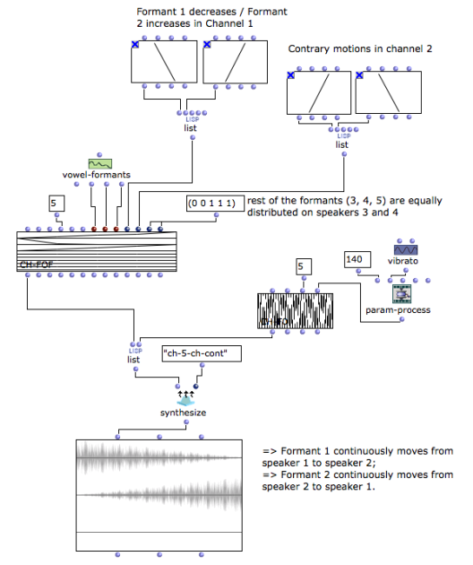
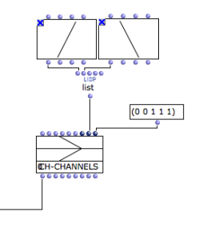
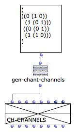

Navigation : [Previous](Formants "page précédente\(Formants and
vocal simulation\)") | [Next](Time "Next\(Time and
Structure\)")
Navigation generale :

  * [Guide](OM-Chant)
  * [Plan](OM-Chant_1)

OM-Chant 2.0 User Manual

Navigation : [Previous](Formants "page précédente\(Formants and
vocal simulation\)") | [Next](Time "Next\(Time and
Structure\)")

# Spatialization and Multi-Channel Control

The Chant synthesizer allows to create files with an arbitrary number of
channels, and to determine the distribution of the FOF generators and filter
bank outputs over these channels. This feature enables the control of the
spatialization in synthesis processes with a "speaker-oriented" apporach.

As for the rest of the parameters, the control is done "per component" using
the matrix structures : every individual FOF or filter can have a specific
position or trajectory.

The channel control can be done at two complementary levels:

  *  **Inside the events** , that is, in the CH-FOF or CH-FILTER objects
  *  **At the global level** of the phrase, using specific channel controllers (CH-CHANNELS)

## Channel Control in the Chant Events \- The :chanX keywords

Multichannel control can be added to a Chant matrix event (CH-FOF or CH-
FILTER) by adding the corresponding number of **keyword** controllers. [type
`k` / `K` to add/remove a keyword controller to a CLASS-ARRAY object].

Get more info on the use of keyword controls in the CLASS-ARRAY in the OM User
Manual : http://support.ircam.fr/docs/om/om6-manual/co/ClassArray

Channel Controls

You can add as many control slots `k` as you like in the Chant objects (as in
CLASS-ARRAY objects in general).

In order to make these control slots channel controllers for the Chant
synthesizer, just name them **:chan** **XXX**. (for instance, :channel1,
:channel2, etc.)

The number of channels in the output file will be the maximum number of :chanX
keywords found in the Chant events.

In this example, two channel controls are added to the CH-FOF object.

The 5 FOF will therefore be distributed on two channels accordingly.

  * FOF 1 outputs on channel 1 and two (100% on channel 1 and 50% only on channel 2)
  * FOFs 2, 3 and 4 output on both channels
  * FOF 5 ouputs on channel 1 only.

|

  
  
---|---  
  
Splitting the FOFs

The tutorial patch "chant-channels" is a similar example with 5 channels where
each FOF is directed to one specific channel.

Continuous Control

The multi-channel control can also be done in a continuous way using **BPF**
objects instead of constant values.

Then, a BPF describes the evolution of the gain for a given FOF and a given
channels. Continuous transitions of the FOF between one channel and another
one (that is, between the different speakers in a given rendering setup) can
therefore be impemented.

The tutorial patch "channels-continu" is an example of continuous multi-
channel control.

## Global Multi-Channel Control : CH-CHANNELS

The object **CH-CHANNELS** is a special type of Chant event controlling the
channel distribution globally and independently from the structure and
contents of the CH-FOF or CH-Filter events.

CH-CHANNELS behaves exactly the same as a standard Chant event and must be
initialized with similar temporal attributes (action-time, duration), number
of components (numcols), etc.

|

  
  
---|---  
  
Voir aussi

  * [Chant Events](Events)

Generation of a CH-CHANNELS from FOF trajectories.

It is often more convenient to think of trajectories by components (FOF)
rather than by channel. The function **GEN-CHANT-CHANNELS** automatically
creates an instance of CH-CHANNELS from a list of timed distributions provided
for each different component.

(

; formant 1

((t0 (speaker1 speaker2 speaker3 speaker4))

(t1 (speaker1 speaker2 speaker3 speaker4))

; ...

(tn (speaker1 speaker2 speaker3 speaker4)))

; formant 2

((t0 (speaker1 speaker2 speaker3 speaker4))

(t1 (speaker1 speaker2 speaker3 speaker4))

; ...

(tn (speaker1 speaker2 speaker3 speaker4)))

; ...

)

|

  
  
---|---  
  
References :

Plan :

  * [Introduction](OM-Chant)
  * [Installation](Install)
  * [Principles](Intro)
  * [Low-level Control Tools](Low)
  * [Displaying Results as a Sonogram](Display)
  * [Chant Events](Events)
  * [Durations and Continuous Control](Continuous)
  * [Modulating Effects](Modulation)
  * [Formants and vocal simulation](Formants)
  * Spatialization and Multi-Channel Control
  * [Time and Structure](Time)
  * [Transitions](Transitions)
  * [Chant Maquettes](Maquette)
  * [Additional resources](Resources)

Navigation : [Previous](Formants "page précédente\(Formants and
vocal simulation\)") | [Next](Time "Next\(Time and
Structure\)")
