Navigation : [Previous](Time "page précédente\(Time and
Structure\)") | [Next](Maquette "Next\(Chant
Maquettes\)")
Navigation generale :

  * [Guide](OM-Chant)
  * [Plan](OM-Chant_1)

OM-Chant 2.0 User Manual

Navigation : [Previous](Time "page précédente\(Time and
Structure\)") | [Next](Maquette "Next\(Chant
Maquettes\)")

# Transitions

We have observed at several occasions that the overlapping of Chant events was
problematic because of the monophonic, continuous control model of the
synthesizer. OM-Chant provides several tools allowing to deal with transitions
and handle the succession and possible overlaps between control events,
introducing interesting and flexible solutions for the generation of "phrases"
with the synthesizer.

In the example below we observe the evolution of the f0 control curve from the
examples from section "[Time and Structure / Chord-Seq](Time)", if the
durations of the notes overlap.

[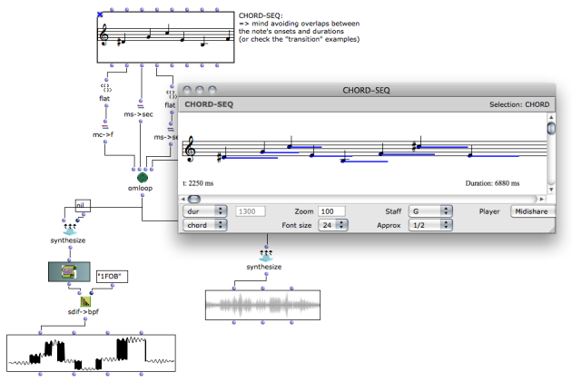](../res/cseq-overlap.png "Cliquez pour
agrandir")

## CH-TRANSITIONS : A Preliminary Example

The function CH-TRANSITIONS processes a sequence of Chant events of a given
type pairwise, and allows to determine the control behaviour on the
overlapping intervals.

The arguments of CH-TRANSITIONS are :

  * A list of Chant events of the same type (e.g. CH-F0, CH-FOF...)
  * A lambda function or patch determining the expected resulting control sequence for each tow successive events. The expected input for this function is an object of type TRANSITION-INFO, updated at each iteration of the process.
  * [optional] Some values for the display of the trandition handler behaviour (see below).

An example of a simple transition process is provided in the tutorial patch
"ch-transition-1", derived from the "chant-chord-seq" example used in a
previous section.

The CH-FOF and CH-F0 events are now collected and returned separately from the
OMLOOP. The overlapping interval of the events will be handled for the CH-FOF
objects only, using the fade-in/fade-out mechanism (and hence hide the
artifact produced by the overlapping sections of the CH-F0).

|

[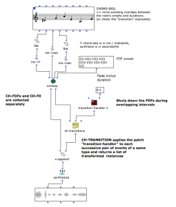](../res/transition-1.png "Cliquez pour
agrandir")  
  
---|---  
  
The Transition Control Patch

The transition handler patch must have one input connected to a **TRANSITION-
INFO** object, and one output returning the list of events corresponding to
the processing of two successive events.

In order to design this process, TRANSITION-INFO provides some information,
updated at each new iteration :

  * <full-list> the list of all events to process events ;
  * <ev1> the first event in the transition ;
  * <ev2> the second event in the transition ;
  * <i> the position of the pair in the full list of events ;
  * <beg1> the onset of teh first event ;
  * <end1> the end time of the first event ;
  * <dur1> the duration of the event1 solo (no overlap) ;
  * <beg2> theonset of the second event ;
  * <end2> the end time of the second event ;
  * <dur2> the duration of event2 solo (no overlap) ;
  * <dur-inter> the duration of the overlapping interval.

In the example of the tutorial patch "ch-transition-1" this process simply
adjusts the two events' onset and durations to the "solo" time intervals,
leaving the overlapping intervals empty. The fade in/fade-out allows to shut
the FOF down between the transformed events.

For a pair of sucessive events, two new modified events are returned.

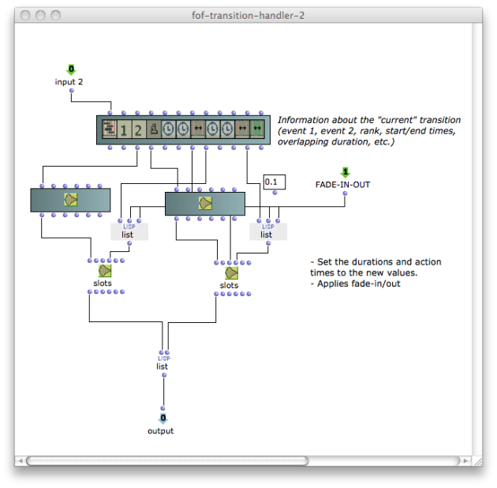

Vizualization of the Process

Since the transition process is not always straightforward to conceive and
understand, a visualization utility has been added to the CH-TRANSITIONS tool,
allowing the observation of the construction of the events and the values of a
given parameter during the successive steps of the process.

The third (optional) input of CH-TRANSITIONS allows to connect, as a list, the
name of a slot of the Chant event being processed (e.g. f0 for CH-F0, freq,
amp... for CH-FOF, etc.) and a range for the values of this parameter. In the
previous example, since we added a fade in/ou, we would probably want to
observe the amp slot => (amp 0.0 1.0).

A window appears, showing the initial state of our system :

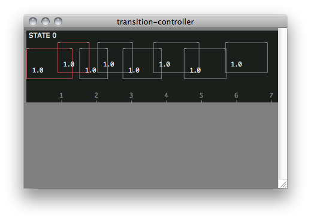

Use the `up` and `down` arrow keys to separate the events vertically and
better visualize the succession of events.

By using the `TAB` key, you can unfold the algorithm and observe the sequence
as processed by the transition handler patch at the successive steps of the
process.

[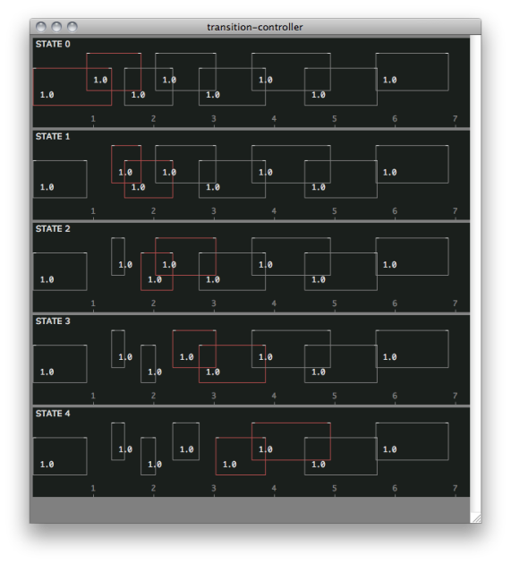](../res/viz-steps.png "Cliquez pour agrandir")

## Transition Handlers

In this section we give some more advanced examples of transition handling
strategies.

Modification of the events

In the patches "ch-transition-1" and "ch-transition-inter-f0" are proposed
several solution for the transition modifying the temporal properties of the
events in order to cancel the ovrelapping intervals.

[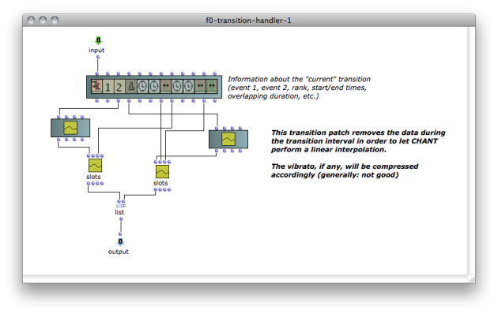](../res/f0-transition-handler.png
"Cliquez pour agrandir")

Generation of transitory events

In "ch-transition-inter-f0" is proposed other transition strategy consisting
in generating a tansitory event between each two successive events.

The transition handler patch therefore takes two events as input, and returns
3 : the two original, modified events, and a new one spreading over the
overlapping interval.

[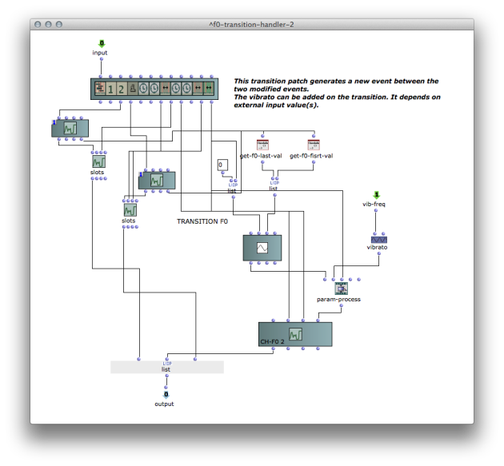](../res/inter-event.png "Cliquez pour
agrandir")

GEN-INTER-EVENTS

The function **GEN-INTER-EVENTS** helps implementing this transitory event
generation process for complex, compound Chant events.

GEN-INTER-EVENTS takes two events and a list of RULES, and returns an
adequately parameterized event of the same type, valid on the inter-event
interval.

Rules are formatted as pairs of [PARAM VALUE] where :

  * **param** can be either a Chant event slot identifier (e.g. :freq, :amp, :bw...) or a sub list containing such identifier and a component (or formant) number (e.g. (:freq 2) means "frequency of the third (nth 2) component" ).
  *  **value** can be either a constant value (number or BPF), or a function (lambda patch) describing the evolution of the parameters starting from the last value in event 1, and the going to the first value in event 2.

An exemple is provided in the tutorial patch "ch-transition-inter-event".

The transition handler for the CH-FOF events in patch ch-transition-inter-
event

GEN-INTER-FOF / PHONEMES

The function **GEN-INTER-FOFS** is a specialization of GEN-INTER-EVENT
allowing to use an object of type **PHONEME** to describe the transition
between two CH-FOF objects.

A **PHONEME** is a special type of CLASS-ARRAY object defining **transition
profiles** for a number of keyword parameters.

Add/remove kewords with `k`/`K` and name them after the parameter(s) to which
the transition may apply (e.g. :freq, :amp, :bw...).

The <transition> input deteremines the profile of the interpolation used at
applying the PHONEME between two Chant events.

|

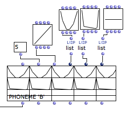

The PHONEME 'B'  
  
---|---  
  
An example is provided in the tutorial patch "ch-transition-phoneme".

[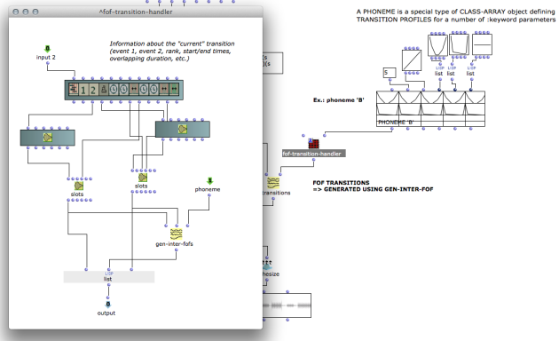](../res/phoneme-transition.png "Cliquez
pour agrandir")

GEN-INTER-FOFS's <sr> optional input also allows to control the sample rate of
the transition.

Merging events

A solution to handle transitions between overlapping events is to determine
how to merge them into a new comprehensive one.

The tutorial patch ch-transition-fusion provides an example with the case of
the modulated CH-F0 events seen in the previous examples.

In this case, each two successive events produce a new one (generated with the
BPF-CROSSFADE function). At the end, CH-TRANSITIONS therefore returns one
signle inclusive event for the whole F0 sequence.

|

[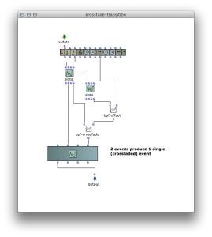](../res/f0-merge.png "Cliquez pour agrandir")  
  
---|---  
  
The snapshot of the process, obtained using the visualization option in CH-
TRANSITIONS, allows to better understand this mechanism.

|

[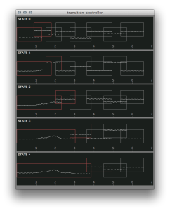](../res/visu-merge.png "Cliquez pour agrandir")  
  
---|---  
  
Morphing

The function **FOF-MORPH** creates a non-linear interpolation (morphing)
between the formantic parameters of two (or more) CH-FOF events. The morphing
is effective on the portion where the CH-FOF events are overlapping.

One or two BPFs can be given as an input to determine the "morphing profile".
If two events are overlapping, only the first one is used ; and if three
events are overlapping, the two BPFs will define the "3D morphing" profile.

[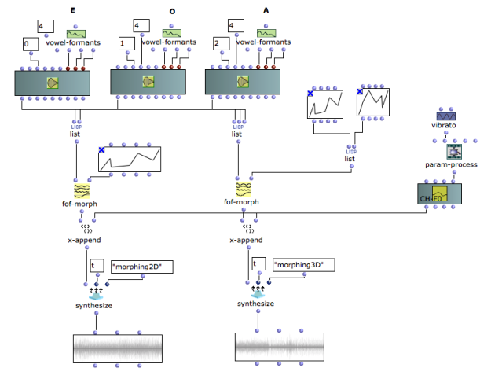](../res/morphing.png "Cliquez pour agrandir")

Tutorial patch "transition-morphing" shows how to use this function as a means
to control the transitions with CH-TRANSITIONS.

References :

Plan :

  * [Introduction](OM-Chant)
  * [Installation](Install)
  * [Principles](Intro)
  * [Low-level Control Tools](Low)
  * [Displaying Results as a Sonogram](Display)
  * [Chant Events](Events)
  * [Durations and Continuous Control](Continuous)
  * [Modulating Effects](Modulation)
  * [Formants and vocal simulation](Formants)
  * [Spatialization and Multi-Channel Control](Spatialization)
  * [Time and Structure](Time)
  * Transitions
  * [Chant Maquettes](Maquette)
  * [Additional resources](Resources)

Navigation : [Previous](Time "page précédente\(Time and
Structure\)") | [Next](Maquette "Next\(Chant
Maquettes\)")
