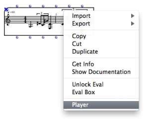

Navigation : [Previous](2-Instanciation "page
précédente\(Instantiating Objects\)") | [Next](3-Editors "page
suivante\(Editors\)")

# Playback and Players

## Play in Patches

Some objects manipulated in OM are "musical" (sounding) objects which can be
played (provided the corressponding player is correctly installed).

In order to play an object, just select the box and press `Space` or `p`.

Pressing `Space` again (or `s`) will stop playing.

Multiple Playback

In order to play several objects simultaneously, select the corresponding
boxes at once and use the same playback shortcuts.

## Play in Editors

Object Editors

Musical objects such as score objects or sounds have an editor where thay can
be played thanks to standard playback controls.

Some Object Editors

  * [Play Controls](Editor-Play)
  * [The Sound Editor](SoundEditor)

Maquette

The MAQUETTE has many functionalities, but can be used just to put musical
object together and play them.

Maquette

  * [The Maquette Editor](Editor)

## Player Selection

Sometimes several players are available for a given type of object.

For instance :

  * Score objects can be played either via MIDI (and the MidiShare default player) or using the MicroPlayer (external playback application for microintervals).

  * Sounds can be player via the default LibAudioStream player or via external players such as the MultiPlayer (for multi-channel audio files).

When it is the case, it is possible to select the player either using the box
contextual menu, or inside the object specific editors.

|

  
  
---|---  
  
Score Players

  * [Score Players](ScorePlayer)

Audio Players

  * [The Audio Player](AudioPlayer)

References :

Plan :

  * [OpenMusic Documentation](OM-Documentation)
  * [OM User Manual](OM-User-Manual)
    * [Introduction](00-Sommaire)
    * [System Configuration and Installation](Installation)
    * [Going Through an OM Session](Goingthrough)
    * [The OM Environment](Environment)
    * [Visual Programming I](BasicVisualProgramming)
      * [Patch Introduction](ProgrammingIntro)
      * [Adding Boxes Into a Patch](AddingBoxes)
      * [Elementary Manipulations](ElementaryManips)
      * [Boxes](Boxes)
        * [Boxes Features](GraphicFeatures)
        * [Data Boxes](DataBox)
        * [Function Boxes](FunctionBoxes)
        * [Objects - Factory Boxes](FactoryBoxes)
          * [Visualization](1-Visualization)
          * [Instantiating Objects](2-Instanciation)
          * Playback and Players
          * [Editors](3-Editors)
          * [Import/Export](4-ImportExport)
        * [Abstraction Boxes](AbsBoxesIntro)
        * [Other Boxes](OtherBoxes)
      * [Box Inputs](BoxInputs)
      * [Connections](Connections)
      * [Evaluation](Evaluation)
      * [Documentation and Info](DocAndInfo)
      * [Comments](Comments)
      * [Pictures](Pictures)
      * [Saving / Reloading a Patch](SavingPatch)
      * [Dead Boxes](DeadBox)
    * [Visual Programming II](AdvancedVisualProgramming)
    * [Basic Tools](BasicObjects)
    * [Score Objects](ScoreObjects)
    * [Maquettes](Maquettes)
    * [Sheet](Sheet)
    * [MIDI](MIDI)
    * [Audio](Audio)
    * [SDIF](SDIF)
    * [Lisp Programming](Lisp)
    * [Errors and Problems](errors)
  * [OpenMusic QuickStart](QuickStart-Chapters)

Navigation : [Previous](2-Instanciation "page
précédente\(Instantiating Objects\)") | [Next](3-Editors "page
suivante\(Editors\)")

