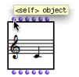
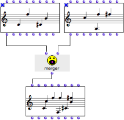
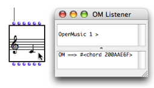
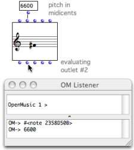

Navigation : [Previous](1-Visualization "page
précédente\(Visualization\)") | [Next](1-Play "page
suivante\(Playback and Players\)")

# Instantiating Objects

Instantiation

An instance is an exemplar of a class of objects. Instantiation is the process
of creating an instance of a class using a factory box.

Factory Slots

A factory box has a number of slots, represented by inputs and outputs. Once
values are assigned to the slots or parameters of a factory box, it can be
evaluated to produce an instance[1], an exemplar of a class.

  * The first input and output always correspond to the object that is created by the box. It is called the "self" of the box.
  * Each of the other inputs and outputs stands for an attribute, or parameter of the object - a slot[2] of the corresponding class[3].

Note that the value of a factory box can also be defined via its editor.

## First Input / Output : "Self"

|

The first input / output of a factory box is usually called "self". It stands
for the object itself.

A "self" input can be connected to :

  * the "self" output of an  **object belonging to the same class** , 
  * a  **simple value** , or the  **output of an object** , provided it can produce such an object.

Reciprocally, the evaluation of a "self" output, or its connection to another
box returns the computed object itself.  
  
---|---  
  
Automatic Object Conversions

When compatibility allows it, OM automatic converts objects of a diferent type
and creates an instance of the relevant class.

A chord can be created from a note, but a note cannot be created from a chord.

Manipulating Objects via the "Self" Input

The merger function builds a chord-sequence, or  chord-seq[4] , out of two
other chord-sequences given as arguments[5].

|

  * Top : the "self" outputs of the chord-seqs are connected to the inputs of merger. 
  * Middle : the output of merger is connected to the "self" input of a third chord-seq.
  * Bottom : the third chord-seq represents the resulting chord sequence once evaluated.

  
  
---|---  
  
The two initial chord-seqs are locked to preserve their value. Conversely, the
box that is to be evaluated isn't locked, to take the result of the upstream
computation into account.

Protecting a Box

  * [Lock Mode](LockMode)

Evaluation

To evaluate a box, select it and press `v` .

Its value is computed, and the result of the "self" output, that is, the
internal representation of the resulting instance[1] is displayed in the
Listener.

|

  
  
---|---  
  
About Evaluation

  * [Evaluation](Evaluation)

Tip : Reinitializing a Box

To reset a box to its default state, press `SHIFT` \+ `i` .

## Other Inputs / Outputs : Object Parameters

Parameters (Slots)

The other inputs and outputs represent the various parameters (also called
class slots[2]), used for defining an instance.

Inputs and outputs respectively address the same parameters - and follow the
same ordering.

A note box has five inlets and outlets, a "self", and four other inlets, which
correspond to the usual musical features or parameters of a note : midicents -
pitch -, velocity - dynamics -, duration, midi channel.

To get information about the qualities of a slot, keep pressing `Cmd` while
overing the mouse over an input or output.

Setting Input Values

Building a chord with two of its parameters : a list of pitches (6000 6800)
for C4 and G#4, and a list of note velocities - dynamics - (100 50).

|

Input values must be specified to define an object. Several parameters can be
set or connected at a time. If no value is specified, the default value of the
input is applied.  
  
---|---  
  
Setting Box Inputs Values, Using a Box's Editor

  * [Box Inputs](BoxInputs)
  * [Editors](3-Editors)

Conflict : Setting the "Self" Input and Other Attributes

An object can be created directly from the "self" input value, and from the
other input parameters. By convention, "self" has priority over the other
inputs, whose values are ignored.

|

Different values have been assigned to the "self" and "pitch" inputs. The
value of the "self" input is applied for the instantiation.  
  
---|---  
  
Getting Output Values

The different outlets of an object can be used for reading the values of its
attributes. Outputs can be connected as parameters to other factory or
function box inputs.

To evaluate the value of an output, `Cmd` click on it. The whole box is
evaluated and a specific instance of the class is created.

The second input represents the pitch value of a note box.

  * If the factory box, or if its "self" outlet is evaluated, the reference of the instance appears in the Listener. 
  * If the second output is evaluated, a similar value to that of the second inlet is returned in the Listener, and inform us about the pitch of the note. 

|

  
  
---|---  
  
References :

  1. Instance

An actual object created at runtime, out of a given class. In OM, more
specifically, an object created when evaluating a factory box. An instance can
be saved as a global variable.

⤷ `SHIFT` click on an outlet - especially the first outlet representing the
self, the whole object - of a factory box to materialize an instance.

  2. Slot

In object oriented programming, a slot represents and attribute of a class.
For instance, the class "note" in OM has 4 slots : pitch, duration, velocity,
and MIDI channel.

  3. Class

A category of objects sharing common properties - characteristics and
behaviour. A class specifies the internal structure and behaviour of an
object. In OM, it is represented in a patch by a factory box that can produce
an instance of a class.

See also : Object, Instance

  4. Chord-Seq

OM name of a chord sequence. By extension, a note sequence, since a single
note can be considered a chord.

  5. Argument

An argument represents a parameter upon which a function operates. For
instance, the (om+ x y) function has two arguments : x and y.

Plan :

  * [OpenMusic Documentation](OM-Documentation)
  * [OM User Manual](OM-User-Manual)
    * [Introduction](00-Sommaire)
    * [System Configuration and Installation](Installation)
    * [Going Through an OM Session](Goingthrough)
    * [The OM Environment](Environment)
    * [Visual Programming I](BasicVisualProgramming)
      * [Patch Introduction](ProgrammingIntro)
      * [Adding Boxes Into a Patch](AddingBoxes)
      * [Elementary Manipulations](ElementaryManips)
      * [Boxes](Boxes)
        * [Boxes Features](GraphicFeatures)
        * [Data Boxes](DataBox)
        * [Function Boxes](FunctionBoxes)
        * [Objects - Factory Boxes](FactoryBoxes)
          * [Visualization](1-Visualization)
          * Instantiating Objects
          * [Playback and Players](1-Play)
          * [Editors](3-Editors)
          * [Import/Export](4-ImportExport)
        * [Abstraction Boxes](AbsBoxesIntro)
        * [Other Boxes](OtherBoxes)
      * [Box Inputs](BoxInputs)
      * [Connections](Connections)
      * [Evaluation](Evaluation)
      * [Documentation and Info](DocAndInfo)
      * [Comments](Comments)
      * [Pictures](Pictures)
      * [Saving / Reloading a Patch](SavingPatch)
      * [Dead Boxes](DeadBox)
    * [Visual Programming II](AdvancedVisualProgramming)
    * [Basic Tools](BasicObjects)
    * [Score Objects](ScoreObjects)
    * [Maquettes](Maquettes)
    * [Sheet](Sheet)
    * [MIDI](MIDI)
    * [Audio](Audio)
    * [SDIF](SDIF)
    * [Lisp Programming](Lisp)
    * [Errors and Problems](errors)
  * [OpenMusic QuickStart](QuickStart-Chapters)

Navigation : [Previous](1-Visualization "page
précédente\(Visualization\)") | [Next](1-Play "page
suivante\(Playback and Players\)")

