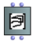

Navigation : [Previous](3DC "page précédente\(3DC\)") | [Next](ClassArray "Next\(Array\)")

# Multiple 3DCs : 3DC-Lib

## 3DC-Lib

|

The  **3DC-Lib** objects is similar to a  BPC-Lib . As [for BPFs and
BPCs](MultiBPF), collections of 3DC objects can be created and stored in
the  3DC-lib object.  
  
---|---  
  
Access

To add a  3DC object, type its name or go to the` Classes / Basic Tools / 3D
menu`.

Inputs and Outputs

The 3DC-Lib object has two inputs and outputs :

  * "self" : the object itself

  * "bpf-list" : a list of 3DC objects

A 3DC-Lib and its editor.

## Editor Display

  * To display all the curves in the 3DC-Lib editor, select the `Show All` option. 

  * To display the current active curve, unselect this option. By default, the displayed curve is curve #0. 

To display and activate a specific curve, use the `TAB` key. The current
active curve index is indicated under the `Selected Curve` label.

If the 2D Editors option is selected, the corresponding 2D editors will be
refreshed automatically in the window.

Naming Curves

Use `n` to set a name to the current curve. This name will the appear on the
left panel, next to the curve index.

## Editing Curves

The active selected curve of a 3DC-Lib can be edited as in a 3DC editor.

Adding / deleting 3DCs

To add a new 3DC in the collection, press `+`.To remove the current curve,
press `-`.

When a new curve is added, it is added right after the current curve.

3DC-Lib Edition

Only one 3DC can be visualized and edited at a time in the 2D projections.

The precision value, if modified, will be applied to all the 3DC objects in
the 3DC-Lib.

References :

Plan :

  * [OpenMusic Documentation](OM-Documentation)
  * [OM User Manual](OM-User-Manual)
    * [Introduction](00-Sommaire)
    * [System Configuration and Installation](Installation)
    * [Going Through an OM Session](Goingthrough)
    * [The OM Environment](Environment)
    * [Visual Programming I](BasicVisualProgramming)
    * [Visual Programming II](AdvancedVisualProgramming)
    * [Basic Tools](BasicObjects)
      * [Curves and Functions](CurvesAndFunctions)
        * [BPF / BPC](BPF-BPC)
        * [BPF/BPC-Libs](MultiBPF)
        * [Editors](BPFEditors)
        * [BPF / BPC Tools](Tools)
        * [3D Objects](3D)
          * [3DC](3DC)
          * 3DC-Lib
      * [Array](ClassArray)
      * [TextFile](textfile)
      * [Picture](Picture)
    * [Score Objects](ScoreObjects)
    * [Maquettes](Maquettes)
    * [Sheet](Sheet)
    * [MIDI](MIDI)
    * [Audio](Audio)
    * [SDIF](SDIF)
    * [Lisp Programming](Lisp)
    * [Errors and Problems](errors)
  * [OpenMusic QuickStart](QuickStart-Chapters)

Navigation : [Previous](3DC "page précédente\(3DC\)") | [Next](ClassArray "Next\(Array\)")

