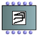
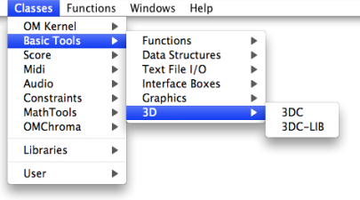
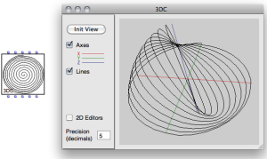
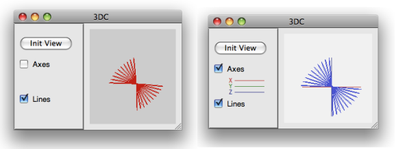
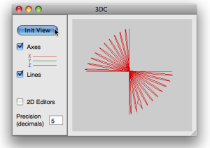
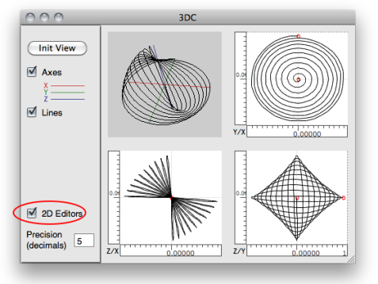
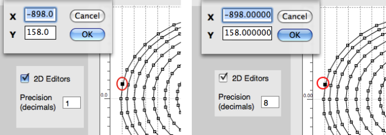
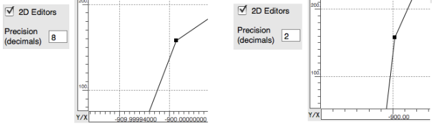

Navigation : [Previous](3D "page précédente\(3D Objects\)") |
[Next](3DC-Lib "Next\(3DC-Lib\)")

# 3D Curves

## The 3DC Object

|

The  **3DC** object is similar to a tridimensional  BPC. The additional "
**z-points** " slots allows the handling of the 3rd dimension of the
coordinates.  
  
---|---  
  
Access

To add a  3DC object, type its name or go to the` Classes / Basic Tools / 3D
menu`.

Inputs and Outputs

The 3DC object has five inputs and outputs :

  * "self" , which represents the object itself

  * "x-points", "y-points" and "z-points" : lists of x, y and z coordinates

  * "precision", the number of decimals for the coordinates. 

|

Generating a 3DC in OM using the x, y and z coordinates list.  
  
---|---  
  
## 3D Visualization

The 3DC editor allows to visualize the curve in a 3D view. It offers basic 3D
navigation commands.

|

A 3DC and its editor.  
  
---|---  
  
Displaying Axes and Colours

  * The `Axes` option allows to display the  x ,  y , and  z axes of the 3D object.

  * Press `b` or to change the background colour.

  * Press `c` to change the colour or the curve.

Manipulation of the Object

Click on the object and move the mouse to rotate the curve.

`SHIFT` \+ click and move up/down to zoom in/out

Use `Init View` to restore the initial view point.

|

  
  
---|---  
  
Edition

The 3DC is only editable from the optional 2D views (see below).

## 2D Editors

To display the three 2D editors corresponding to projections of the curves on
the x/y, x/z and y/z planes, select the `2D Editors` option. These editor are
similar, and work exactly the same way as standard [BPC
editors](BPFEditors).

On single editor (the last clicked one) is active at a time, and will then
respond to key events for moving points, etc.

View and Edition

To zoom in/out on the 2D views the object, click and drag one of the rulers.
Use the button  of the palette to restore the
original (optimal) view ratio.

Use the button  to navigate in a 2D view.

Note : When the `Precision` value is modified, the view is automatically reset
to its original ratio.

Use the stadard [BPC edit commands](Edition) to move or delete points in
the 2D editors.

Global Changes

Since any point belong to the three axes, it is displayed in **all editors**.
Consequently, any modification in an editor will affect the two others, as
well as the global 3D view.

Precision and Coordinates

To visualize the coordinates of a point, double click on it with the mouse.
These coordinates can be edited, just as in a BPC.

The `Precision` parameter changes the precision of the points with a decimals
number.

Precision changes may lead to modifying the points positions by truncating
their coordinates values.

Displaying Points or Curves

As in standard BPF/BPC editors, the `Lines` option allows to display the 3DC
and 2D projections as points or as a continuous curve.

|

Displaying the points in a 3DC editor  
  
---|---  
  
References :

Plan :

  * [OpenMusic Documentation](OM-Documentation)
  * [OM User Manual](OM-User-Manual)
    * [Introduction](00-Sommaire)
    * [System Configuration and Installation](Installation)
    * [Going Through an OM Session](Goingthrough)
    * [The OM Environment](Environment)
    * [Visual Programming I](BasicVisualProgramming)
    * [Visual Programming II](AdvancedVisualProgramming)
    * [Basic Tools](BasicObjects)
      * [Curves and Functions](CurvesAndFunctions)
        * [BPF / BPC](BPF-BPC)
        * [BPF/BPC-Libs](MultiBPF)
        * [Editors](BPFEditors)
        * [BPF / BPC Tools](Tools)
        * [3D Objects](3D)
          * 3DC
          * [3DC-Lib](3DC-Lib)
      * [Array](ClassArray)
      * [TextFile](textfile)
      * [Picture](Picture)
    * [Score Objects](ScoreObjects)
    * [Maquettes](Maquettes)
    * [Sheet](Sheet)
    * [MIDI](MIDI)
    * [Audio](Audio)
    * [SDIF](SDIF)
    * [Lisp Programming](Lisp)
    * [Errors and Problems](errors)
  * [OpenMusic QuickStart](QuickStart-Chapters)

Navigation : [Previous](3D "page précédente\(3D Objects\)") |
[Next](3DC-Lib "Next\(3DC-Lib\)")

