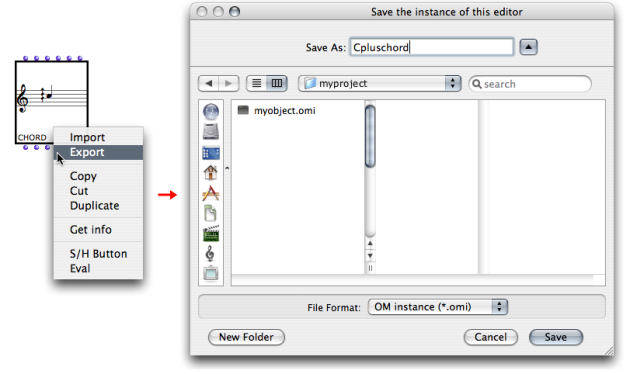
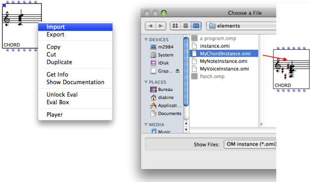
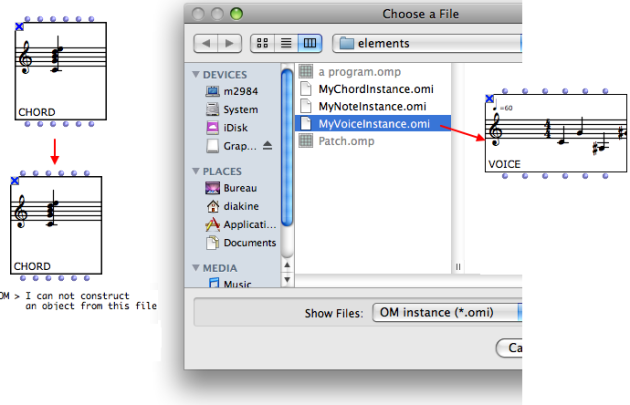

# Importing/Exporting Factory Box Values

## Instances Files

The current value of a factory box can be exported or imported as a file to or
from any location in the computer. Exporting an instance is a means to
preserve the musical result of a computation.

Both procedures take place in the patch editor, via a contextual menu.
Instances are identified by the .omi extension - "i" for "instance".

Export Procedure

  1. To export the instance from a factory box, `Ctrl` / right click on the box and select "Export".

  2. Choose an export location and file name on tyour hard-disk.

Import Procedure

  1. To import an instance in a factory box, `Ctrl` / right click on the box and select "Import".

  2. Choose a .omi file to import.

[Zoom](../res/impchordtochord_scr_1.png "Zoom \(nouvelle fenêtre\)")

Compatibility

Mind importing a suitable instance file in a given factory editor. In case of
incopmpatible object, OM will display an error message and the box contents
won't be modified.

It may be more convenient to create an instance box[1] out of the box value.
Instance boxes can be saved as global variables[2] in a dedicated package of
the Library, the Globals package.

About Instances and Global Variables, See :

  * [Instance Boxes](InstanceBoxes)
  * [Global Variables](GlobalVariables)

## External File Formats

Some objects (particularly, musical object) can be imported/exported from/to
standard external formats (e.g. MIDI, MusicXML, etc.)

In this case, some additional options will be displayed in the Import and
Export menus.

Importing/Exporting Score Objects

  * [Export](Export)

References :

  1. Instance

An actual object created at runtime, out of a given class. In OM, more
specifically, an object created when evaluating a factory box. An instance can
be saved as a global variable.

⤷ `SHIFT` click on an outlet - especially the first outlet representing the
self, the whole object - of a factory box to materialize an instance.

  2. Global variable

An instance of OM object that has been saved in order to be used in other
programs. Global variables are visible from the `Library` window and stored as
.omi files in the `Globals` folder of the workspace.

Plan :

  * [OpenMusic Documentation](OM-Documentation)
  * [OM 6.6 User Manual](OM-User-Manual)
    * [Introduction](00-Sommaire)
    * [System Configuration and Installation](Installation)
    * [Going Through an OM Session](Goingthrough)
    * [The OM Environment](Environment)
    * [Visual Programming I](BasicVisualProgramming)
      * [Patch Introduction](ProgrammingIntro)
      * [Adding Boxes Into a Patch](AddingBoxes)
      * [Elementary Manipulations](ElementaryManips)
      * [Boxes](Boxes)
        * [Boxes Features](GraphicFeatures)
        * [Data Boxes](DataBox)
        * [Function Boxes](FunctionBoxes)
        * [Objects - Factory Boxes](FactoryBoxes)
          * [Visualization](1-Visualization)
          * [Instantiating Objects](2-Instanciation)
          * [Playback and Players](1-Play)
          * [Editors](3-Editors)
          * Import/Export
        * [Abstraction Boxes](AbsBoxesIntro)
        * [Other Boxes](OtherBoxes)
      * [Box Inputs](BoxInputs)
      * [Connections](Connections)
      * [Evaluation](Evaluation)
      * [Documentation and Info](DocAndInfo)
      * [Comments](Comments)
      * [Pictures](Pictures)
      * [Saving / Reloading a Patch](SavingPatch)
      * [Dead Boxes](DeadBox)
    * [Visual Programming II](AdvancedVisualProgramming)
    * [Basic Tools](BasicObjects)
    * [Score Objects](ScoreObjects)
    * [Maquettes](Maquettes)
    * [Sheet](Sheet)
    * [MIDI](MIDI)
    * [Audio](Audio)
    * [SDIF](SDIF)
    * [Lisp Programming](Lisp)
    * [Errors and Problems](errors)
  * [OpenMusic QuickStart](QuickStart-Chapters)

Navigation : [page precedente](3-Editors "page précédente\(Editors\)") |
[page suivante](AbsBoxesIntro "page suivante\(Abstraction Boxes\)")

