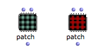
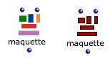
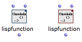

Navigation : [Previous](4-ImportExport "page
précédente\(Import/Export\)") | [Next](OtherBoxes "page
suivante\(Other Boxes\)")

# Abstraction Boxes (Intro)

## Concept

[1]Patches can be added in the Workspace, but also, subsequently, inserted or
incremented in a bigger scale program. This procedure is called  functional
abstraction [1].

Abstraction

Abstraction is a procedure that permits to abstract a program, that is, a
process, a patch, into a box that can then be used into another program. In
other words, an abstraction box represents a patch in another patch and acts
as a function.

Abstraction is detailed in of the [Advanced
Programming](AdvancedVisualProgramming) section.

## Abstraction Boxes

Patches

The main type of abstraction box is the Patch pox

There exist two type of patch boxes :

  * Global abstractions (blue)
  * Internal abstraction (red)

|

  
  
---|---  
  
About Abstraction Boxes

  * [Abstraction](Abstraction)

OMLoop Boxes

[OMLoops](OMLoop) are particular abstractions that allow to design
iterative processes.

|

  
  
---|---  
  
About the OMLoop Box

  * [Iterations: OMLoop](OMLoop)

Maquettes

Maquettes are special programming editors with a temporal dimension.

Like patch boxes, they can be eitheir global or internal.

|

  
  
---|---  
  
About Maquette Boxes

  * [Maquettes](Maquettes)

Lisp Functions

Lisp functions are abstractions defined textually in Lisp.

Like patch boxes, they can be eitheir global (blue) or internal abstractions
(red).

|

  
  
---|---  
  
About Lisp Function Boxes

  * [Lisp Function Boxes](LispFunctions)

References :

  1. Functional Abstraction

A functional abstraction is a program whose some elements can become
variables, via connections to the outside environment. Hence, this program
must have inputs or outputs that can be connected to external variable
elements. The resulting functional abstraction can then be embedded into other
programs to be used as a functional component.

Plan :

  * [OpenMusic Documentation](OM-Documentation)
  * [OM 6.6 User Manual](OM-User-Manual)
    * [Introduction](00-Sommaire)
    * [System Configuration and Installation](Installation)
    * [Going Through an OM Session](Goingthrough)
    * [The OM Environment](Environment)
    * [Visual Programming I](BasicVisualProgramming)
      * [Patch Introduction](ProgrammingIntro)
      * [Adding Boxes Into a Patch](AddingBoxes)
      * [Elementary Manipulations](ElementaryManips)
      * [Boxes](Boxes)
        * [Boxes Features](GraphicFeatures)
        * [Data Boxes](DataBox)
        * [Function Boxes](FunctionBoxes)
        * [Objects - Factory Boxes](FactoryBoxes)
        * Abstraction Boxes
        * [Other Boxes](OtherBoxes)
      * [Box Inputs](BoxInputs)
      * [Connections](Connections)
      * [Evaluation](Evaluation)
      * [Documentation and Info](DocAndInfo)
      * [Comments](Comments)
      * [Pictures](Pictures)
      * [Saving / Reloading a Patch](SavingPatch)
      * [Dead Boxes](DeadBox)
    * [Visual Programming II](AdvancedVisualProgramming)
    * [Basic Tools](BasicObjects)
    * [Score Objects](ScoreObjects)
    * [Maquettes](Maquettes)
    * [Sheet](Sheet)
    * [MIDI](MIDI)
    * [Audio](Audio)
    * [SDIF](SDIF)
    * [Lisp Programming](Lisp)
    * [Errors and Problems](errors)
  * [OpenMusic QuickStart](QuickStart-Chapters)

Navigation : [Previous](4-ImportExport "page
précédente\(Import/Export\)") | [Next](OtherBoxes "page
suivante\(Other Boxes\)")

