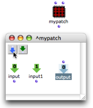
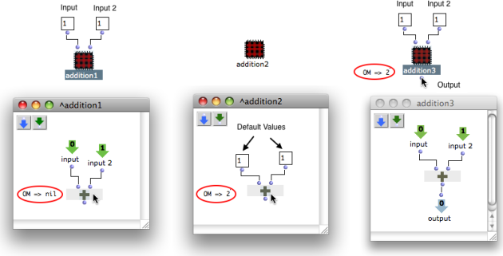
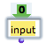
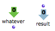
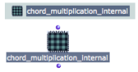
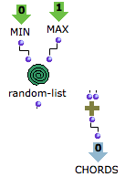
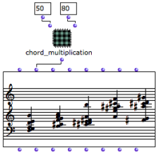

Navigation : [Previous](AbsApplication "page
précédente\(Application\)") | [Next](AbsInputBoxes "page
suivante\(Input Boxes\)")

# Inputs / Outputs

## Creating Connections to the Outside

Once a patch is added in another patch editor, it can be used as an
abstraction[1].

An abstraction can have as many inlets and outlets as necessary to establish
connections with other boxes.

  * Values are returned by the inlets from the outside to the sub patch . 

  * Results of computations are returned by the outlets to the outside.

Adding Inputs and Outputs

Inputs and outputs are added with a click on the
 and  arrow icons
in the open patch.

To add the desired number of inputs and outputs, click as many times as
necessary on the corresponding icons. Inlets and outlets will appear on the
sub patch icon.

Connections to other boxes in the patch editor can then be created.

|

  
  
---|---  
  
Internal Evaluation

[Zoom](../res/InternalEvaluationExample_scr_1.png "Zoom \(nouvelle fenêtre\)")

An internal patch can potentially be used in an infinite number of
configurations. Hence, if a patch is assigned input boxes, OM considers that
these boxes can get any values from the outside. Consequentely, when a patch
with input boxes is evaluated from the inside, the values outside the patch
are ignored, and OM returns "nil".

To be evaluated, a program  that is assigned values from the outside of a
patch must be evaluated  from the outside of the patch , via its output.

If an internal patch is assigned  its own default values , it can then be
evaluated from the inside.

Assigning Default Values to Input Boxes

  * [Input Boxes](AbsInputBoxes)

Naming Inputs and Outputs

To rename inputs and outputs :

1\. double click on the name of the icon :
,

|

2\. edit it and validate : .  
  
---|---  
  
This has no effect on the input or output's behaviour.

More Information about Input Boxes Edition :

  * [Input Boxes](AbsInputBoxes)

Viewing Inlets and Outlets

Inlets and outlets of blue patches are not visible in the workspace.

|

  
  
---|---  
  

|

To display information about inputs and outputs names, as well as a possible
documentation, keep `Cmd` pressed while hovering the mouse over them.  
  
---|---  
  
## Example : Using a Sub Patch as a Functional Abstraction

Once a patch is added one or more inputs and connected to other items, it can
manipulate **variables** , just like a function does. These variables are
taken as arguments by the function. Data returned by the abstraction output(s)
can also become variables for other boxes or for other functional
abstractions.

A "Large" Program

The following program is quite developed. It could be used as a subordinate
and coherent element in a more important patch. We will integrate it in a
patch to use it as an abstraction.

Building successive chords from a chord multiplication.

Adding Inputs and Outputs to the Patch

  * Two input boxes are substituted to the parameters of the  random-list function.
  * One output box is substituted to the chord-seq to return the result of the computation to the outside of the patch.

|

  
  
---|---  
  
Functional Call of the Patch

The patch is dropped into  **another patch editor** .

  1. Values can now be sent to the inputs of random-list from the outside of the patch, via the patch inputs. 

  2.     * The resulting data can also be returned to other boxes and be manipulated. 
    * The result of the computation can also be materialized by an external chord-seq box, via its "midics" input.

Hence, the patch behaves like a function within a "larger-scale" program.

|

  
  
---|---  
  
References :

  1. Functional Abstraction

A functional abstraction is a program whose some elements can become
variables, via connections to the outside environment. Hence, this program
must have inputs or outputs that can be connected to external variable
elements. The resulting functional abstraction can then be embedded into other
programs to be used as a functional component.

Plan :

  * [OpenMusic Documentation](OM-Documentation)
  * [OM 6.6 User Manual](OM-User-Manual)
    * [Introduction](00-Sommaire)
    * [System Configuration and Installation](Installation)
    * [Going Through an OM Session](Goingthrough)
    * [The OM Environment](Environment)
    * [Visual Programming I](BasicVisualProgramming)
    * [Visual Programming II](AdvancedVisualProgramming)
      * [Abstraction](Abstraction)
        * [Abstraction Boxes](AbsBoxes)
        * [Application](AbsApplication)
          * Inputs / Outputs
          * [Input Boxes](AbsInputBoxes)
        * [Recursive Patches](Recursion)
      * [Evaluation Modes](EvalModes)
      * [Higher-Order Functions](HighOrder)
      * [Control Structures](Control)
      * [Iterations: OMLoop](OMLoop)
      * [Instances](Instances)
      * [Interface Boxes](InterfaceBoxes)
      * [Files](Files)
    * [Basic Tools](BasicObjects)
    * [Score Objects](ScoreObjects)
    * [Maquettes](Maquettes)
    * [Sheet](Sheet)
    * [MIDI](MIDI)
    * [Audio](Audio)
    * [SDIF](SDIF)
    * [Lisp Programming](Lisp)
    * [Errors and Problems](errors)
  * [OpenMusic QuickStart](QuickStart-Chapters)

Navigation : [Previous](AbsApplication "page
précédente\(Application\)") | [Next](AbsInputBoxes "page
suivante\(Input Boxes\)")

