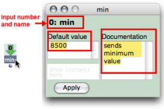
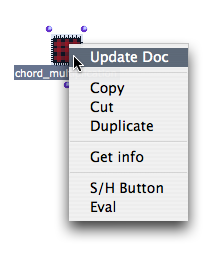
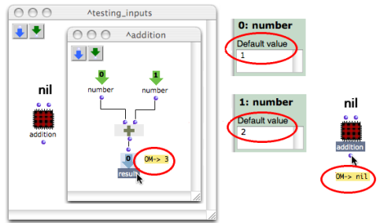
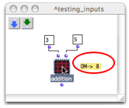

Navigation : [Previous](AbsInOuts "page précédente\(Inputs /
Outputs\)") | [Next](Recursion "Next\(Recursive
Patches\)")

# Input Boxes

The inputs of an abstraction are represented inside the patch by green boxes.
When these boxes are assigned default values , the patch can be evaluated
internally and autonomously.

## Editing Inputs

|

To edit the inputs of an abstraction, double click on an input box to open its
editor.The editor displays :

  * the input name,
  * an editable **" Documentation"** frame,
  * an editable **" Default Value"** frame.

To edit information :

  1. enter values and / or a documentation,

  2. choose `Apply`

  3. close the input box once to validate the default values and documentation.

  
  
---|---  
  
To display the information :

  1. `Ctrl` / right click on the patch and choose `Update Doc`,

  2. press `Cmd` while hovering the mouse over the patch. 

|

  
  
---|---  
  
## Using Default Value

Default values allow to evaluate an internal patch from the inside .

Using an Instance as a Default Value

The **lower left** frame of the input editor can take an ** instance ** as
default input value.

To add an instance or a global variable there, drag an instance box from a
patch editor - or from the Globals package to this frame.

An instance can be created out of a factory box and dropped, as well as a
global variable, from a patch editor to an input editor.

Reminder

`SHIFT` \+ `Cmd` click on an outlet to create an instance in a patch editor.

About Instances and Global Variables :

  * [Instance Boxes](InstanceBoxes)

## Internal Evaluation

Default values are designed to test if a patch works with an internal
evaluation.

To evaluate a patch internally, `Cmd` click on the internal output box.

Default values are ineffective as soon as a patch is  evaluated from the
outside .

Note

Default values are also ineffective if values are sent to the patch from other
boxes.

|

  
  
---|---  
  
References :

Contents :

  * [OpenMusic Documentation](OM-Documentation)
  * [OM User Manual](OM-User-Manual)
    * [Introduction](00-Contents)
    * [System Configuration and Installation](Installation)
    * [Going Through an OM Session](Goingthrough)
    * [The OM Environment](Environment)
    * [Visual Programming I](BasicVisualProgramming)
    * [Visual Programming II](AdvancedVisualProgramming)
      * [Abstraction](Abstraction)
        * [Abstraction Boxes](AbsBoxes)
        * [Application](AbsApplication)
          * [Inputs / Outputs](AbsInOuts)
          * Input Boxes
        * [Recursive Patches](Recursion)
      * [Evaluation Modes](EvalModes)
      * [Higher-Order Functions](HighOrder)
      * [Control Structures](Control)
      * [Iterations: OMLoop](OMLoop)
      * [Instances](Instances)
      * [Interface Boxes](InterfaceBoxes)
      * [Files](Files)
    * [Basic Tools](BasicObjects)
    * [Score Objects](ScoreObjects)
    * [Maquettes](Maquettes)
    * [Sheet](Sheet)
    * [MIDI](MIDI)
    * [Audio](Audio)
    * [SDIF](SDIF)
    * [Lisp Programming](Lisp)
    * [Errors and Problems](errors)
  * [OpenMusic QuickStart](QuickStart-Chapters)

Navigation : [Previous](AbsInOuts "page précédente\(Inputs /
Outputs\)") | [Next](Recursion "Next\(Recursive
Patches\)")

