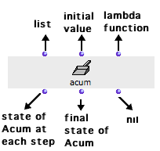
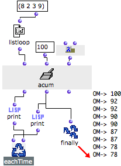

Navigation : [Previous](Count "page précédente\(Count\)") | [Next](LoopExample "Next\(Example : A Random Series\)")

# Acum : Defining Accumulation Procedures

** Acum** is a generic module used for defining
storage or accumulation procedure.

## Inputs and Outputs

|

Contrary to the other accumulators, accum has three default inputs and one
optional input :

  * "acum" : collects the successive elements of a list returned by an iterator
  * "init" :  **initial value** of the accumulator
  * "fun" : an ** accumulation function ** to apply to each collected element.
  * first output : 

  1. collects the input value and applies the accumulation function

  2. returns the current state of the accumulator.

  * second output : returns the finale value of acum. 
  * third output : resets the accumulator to the value specified by "init".

  
  
---|---  
  
More information about Lambda Functions :

  * [Lambda Mode](LambdaMode)

"Init" : Defining Acum's Behaviour

" **Init** " actually defines the accumulator's behaviour.

It must take a function or box on[ lambda](LambdaMode) mode, with two
inputs :

  1. one for the element to collect,

  2. one for the initial value.

## Example : Subtracting a List of Numbers

We want to subtract numbers successively - for instance (100-8-2-3-9). For
this, we need an initial value, x, a list of numbers, the om- function on
"lambda" mode, and acum.

The initial value of acum is 100. Om- is set on "lambda" mode it is connected
to the third output of acum. It is applied recursively to the elements of the
list and to the initial value. We get (100 - a - b - c - d).

  1. Listloop returns the successive elements of the list to acum.

  2. At each step of the iteration, the first print box prints the **successive current values** of acum : 100 ; 100-8 = 92 ; 92-2 = 90 ; ...

  3. At each step of the iteration, the second print box prints the result of the subtraction, which is then stored as **the new current value** of accum.

  4. When the iteration is over, Finally returns the final state of acum.

|

  
  
---|---  
  
References :

Contents :

  * [OpenMusic Documentation](OM-Documentation)
  * [OM User Manual](OM-User-Manual)
    * [Introduction](00-Contents)
    * [System Configuration and Installation](Installation)
    * [Going Through an OM Session](Goingthrough)
    * [The OM Environment](Environment)
    * [Visual Programming I](BasicVisualProgramming)
    * [Visual Programming II](AdvancedVisualProgramming)
      * [Abstraction](Abstraction)
      * [Evaluation Modes](EvalModes)
      * [Higher-Order Functions](HighOrder)
      * [Control Structures](Control)
      * [Iterations: OMLoop](OMLoop)
        * [Iteration](LoopIntro)
        * [General Features](LoopGeneral)
        * [Evaluators](LoopEvaluators)
        * [Iterators](LoopIterators)
        * [Accumulators](LoopAccumulators)
          * [Collect](Collect)
          * [Sum](Sum)
          * [Min / Max](MinMax)
          * [Count](Count)
          * Acum
        * [Example : A Random Series](LoopExample)
      * [Instances](Instances)
      * [Interface Boxes](InterfaceBoxes)
      * [Files](Files)
    * [Basic Tools](BasicObjects)
    * [Score Objects](ScoreObjects)
    * [Maquettes](Maquettes)
    * [Sheet](Sheet)
    * [MIDI](MIDI)
    * [Audio](Audio)
    * [SDIF](SDIF)
    * [Lisp Programming](Lisp)
    * [Reactive mode](Reactive)
    * [Errors and Problems](errors)
  * [OpenMusic QuickStart](QuickStart-Chapters)

Navigation : [Previous](Count "page précédente\(Count\)") | [Next](LoopExample "Next\(Example : A Random Series\)")

