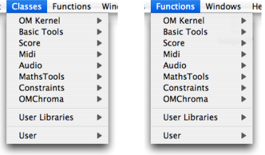
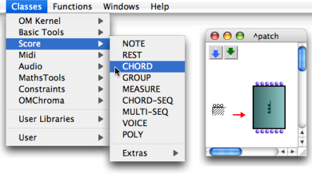
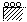
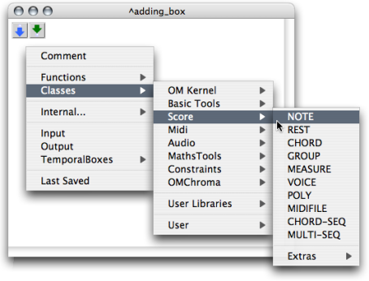
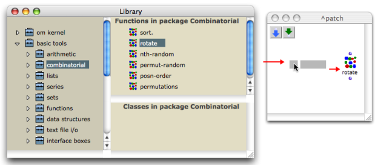
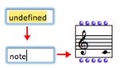
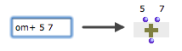

Navigation : [Previous](ProgrammingIntro "page précédente\(Patch
Introduction\)") | [Next](ElementaryManips "page
suivante\(Elementary Manipulations\)")

# Adding Boxes Into a Patch

There are four ways to add a box in a patch editor :

  * via the main menu
  * via the contextual menu
  * typing the box's name directly in the patch editor
  * via the Library window. 

## Menus

This procedure is convenient if you don't know the exact name of the class or
function you need.

Main menu

Note that functions[1] and classes[2] are accessible via two distinct menus.
`Classes` and `Functions` menus give access to the classes and functions of
common packages : this is why they display the same names.

Select a class or a function and click somewhere with
the cursor in the patch editor to add the box
there.

Patch Editor Contextual Menu

To add a box via the contextual menu :

  1. `Ctrl` / right click in the patch editor

  2. select `Functions` or `Classes`.

  3. choose a box in a menu item.

The box will appear in the editor automatically.

## Library Window

The packages[3] in the [Library](Library) window contain the available OM
classes and functions organized in thematic sub packages.

  1. Open the Library window : 

    * select `Windows / Library`
    * press `SHIFT` \+ `Cmd` \+ `p`.
  2. Double click on the lower part of a package to open the classes and functions panes.

  3. Drag and drop the function or class icon in the patch editor.

Full Information about Packages and the Library Window

  * [Packages](Packages)
  * [Library](Library)

## Adding a Box Directly in the Patch Editor

The name of a class or function can always be keyed in a patch editor
directly.

Typing a Class or Function Name

  1. ` Cmd` / right click in the editor : an "undefined" box appears. 

  2. Type the relevant name in the text prompt and validate or click somewhere in the editor.

|

  
  
---|---  
  
Any OM or Lisp function can be created this way. This procedure may be
especially useful since some classes and functions are not accessible via
menus or packages. It implies being familiar with OM functions and classes
names.

Tip

Default values can be directly assigned to a function when entering its name
in the "undefined" box. For instance, typing "om+ 5 7" allows to assign 5 and
7 as default values to om+.

|

  
  
---|---  
  
Specifying a Package Name

In Lisp, a package is also a means to gather symbols, such as function names,
class names, and so on, within a same specific name space. Some functions or
classes can be declared in other packages if they were not designed for OM
exclusive use, or if they come from specific libraries. In this case, adding a
box directly in the patch editor requires typing the package name or nickname
before its name.

  1. A package can be designated by a name or a nickname. For instance, the main OM package name is "openmusic", and has for nickname "om". This syntactically corresponds to : 

**" name-or-nickname-of-the-package::name-of-the-function"**.

  2. To identify the package hosting a given function or class, type the following expression in the  [OM Listener](MainWindows) : 

**(package-name (symbol-package 'class-or-function-name))**

The Listener will display the corresponding package.

References :

  1. Function

A  portion of code within a larger program, which performs a specific task.
Operates upon 0 or more parameters and returns a value.

  2. Class

A category of objects sharing common properties - characteristics and
behaviour. A class specifies the internal structure and behaviour of an
object. In OM, it is represented in a patch by a factory box that can produce
an instance of a class.

See also : Object, Instance

  3. Package

Contains functions or classes components belonging to a common category of
programming items. Packages are provided at the installation of OM, but the
can also be loaded dynamically or added by the user.

Contents :

  * [OpenMusic Documentation](OM-Documentation)
  * [OM User Manual](OM-User-Manual)
    * [Introduction](00-Contents)
    * [System Configuration and Installation](Installation)
    * [Going Through an OM Session](Goingthrough)
    * [The OM Environment](Environment)
    * [Visual Programming I](BasicVisualProgramming)
      * [Patch Introduction](ProgrammingIntro)
      * Adding Boxes Into a Patch
      * [Elementary Manipulations](ElementaryManips)
      * [Boxes](Boxes)
      * [Box Inputs](BoxInputs)
      * [Connections](Connections)
      * [Evaluation](Evaluation)
      * [Documentation and Info](DocAndInfo)
      * [Comments](Comments)
      * [Pictures](Pictures)
      * [Saving / Reloading a Patch](SavingPatch)
      * [Dead Boxes](DeadBox)
    * [Visual Programming II](AdvancedVisualProgramming)
    * [Basic Tools](BasicObjects)
    * [Score Objects](ScoreObjects)
    * [Maquettes](Maquettes)
    * [Sheet](Sheet)
    * [MIDI](MIDI)
    * [Audio](Audio)
    * [SDIF](SDIF)
    * [Lisp Programming](Lisp)
    * [Reactive mode](Reactive)
    * [Errors and Problems](errors)
  * [OpenMusic QuickStart](QuickStart-Chapters)

Navigation : [Previous](ProgrammingIntro "page précédente\(Patch
Introduction\)") | [Next](ElementaryManips "page
suivante\(Elementary Manipulations\)")

