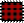

Navigation : [Previous](TemporalBoxes "page
précédente\(TemporalBoxes\)") | [Next](elementary "page
suivante\(Elementary Manipulations\)")

# Adding TemporalBoxes in a Maquette

**Patches** and  **other maquettes** can be included in maquettes, as well as
**instances** or  **factory boxes** such as  notes ,  chords , chord-seqs ,
voices ,  audio files ,  midifiles ,  MIDI controlers .

## Adding Boxes From a Patch

Instances

This maquette contains a patch, a factory box and an instance box.

Factory ,  instance boxes and  global variables can be droppped from a patch
to a maquette editor.

When an object is dropped in the maquette, a TemporalBox appears in the
maquette. Its reference is the new factory or instance which is created from
the current value of the object.

Patches and Maquettes

** General and local  ** **patches or maquettes** can be dropped in a maquette
editor from the workspace or any other location. A reference to the patch, or
maquette, is then created.

  * If the master patch is a general patch  , a reference to the patch is created.
  * If the master patch is a local patch , a new independent reference patch is created.

Adding a maquette into another maquette allows the conception of  **temporal
hierarchic structures** .

TemporalBoxes and Maquette Appearance

  * [Temporalboxes Appearance](Appearance)

TemporalBox Icon

To display the TemporalBox reference icon, select the `Show Box Icons` option
of the `Maquette Preferences` tab

## Adding Boxes Directly in the Maquette Editor

Local Patches and Maquettes

A  **new local patch or maquette** can be added directly in a maquette.

  * To add a local patch, keep `Cmd` pressed while dragging the mouse in the maquette editor. 
  * To add a local maquette, keep `SHIFT` \+ `Cmd` pressed while dragging the mouse in the maquette editor. 

A TemporalBox of equivalent size and representing a new local patch or
maquette appear.

Adding Factory and Function Boxes

Factory and  function boxes can't be added  directly in a maquette editor.
They must be added in a patch located in the maquette.

Using Sub Patches in Maquettes

  * [TemporalBoxes Value](TempValues)

Adding and Deleting Boxes from the Outside of a Maquette

  * [Reference Mode](Maquettes%20in%20Patches2)

## Patch and "Temporal Patch"

|

Patches located in maquettes can be refered to as " **temporal patches** ".
Basically, temporal patches show no difference with "standard" patches :

  * they have the same editor
  * can access the same boxes and functionalities
  * they are manipulated the same way. 

Nevertheless, temporal patches have an additional feature. They can be used
within the context of the maquette via a specific input and output : the
**temporal input** and  **temporal output** .  
  
---|---  
  
Temporal Input

The temporal input, or  **Tempin** , allows to integrate the relation between
the TemporalBox and the maquette - size, position, for instance - in the own
program of the TemporalBox.

Temporal Output

The temporal output, or  **Tempout** , allows to express the musical value of
a TemporalBox within the context of the maquette.

References :

Contents :

  * [OpenMusic Documentation](OM-Documentation)
  * [OM User Manual](OM-User-Manual)
    * [Introduction](00-Contents)
    * [System Configuration and Installation](Installation)
    * [Going Through an OM Session](Goingthrough)
    * [The OM Environment](Environment)
    * [Visual Programming I](BasicVisualProgramming)
    * [Visual Programming II](AdvancedVisualProgramming)
    * [Basic Tools](BasicObjects)
    * [Score Objects](ScoreObjects)
    * [Maquettes](Maquettes)
      * [Creating a Maquette](Maquette)
      * [TemporalBoxes](TemporalBoxes)
        * Adding TemporalBoxes
        * [Elementary Manipulations](elementary)
        * [Temporalboxes Appearance](Appearance)
        * [TemporalBoxes Value](TempValues)
      * [The Maquette Editor](Editor)
      * [Maquette Programming](Programming%20Maquette)
      * [Maquettes in Patches](Maquettes%20in%20Patches)
    * [Sheet](Sheet)
    * [MIDI](MIDI)
    * [Audio](Audio)
    * [SDIF](SDIF)
    * [Reactive mode](Reactive)
    * [Lisp Programming](Lisp)
    * [Errors and Problems](errors)
  * [OpenMusic QuickStart](QuickStart-Chapters)

Navigation : [Previous](TemporalBoxes "page
précédente\(TemporalBoxes\)") | [Next](elementary "page
suivante\(Elementary Manipulations\)")

