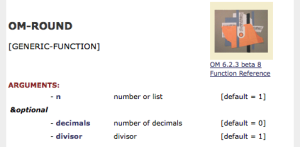
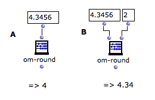
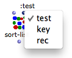
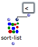
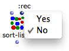
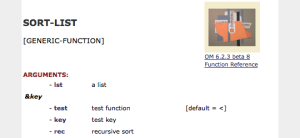
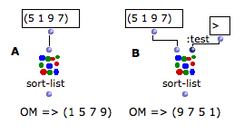
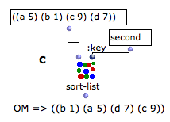

Navigation : [Previous](StandardInputs "page précédente\(Standard
Inputs\)") | [Next](Connections "Next\(Connections\)")

# Additional Inputs : Optional, Keyword and Rest Arguments

For practical issues, function boxes don't always show all possible inlets.
Additional arguments can be added to Lisp and OM functions. They can be either
**optional** , ** keyword **, or " ** rest **" arguments.

  * ** Optional arguments ** can be added successively in a predefined order, which cannot be modified. 

  * **Keyword arguments** can be added and named  ad libitum by the user with a keyword. 

Hence, keyword arguments are especially convenient if a function has numerous
additional arguments : the user can choose one or more specific items among a
whole range of arguments. This also means that keyword arguments are more or
less independent from each other.

  * **Rest arguments** represent an unlimited numbers of successive parameters.

Contrary to standard arguments, functions **always work** if optional
arguments or keyword arguments are not specified, usually because suitable
default values are applied.

Getting Information About Arguments

The additional arguments type - **optional** or ** keyword ** arguments - is
indicated at the beginning of the documentation.

  * Optional arguments are signaled by the" ** &optional **"prefix.

  * Keyword arguments are identified by the  **& key** prefix.
  * Rest arguments are identified by the  **& rest** prefix.

Accessing Documentation

  * [Documentation and Info](DocAndInfo)

## Optional Arguments

Optional arguments are not visible by default

  * To add optional arguments, select the box and press `Alt` \+ `->`.
  * To delete them, press `Alt` \+ `<-` (or `<`). 

|

The OM-ROUND function has one input by default and and two optional inputs.  
  
---|---  
  
Adding All Optional Inputs : >

Press `>` to add all possible optional inputs at once.

Using Optional Inputs : OM-ROUND

|

OM-ROUND rounds a number (or a list of number) to the closest integer
value(s).

It has also two Optional arguments :

  * decimals allows to round to the closest decimal value (by default, 0 decimals = integer)
  * divisor allows to specify a divisor to apply before rounding (by default, 1). 

  
  
---|---  
  
The standard use of OM-ROUND does not require using the optional inputs (A).

In (B) we use the first optional ( decimals ) to round the input number whith
a higher precision.

|

  
  
---|---  
  
## Keyword Arguments

Keyword arguments are not visible by default.

To add keyword arguments, select the box and press `k`.

To remove them, press `SHIFT` \+ `k` to remove it.

|

The SORT-LIST function has one initial argument and three keyword arguments  
  
---|---  
  
Note that keyword arguments are represented by  **dark blue inlets** .

Setting Keyword Arguments

Contrary to optional arguments, keyword arguments are not in a fixed,
predefined order and can therefore be used independently from one another.

You must therefore set **both the name of the keyword input and its value**.

The default name of a new keyword is the first unused argument in the keywords
list. This name is visible by hovering the mouse over the box inlet.

Note that keyword names are always preceded by " **`:` **"

To change the argument :

  1. click on the inlet 

  2. select a name in the pop up menu

|

  
  
---|---  
  
The value of a keyword argument is set like the value of a standard argument
by connecting a box to the keyword input.

Like standard or optional inputs, keyword inputs can have default values. To
show this value, `Shift` click on the input.

|

  
  
---|---  
  
When an input menu is attached to a keyword input, it is also accessed with
`Shift` click on the input.

|

  
  
---|---  
  
Setting Box Inputs, Input Menus, etc.

  * [Standard Inputs](StandardInputs)

Using Keyword Inputs : SORT-LIST

|

SORT-LIST sorts items in a list. It has three keyword arguments

  * test : a test used to compare items to sort them (by default, <, so the function sorts number in growing order)
  * key : an accessor applyed to the items before to compare them to each other (Do not confuse with the &key prefix of keyword arguments!
  * rec : which allows to apply the sort procedure recursively in the list.

  
  
---|---  
  
Using Functions as Arguments (test, key...)

  * [Lambda Mode](LambdaMode)

The default behaviour of the function sorts the numbers in ascending order
(A).

If we add the  :test keyword input and change the test function, we can change
this default behaviour. Here, the test function is changed for >, which
outputs numbers in decreasing order (B).

|

  
  
---|---  
  
The  :key argument is a potential connection used for applying a function to
the elements of the input list, before they are compared with each other.

Here, (C) we sort a more complex list by comparing the  second element of each
item.

|

  
  
---|---  
  
It would also be possible to change  both the test and key values by adding
another keyword input to the box.

In general, any combination of the different keyword inputs is allowed.

## Rest Arguments

Rest arguments are not visible by default, and are generally at the end of the
arguments list of a function. They work like optional arguments but are not
named nor of a specific number.

  * To add rest arguments, select the box and press `Alt` \+ `->` or `>` .
  * To delete them, press `Alt` \+ `<-` or `<`. 

|

The X-APPEND function has two initial arguments and a undertermined number of
'rest' arguments.  
  
---|---  
  
References :

Contents :

  * [OpenMusic Documentation](OM-Documentation)
  * [OM User Manual](OM-User-Manual)
    * [Introduction](00-Contents)
    * [System Configuration and Installation](Installation)
    * [Going Through an OM Session](Goingthrough)
    * [The OM Environment](Environment)
    * [Visual Programming I](BasicVisualProgramming)
      * [Patch Introduction](ProgrammingIntro)
      * [Adding Boxes Into a Patch](AddingBoxes)
      * [Elementary Manipulations](ElementaryManips)
      * [Boxes](Boxes)
      * [Box Inputs](BoxInputs)
        * [Standard Inputs](StandardInputs)
        * Additional Inputs
      * [Connections](Connections)
      * [Evaluation](Evaluation)
      * [Documentation and Info](DocAndInfo)
      * [Comments](Comments)
      * [Pictures](Pictures)
      * [Saving / Reloading a Patch](SavingPatch)
      * [Dead Boxes](DeadBox)
    * [Visual Programming II](AdvancedVisualProgramming)
    * [Basic Tools](BasicObjects)
    * [Score Objects](ScoreObjects)
    * [Maquettes](Maquettes)
    * [Sheet](Sheet)
    * [MIDI](MIDI)
    * [Audio](Audio)
    * [SDIF](SDIF)
    * [Lisp Programming](Lisp)
    * [Reactive mode](Reactive)
    * [Errors and Problems](errors)
  * [OpenMusic QuickStart](QuickStart-Chapters)

Navigation : [Previous](StandardInputs "page précédente\(Standard
Inputs\)") | [Next](Connections "Next\(Connections\)")

