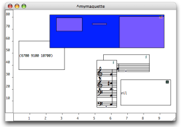
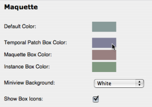
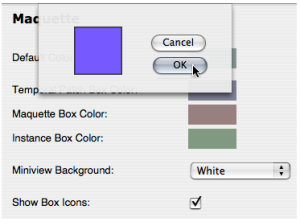
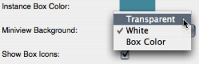

Navigation : [Previous](elementary "page précédente\(Elementary
Manipulations\)") | [Next](TempValues "page
suivante\(TemporalBoxes Value\)")

# Temporalboxes Appearance

## Miniview

|

The current value of a TemporalBox can be visualized with the miniview.

To display the miniview, select a box and press `m` .  
  
---|---  
  
Size Parameter

While the representation of this current value does not necessarily fit the
size of the TemporalBox, the size itself can be significant to the maquette's
program.

## Default Appearance of TemporalBoxes and Maquettes

To modify the default colour of TemporalBoxes`` :

  1. go to the `Prefences` menu

  2. select the `Maquette`  tab.

These modification only apply to items created afterwards.

TemporalBoxes Default Colour

|

Click on the **" Colour"**  icon of the corresponding box.  
  
---|---  
  
  1. pick a colour in the Colour Chooser

  2. choose `OK`. 

  3. select `Apply` or `Cancel`, 

  4. select `OK` to validate your choice.

Select `Restore` to reset the default preferences of the TemporalBoxes.

|

  
  
---|---  
  
Contextual Modifications

To modify the colour of a selected TemporalBox, press `c` and apply the same
procedure.

TemporalBoxes Miniview and Icon

|

  * To modify the miniview background, choose a menu item in the `Miniview` pop up menu.
  * To hide or show the TemporalBox reference icon, unselect or select the `Show Box Icons` option. 

  
  
---|---  
  
Modifying the Maquette Editor Appearance

  * [Maquette Editor Appearance](EditorAppearance)

References :

Plan :

  * [OpenMusic Documentation](OM-Documentation)
  * [OM User Manual](OM-User-Manual)
    * [Introduction](00-Sommaire)
    * [System Configuration and Installation](Installation)
    * [Going Through an OM Session](Goingthrough)
    * [The OM Environment](Environment)
    * [Visual Programming I](BasicVisualProgramming)
    * [Visual Programming II](AdvancedVisualProgramming)
    * [Basic Tools](BasicObjects)
    * [Score Objects](ScoreObjects)
    * [Maquettes](Maquettes)
      * [Creating a Maquette](Maquette)
      * [TemporalBoxes](TemporalBoxes)
        * [Adding TemporalBoxes](AddingTempbox)
        * [Elementary Manipulations](elementary)
        * Temporalboxes Appearance
        * [TemporalBoxes Value](TempValues)
      * [The Maquette Editor](Editor)
      * [Maquette Programming](Programming%20Maquette)
      * [Maquettes in Patches](Maquettes%20in%20Patches)
    * [Sheet](Sheet)
    * [MIDI](MIDI)
    * [Audio](Audio)
    * [SDIF](SDIF)
    * [Lisp Programming](Lisp)
    * [Errors and Problems](errors)
  * [OpenMusic QuickStart](QuickStart-Chapters)

Navigation : [Previous](elementary "page précédente\(Elementary
Manipulations\)") | [Next](TempValues "page
suivante\(TemporalBoxes Value\)")

