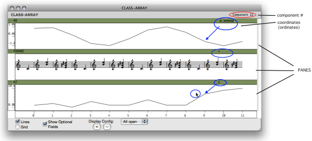
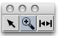
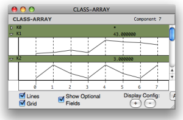
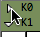
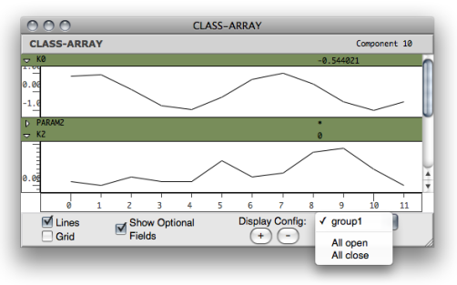
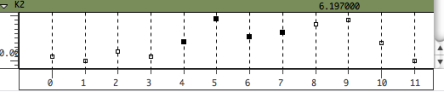

Navigation : [Previous](ArrayObject "page précédente\(Class-Array
Object\)") | [Next](ArrayTools "Next\(Class-Array
Tools\)")

# Class-Array Editor

The  ** class-array ** ** ** editor ** ** allows to visualize and edit - to a
certain extent - the contents of a  class-array object.

## General Features

The class-array editor.[Zoom](../res/array-ed_scr_1.png "Zoom \(nouvelle
fenêtre\)")

In the class-array editor, rows are represented by a set of horizontal panes.

These panes can be :

  * ** BPF -like views** , if the component values are  numbers
  * ** list views** , if the components are  other types of objects or values .

The following values can be displayed at the top of the editor by hovering the
mouse over a component :

  * the  number of the current component 
  * the  values related to this component for each of the fields, such as coordinates, if values are available.

## Displaying Options and Configuration

Palette

To zoom in/out on a selected region - a  components subset - : use the
 and  buttons of the
palette.

|

  
  
---|---  
  
Options

|

  * To display or hide the lines of BPFs, check the `Line` option.
  * To apply a global grid to the editor, check the `Grid` option.
  * To show or hide the  user-defined field , check the `Show Optional Fields` option. 

All the fields of a simple  class-array are user-defined. Consequently, all
the rows of such arrays are hidden if this option is unchecked. Subclasses of
class-arrays with "predefined" fields may remain visible.  
  
---|---  
  
Rows Configuration

|

Each row can be hidden or shown with a click on the triangle icons located on
the upper left corner of each pane.  
  
---|---  
  
To save, recall or remove a given configuration, use the `+` and `-` buttons
at the bottom of the editor.

To select a configuration, use the adjacent `pop up menu`, which contains all
available or recorded configurations.

## Edition

BPF-Like Rows

** BPF -like rows** offer some of the possibilities of BPF editors :

  * hiding / showing lines
  * moving points, in order to change the value(s) of the corresponding components.

Points cannot me removed.

List Rows

** List rows** display the contents of every components, with various types of
representations depending on the type of data.

Objects with an editor - BPFs , score objects, arrays, etc.- can be open by a
double click and edited individually.

Limits of Array Editors

A big array may not represent all of its internal component values, in which
case the internal components display may be automatically disabled.

References :

Plan :

  * [OpenMusic Documentation](OM-Documentation)
  * [OM 6.6 User Manual](OM-User-Manual)
    * [Introduction](00-Sommaire)
    * [System Configuration and Installation](Installation)
    * [Going Through an OM Session](Goingthrough)
    * [The OM Environment](Environment)
    * [Visual Programming I](BasicVisualProgramming)
    * [Visual Programming II](AdvancedVisualProgramming)
    * [Basic Tools](BasicObjects)
      * [Curves and Functions](CurvesAndFunctions)
      * [Array](ClassArray)
        * [Class-Array Object](ArrayObject)
        * Class-Array Editor
        * [Class-Array Tools](ArrayTools)
      * [TextFile](textfile)
      * [Picture](Picture)
    * [Score Objects](ScoreObjects)
    * [Maquettes](Maquettes)
    * [Sheet](Sheet)
    * [MIDI](MIDI)
    * [Audio](Audio)
    * [SDIF](SDIF)
    * [Lisp Programming](Lisp)
    * [Errors and Problems](errors)
  * [OpenMusic QuickStart](QuickStart-Chapters)

Navigation : [Previous](ArrayObject "page précédente\(Class-Array
Object\)") | [Next](ArrayTools "Next\(Class-Array
Tools\)")

